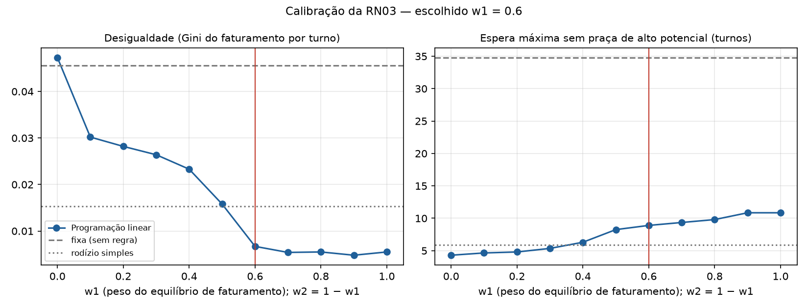

# Calibração dos pesos da RN03 — GASTRA

**Issue #55.** A RN03 distribui os garçons entre as praças por programação linear, com custo
`c(i,j) = w1 · desequilíbrio + w2 · espera`, com w1 + w2 = 1. Este documento define os valores de
w1 e w2, com a metodologia e as premissas explícitas, para entrar no texto do TG.

**Resultado:** w1 = **0,6** (equilíbrio de faturamento) e w2 = **0,4** (espera por praça de alto potencial).

A calibração também revelou uma **falha na definição do primeiro fator**, corrigida no código
(seção 4.1).

---

## 1. Por que simulação

O restaurante não forneceu histórico e o sistema ainda não tem movimento real. A própria issue prevê
calibrar "com dado simulado, com premissas explícitas".

- **Simulador:** `data-science/src/gastra_analitica/alocacao/calibracao.py`.
- **Script:** `data-science/scripts/calibrar_pesos_rn03.py`.
- **Resultados brutos:** `calibracao_rn03.csv`, nesta pasta.

A simulação é determinística: mesma semente, mesmo resultado. A cada turno, a alocação é resolvida
**pela mesma função de programação linear usada pelo serviço em produção**, e não por uma aproximação.

## 2. Premissas do salão simulado

| Premissa | Valor | Justificativa |
|---|---|---|
| Garçons | 7 | Porte de um restaurante médio; garante competição pelas vagas das praças boas |
| Praças (vagas; faturamento médio por turno) | forte (3; R$ 1.800), média (3; R$ 1.200), fraca (2; R$ 600) | Três níveis de potencial, como a "desigualdade entre praças" relatada na pesquisa |
| Turnos por simulação | 120 | 60 dias com almoço e jantar |
| Presença | 85% por garçom, por turno | Folgas e faltas; toda praça sempre tem ao menos um garçom |
| Variação do faturamento da praça | desvio de 25% entre turnos | Movimento varia de um dia para outro |
| Variação individual | desvio de 10% dentro da mesma praça | Garçons diferentes faturam um pouco diferente na mesma praça |
| Divisão do faturamento | o da praça é dividido entre os garçons dela | Praça com mais garçons rende menos para cada um |
| Janela do faturamento do garçom | 60 turnos | Os mesmos 30 dias usados pelo backend |
| Praça de alto potencial | faturamento médio acima da média das praças | A mesma regra do backend (`RegraDeDistribuicao`) |
| Repetições | 20 sementes para cada peso | Reduz o efeito do acaso de uma única simulação |
| Pesos testados | w1 de 0,0 a 1,0, de 0,1 em 0,1 | Varredura completa |

## 3. Métricas

As duas métricas vêm do que motivou a RN03:

- **Desigualdade: coeficiente de Gini** do faturamento médio por turno trabalhado de cada garçom
  (0 = todos iguais).
  - É **por turno**, e não total: quem faltou mais naturalmente fatura menos no total, e isso não é
    injustiça da alocação.
  - Representa a dor espontânea da entrevista e do questionário: "desigualdade percebida entre praças".
- **Espera máxima:** a maior sequência de turnos que algum garçom trabalhou sem pegar praça de alto
  potencial. Representa a recorrência pedida pelo orientador.

Para comparação, duas políticas de referência rodam nas mesmas sementes:

- **fixa (sem regra):** cada garçom tende a ficar sempre na mesma praça;
- **rodízio simples:** a ordem dos garçons gira um passo a cada turno.

## 4. Resultados

| Política | Gini médio | Espera máxima média (turnos) |
|---|---|---|
| w1 = 0,0 | 0,0473 | 4,30 |
| w1 = 0,1 | 0,0302 | 4,65 |
| w1 = 0,2 | 0,0282 | 4,80 |
| w1 = 0,3 | 0,0264 | 5,35 |
| w1 = 0,4 | 0,0233 | 6,30 |
| w1 = 0,5 | 0,0158 | 8,25 |
| **w1 = 0,6** | **0,0067** | **8,90** |
| w1 = 0,7 | 0,0054 | 9,35 |
| w1 = 0,8 | 0,0055 | 9,80 |
| w1 = 0,9 | 0,0048 | 10,85 |
| w1 = 1,0 | 0,0055 | 10,85 |
| fixa (sem regra) | 0,0456 | 34,80 |
| rodízio simples | 0,0153 | 5,90 |

### 4.1 Achado: o faturamento do garçom precisa ser por turno

A primeira rodada usou o fator como está no documento de KPIs: o **faturamento acumulado** (soma) do
garçom nos últimos 30 dias. Nela, a programação linear foi **pior que o rodízio simples** em
desigualdade, e com w1 = 0 foi pior até que não ter regra.

**Por quê:** somando, quem faltou mais turnos aparece com menos faturamento e é tratado como "quem está
para trás". Com isso, recebe as praças boas quando volta, e a média por turno dele passa a dos colegas.

**Correção:** o fator passou a ser o **faturamento médio por turno trabalhado** nos últimos 30 dias:
- no backend, com `AVG` em vez de `SUM` sobre `vw_desempenho_garcom_turno`;
- no contrato com o Python, o campo foi renomeado de `faturamento_acumulado` para `faturamento_por_turno`.

A tabela acima já é da versão corrigida. Numa rodada exploratória mais curta (60 turnos, 3 sementes),
os pesos altos deixavam o Gini perto de 0,03 com a soma e perto de 0,007 com a média por turno.

### 4.2 Leitura

- **Qualquer peso é muito melhor que não ter regra.** A espera máxima cai de 34,8 para no máximo 10,9
  turnos.
- **As duas métricas puxam para lados opostos.**
  - Mais peso no faturamento (w1 alto) reduz a desigualdade, mas deixa alguns garçons mais tempo longe
    da praça boa.
  - Mais peso na espera (w1 baixo) faz o contrário.
- **O Gini despenca entre 0,5 e 0,6 e depois quase não muda.** De 0,6 a 1,0, ele varia só entre 0,0048 e
  0,0067, enquanto a espera continua subindo.
- **Nenhum peso vence o rodízio simples nas duas métricas ao mesmo tempo.**
  - Com w1 = 0,6, a desigualdade fica **56% menor** que a do rodízio, com espera **51% maior**: 8,9
    turnos, cerca de quatro dias e meio de trabalho.
  - O rodízio não olha faturamento nem potencial: é justo na espera por construção, mas deixa mais
    diferença de ganho entre os garçons.

## 5. Critério de escolha e peso escolhido

1. **Métrica principal: a desigualdade.** É a dor que apareceu espontaneamente na pesquisa.
2. **Métrica secundária: a espera.** É o complemento pedido pelo orientador.
3. **Regra:** entre os pesos cujo Gini fica até **50% acima do menor Gini** obtido, vale o **menor w1**,
   isto é, o que mais protege a espera.

Aplicando: o menor Gini é 0,0048 (w1 = 0,9), então aceitam-se Gini até 0,0072. Os pesos aceitáveis são
0,6, 0,7, 0,8, 0,9 e 1,0, e o menor é **w1 = 0,6**.

**Critério descartado.** A primeira versão fazia a média das duas métricas normalizadas entre o melhor e
o pior valor e escolhia w1 = 0,2. Foi descartada porque a normalização é dominada pelo extremo w1 = 0, e o
peso escolhido perdia para o rodízio simples justamente na métrica principal (Gini de 0,028 contra 0,015).

**Sensibilidade.** Com tolerância de 25%, o critério escolheria 0,7; com 100%, também 0,6. A escolha é
estável na faixa de 0,6 a 0,7.

## 6. Limites

- **Dado simulado.** Com movimento real, a calibração deve ser refeita, adaptando o script para ler o histórico
  do banco pelas views.
- **Uma única configuração de salão.** Salões com mais praças fortes, ou com praças de potencial parecido,
  podem pedir outro peso.
- **Vagas e equilíbrio.** A formulação dos KPIs pede que cada praça receba exatamente N garçons. A
  implementação permite no máximo N e ao menos um, porque a presença varia de turno para turno.
- **A espera é contada em turnos trabalhados, e não em dias.**

## 7. Onde os pesos estão

| Lugar | Valor |
|---|---|
| Backend: `RegraDeDistribuicao.PesoDesequilibrio` e `PesoEspera` | 0,6 e 0,4 |
| Serviço Python: padrão de `POST /alocacao/sugestao` | 0,6 e 0,4 |
| `GASTRA_Requisitos_RN.docx`, RN03 | valores registrados |
| `GASTRA_KPIs_Criterios_Analiticos.docx`, seção 1 | pendência substituída pelo resultado |
