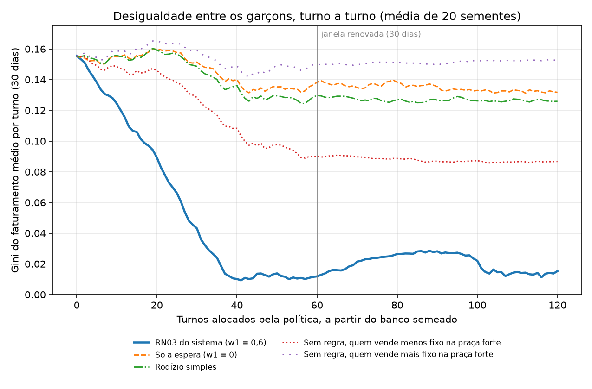

# Evolução da desigualdade com a RN03, turno a turno — GASTRA

**Issue #221.** A validação dos dados simulados mostrou que a RN03 **escolhe** bem um turno: a praça de alto potencial
vai para quem fatura pouco e espera há mais tempo. Faltava mostrar que ela **corrige** a desigualdade ao longo do
tempo, que é a promessa da regra. Este documento mede isso partindo do banco semeado.

**Resultado:** com a RN03 do sistema, a desigualdade entre os garçons cai **92% em 30 dias** — o Gini do faturamento
médio por turno vai de 0,1555 a 0,0118 — e fica abaixo de 0,03 dali em diante. Nenhuma das outras políticas chega
perto.

---

## 1. Pergunta e diferença em relação à calibração

A calibração (`GASTRA_Calibracao_Pesos_RN03.md`) parte de um salão sintético, roda 120 turnos e mede o resultado
**no fim**. Aqui o ponto de partida é o **estado de um banco** — o semeado pela semente 42 — e o que se mede é a
**curva**: a cada turno, o Gini do faturamento médio por turno de cada garçom nos últimos 30 dias, que é a
desigualdade que os próprios garçons percebem e a janela que a RN03 usa.

- **Módulo:** `data-science/src/gastra_analitica/alocacao/evolucao.py` (testado em `tests/test_evolucao.py`).
- **Script:** `data-science/scripts/evolucao_gini_rn03.py`.
- **Resultados brutos:** `evolucao_gini_rn03.csv`, nesta pasta.

## 2. O estado inicial vem do banco

O banco foi semeado com a semente 42 pelo semeador que planta os perfis de consumo (#240, PR #241). Tudo lido das
views, como o serviço analítico lê (D10):

| Dado | Como foi obtido |
|---|---|
| Faturamento de cada turno de cada garçom nos últimos 30 dias | `vw_desempenho_garcom_turno` |
| Turnos desde a última praça de alto potencial | alocações confirmadas, com a mesma regra do backend |
| Movimento de cada praça (média e desvio de comandas por turno) | `vw_faturamento_praca_turno` |
| Ticket médio do restaurante | `vw_comanda_faturamento` |
| **Fator de venda de cada garçom** | **ticket médio das comandas dele ÷ ticket médio do restaurante** |

O fator de venda é estimado dos dados, e não copiado do semeador: quem sugere entrada, sobremesa e a segunda rodada
tem comanda mais cara. As estimativas saíram na ordem e na escala do que o semeador usa (0,70 a 1,42):

| Garçom | 4 | 5 | 6 | 7 | 8 | 9 | 10 |
|---|---|---|---|---|---|---|---|
| Fator de venda estimado | 0,64 | 0,72 | 0,87 | 0,98 | 1,09 | 1,25 | 1,37 |

| Praça | Vagas | Comandas por turno |
|---|---|---|
| 1 | 3 | 15,1 ± 1,5 |
| 2 | 3 | 10,0 ± 1,4 |
| 3 | 2 | 5,0 ± 1,4 |

Ticket médio: R$ 151,81. Gini inicial: **0,1555** — o garçom que mais fatura ganha 2,2 vezes o que menos fatura.

## 3. Como cada turno é simulado

1. Cada garçom está presente com 85% de chance, como na calibração; toda praça recebe pelo menos um.
2. A política distribui os presentes.
3. Cada praça recebe o seu movimento do turno (sorteado com a média e o desvio do banco), e as comandas são divididas
   entre os garçons dela em rodízio, como faz o semeador.
4. Cada comanda vale o ticket médio vezes o fator do garçom, com variação de 30%.
5. Atualizam-se o faturamento de cada um e os turnos desde a praça de alto potencial, e mede-se o Gini da janela.

As políticas comparadas, nas mesmas 20 sementes, por 120 turnos (60 dias):

| Política | O que faz |
|---|---|
| **RN03 do sistema** (w1 = 0,6) | A programação linear do serviço, com os pesos calibrados |
| Só a espera (w1 = 0) | A mesma programação linear, sem olhar faturamento: é a comparação pedida na issue |
| Rodízio simples | A ordem dos garçons gira um passo a cada turno |
| Sem regra, quem vende menos fixo na praça forte | Cada garçom sempre na mesma praça, os de fator baixo na forte |
| Sem regra, quem vende mais fixo na praça forte | A mesma política, com a ordem ao contrário |

## 4. Resultados



| Política | Início | Turno 60 (30 dias) | Turno 120 (60 dias) |
|---|---:|---:|---:|
| **RN03 do sistema (w1 = 0,6)** | 0,1555 | **0,0118** | **0,0153** |
| Só a espera (w1 = 0) | 0,1555 | 0,1383 | 0,1317 |
| Rodízio simples | 0,1555 | 0,1296 | 0,1259 |
| Sem regra, quem vende menos fixo na praça forte | 0,1555 | 0,0899 | 0,0867 |
| Sem regra, quem vende mais fixo na praça forte | 0,1555 | 0,1495 | 0,1525 |

## 5. Leitura

- **A RN03 corrige a desigualdade, e rápido.** O Gini cai continuamente nos primeiros 40 turnos (20 dias), até cerca
  de 0,01, e está em 0,0118 quando a janela de 30 dias termina de se renovar — 92% abaixo do início. Depois disso,
  oscila entre 0,01 e 0,03, sempre muito abaixo de qualquer outra política.
- **Girar sem olhar faturamento não corrige.** O rodízio simples e a política "só a espera" dão a todos a mesma
  chance de pegar a praça forte, mas a diferença de fator de venda continua: quem vende mais continua ganhando mais.
  Só o primeiro fator da RN03 — mandar quem faturou menos para onde há mais movimento — compensa essa diferença.
- **Deixar sem regra é loteria.** A mesma política fixa termina com Gini de 0,087 ou de 0,153, conforme quem calhou de
  ficar na praça forte. Na primeira rodada deste experimento, só a primeira ordem foi testada, e ela pareceu melhor
  que o rodízio; a ordem invertida mostrou que o resultado vinha da coincidência entre o id do garçom e o fator de
  venda, e não da política. A RN03 não depende dessa sorte, porque decide pelo faturamento de cada um.
- **A oscilação depois do turno 60** (o Gini sobe até cerca de 0,028 e volta) coincide com a saída do histórico do
  banco da janela, quando só restam os turnos alocados pela própria regra. A causa não foi investigada a fundo; como
  o valor fica sempre abaixo de 0,03, não muda a conclusão.

## 6. Limites

- **O faturamento é simulado a partir do banco, e o banco é semeado.** O estado inicial é real no sentido de vir das
  views, mas o histórico que o originou é simulado; com operação real, o experimento deve ser repetido.
- **O fator de venda é constante.** Na prática, um garçom melhora ou piora, e a praça forte pode ensinar quem passa
  por ela; o modelo não captura isso.
- **Um único salão**, com três praças de potencial bem diferente, como na calibração.
- **O Gini zero não é o objetivo.** Quem vende mais deve ganhar mais; a RN03 corrige a parte da desigualdade que vem
  da praça, e não do desempenho. O índice de desempenho (RF11) existe justamente para reconhecer o desempenho.

## Como repetir

Com o banco semeado separado (ver `GASTRA_Validacao_Dados_Simulados.md`, "Como repetir"), dentro de `data-science/`:

```bash
GASTRA_VALIDACAO_URL="mysql+pymysql://<usuario>:<senha>@localhost:3307/gastra_validacao" \
    python scripts/evolucao_gini_rn03.py            # cerca de 20 minutos
python scripts/evolucao_gini_rn03.py --reusar       # só refaz o gráfico a partir do CSV
```

Com a mesma semente do semeador e as mesmas 20 sementes, os números se repetem.
