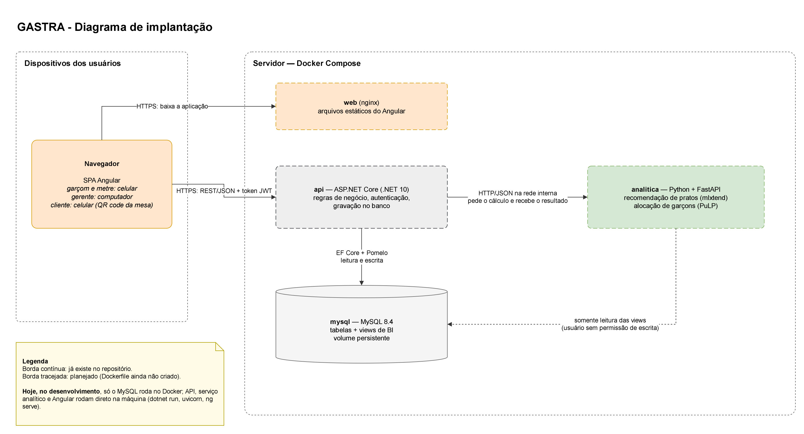
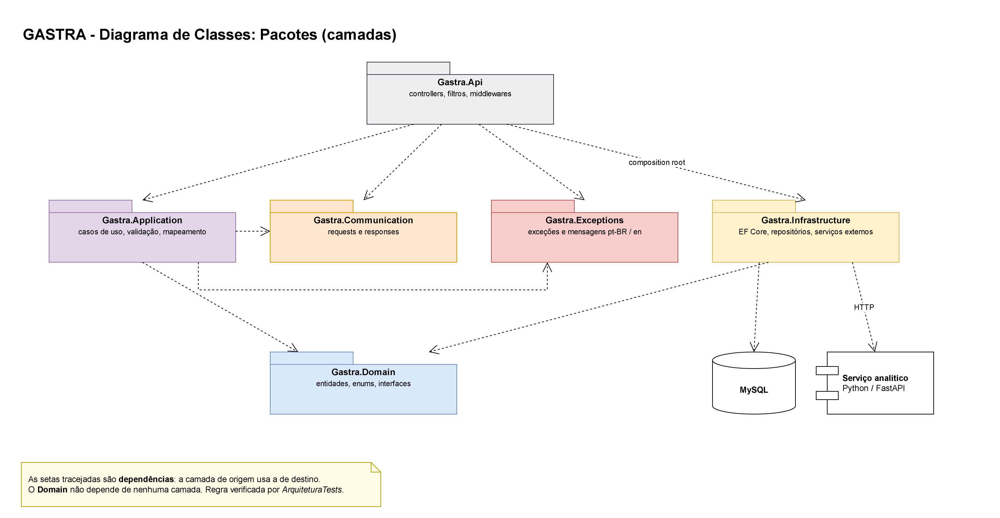
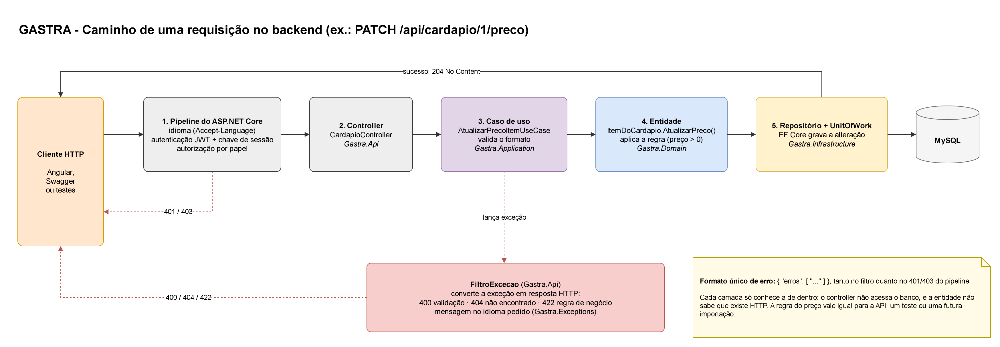

# GASTRA — Arquitetura do Sistema

**TG — FATEC Araraquara** · Autores: Daniel Velluto Bento e Pedro Luis Otrente de Campos ·
Orientador: Prof. Me. Leonardo José de Lima Ferrucci

Documenta a arquitetura do GASTRA: componentes, camadas, decisões técnicas e os *trade-offs* de
cada uma (issue #46). Descreve o sistema **como ele está no repositório**, e separa com clareza o
que já existe do que está planejado.

Substitui `GASTRA_Arquitetura_Tecnologias.docx`, que foi escrito antes de o código existir e
ficou divergente em alguns pontos (seção 12). A versão `.docx` deste documento é gerada a partir
deste arquivo.

**Legenda usada no documento:** ✅ implementado · 🔜 planejado (na versão .docx: ✔ e ○).

---

## 1. Visão geral

O GASTRA tem três componentes de software e um banco de dados:

| Componente | Tecnologia | Responsabilidade | Situação |
|---|---|---|---|
| **Frontend** | Angular 22 (SPA) | Telas do garçom, metre, gerente, coordenador e cliente | ✅ |
| **Backend** | ASP.NET Core (.NET 10) | Regras de negócio, autenticação, autorização, gravação no banco | ✅ cardápio, autenticação, usuários, comandas, praças e mesas, sugestão de pratos, auditoria, alocação de garçons, relatórios de BI, índice de desempenho e promoções |
| **Camada analítica** | Python 3.13 + FastAPI | Cálculos: recomendação de pratos e alocação de garçons por programação linear | ✅ recomendação e alocação, as duas chamadas pelo backend · ✅ leitura do histórico real pelas views (D10) |
| **Banco de dados** | MySQL 8.4 | Dados transacionais e views de BI | ✅ tabelas do cardápio, de acesso e do núcleo de comandas · ✅ views de BI e triggers de auditoria · ✅ promoções |

O princípio que organiza tudo: **o backend é o único dono das regras de negócio e o único que
grava no banco.** O frontend só apresenta e coleta dados; o Python só calcula e devolve o
resultado.

---

## 2. Diagrama de implantação



*Figura 1 — Implantação. Fonte editável: `docs/diagramas/_fontes/GASTRA_Arquitetura_Implantacao.drawio`.*

### 2.1 Dois ambientes

| | Desenvolvimento (hoje) | Demonstração / banca (✅) |
|---|---|---|
| MySQL | contêiner Docker (`infra/docker-compose.yml`), porta 3307 no host | contêiner |
| Backend | `dotnet run` na máquina | contêiner (`backend/Dockerfile`) |
| Camada analítica | `uvicorn` na máquina, porta 8000 | contêiner (`data-science/Dockerfile`) |
| Frontend | `ng serve` na máquina, porta 4200 | contêiner nginx servindo os arquivos compilados e repassando `/api` (D12) |

Os quatro sobem juntos com `docker compose --profile app up -d --build`, e o sistema fica em
`http://localhost:4200`.

**Por que só o MySQL no Docker durante o desenvolvimento:** o código muda a cada minuto, e rodar
API, Python e Angular direto na máquina permite recarregar ao salvar e depurar sem reconstruir
imagens. O banco, ao contrário, precisa ser idêntico para a dupla — e é o que o Docker garante.

**Por que tudo no Docker na demonstração:** um `docker compose up` sobe o sistema inteiro em
qualquer máquina, sem instalar .NET, Python ou Node. Isso reduz o risco no dia da banca.

O Angular aparece fora do servidor no diagrama porque **executa no navegador** do usuário; o
contêiner `web` apenas entrega os arquivos da aplicação.

---

## 3. Decisões de arquitetura

Cada decisão com a alternativa considerada e o custo aceito.

| # | Decisão | Alternativa considerada | Por que esta | Custo aceito |
|---|---|---|---|---|
| D1 | Backend em **camadas separadas em projetos** (seção 4) | Um único projeto com pastas | O compilador impede dependências proibidas (o domínio nem enxerga o banco), e um teste verifica a regra | Mais arquivos e projetos para navegar |
| D2 | Cálculos em **serviço Python separado**, chamado por HTTP | Fazer tudo em C# (ex.: ML.NET) | Python tem as bibliotecas maduras de regras de associação (mlxtend), clusterização (scikit-learn) e programação linear (PuLP) usadas na fundamentação do TG | Um serviço a mais para subir e uma chamada de rede |
| D3 | **Núcleo de comandas não depende do Python** | Consultar o Python ao abrir mesa ou lançar pedido | RNF05: a comanda precisa funcionar o expediente inteiro. Se o Python cair, só a sugestão fica indisponível | A sugestão de pratos/alocação pode faltar temporariamente |
| D4 | **EF Core 9 + Pomelo 9** com a API em .NET 10 | EF Core 10 com outro provider MySQL | O Pomelo é o provider MySQL mais usado no EF Core e ainda não tem versão para o EF 10; o EF Core 9 roda normalmente em .NET 10 | Atualizar para EF 10 quando o Pomelo lançar |
| D5 | **Code First com migrations** | Escrever o schema em SQL à mão (Database First) | O schema é versionado junto com o código, cada alteração vira um arquivo revisável em PR, e o SQL completo é gerado para a documentação | O SQL gerado precisa ser revisado (nomes, tipos, índices) |
| D6 | **Regras de negócio no domínio; banco sem stored procedures** | Procedures para fechamento de comanda e taxa | Regra em C# é testável sem banco e fica num lugar só; procedure duplicaria a regra | Views e triggers só onde o banco é o lugar certo (seção 7) |
| D7 | **JWT + chave de sessão** | Sessão em cookie no servidor | JWT funciona igual para Angular, Swagger e testes; a chave de sessão resolve o ponto fraco do JWT (não dá para "desligar" um token) | Uma consulta ao usuário por requisição autenticada |
| D8 | **Mapster** para converter entidade ↔ response | AutoMapper | Licença MIT; o AutoMapper passou a ter licenciamento comercial a partir da versão 15 | Menos material de referência que o AutoMapper |
| D9 | **Mensagens de erro em arquivos `.resx`** (pt-BR e en) | Textos fixos no código | O idioma é escolhido por requisição e nenhuma mensagem fica espalhada pelo código | Toda mensagem nova precisa entrar nos dois arquivos |
| D10 | **Python lê o histórico só por views, com usuário somente leitura** ✅ *(aprovada pela dupla em 15/09; implementada no #121)* | O backend enviar todo o histórico em cada chamada | As regras de associação precisam de todo o histórico de pedidos; mandar isso a cada chamada é pesado. A view entrega só colunas agregadas, sem dado pessoal, e o usuário não consegue gravar | O Python passa a conhecer o nome das views |
| D11 | **Dados simulados por ferramenta de console que escreve pelo domínio** (`backend/tools/GastraSemeador`) | Semear pela API REST, ou por script SQL direto | Pela API não dá: toda comanda nasce com `DateTime.UtcNow`, e o histórico precisa de datas do passado para as views por turno, dia e hora e para a janela de 30 dias da RN03. SQL direto daria as datas, mas passaria por cima das regras do domínio (composição da mesa, taxa, totais, hash de senha) e geraria dado que o sistema nunca produziria | A ferramenta grava com o `GastraDbContext` e ajusta só as datas pela API de propriedades do EF, que enxerga o setter privado. Fica fora da solução e recusa rodar fora de `Development` |
| D12 | **No contêiner, o nginx serve a SPA e repassa `/api` para a API** (mesma origem) | Manter origens diferentes e liberar a origem do contêiner no CORS | Sem origem cruzada não existe CORS para configurar nem para errar, e o celular na rede local funciona pelo IP da máquina **sem recompilar**, porque a página sempre chama o endereço por onde ela mesma foi aberta | O Angular compilado é estático, então a URL da API entra no build: `environment.ts` no desenvolvimento (absoluta, porque `ng serve` e API são portas diferentes) e `environment.production.ts` no contêiner (relativa). Um build de produção servido fora do proxy não acha a API |
| D13 | **Duas camadas contra tentativa e erro: bloqueio da conta (RN09) e limite por IP**, com a API lendo o IP real no `X-Forwarded-For` só quando a conexão vem da rede do Docker (#230) | Só limite por IP; só bloqueio de conta; confiar no `X-Forwarded-For` de qualquer origem | Cada camada cobre o que a outra não vê. O bloqueio protege **uma conta** de muitos palpites, venham de onde vierem; o limite protege contra quem testa **muitas contas** ou muitos códigos de cliente do mesmo endereço. Atrás do nginx (D12), sem ler o cabeçalho, a API veria todo mundo com o IP do nginx: o limite viraria uma cota única para o restaurante inteiro e a auditoria registraria o IP errado. Confiar no cabeçalho vindo de qualquer lugar deixaria o cliente escolher o próprio IP | Bloqueio conta erros de senha **e** de código 2FA e só zera num acesso completo. Login bloqueado responde a mesma mensagem da senha errada. Porta da API publicada só em `127.0.0.1`: de fora, o caminho é o nginx |

---

## 4. Backend — arquitetura em camadas



*Figura 2 — Camadas do backend e dependências. Fonte: `docs/diagramas/_fontes/GASTRA_Classe_Pacotes.drawio`
(mesmo diagrama do Diagrama de Classes por Camadas).*

### 4.1 Responsabilidade de cada camada

| Projeto | Contém | Pode referenciar |
|---|---|---|
| `Gastra.Domain` | Entidades com suas regras (`ItemDoCardapio`, `Usuario`), enums e **interfaces** de repositório, segurança e serviço analítico | nenhuma camada |
| `Gastra.Application` | **Casos de uso** (um por arquivo, ex.: `CadastrarUsuarioUseCase`), validadores de formato e configuração do Mapster | `Domain`, `Communication`, `Exceptions` |
| `Gastra.Communication` | **Contratos da API**: requests e responses (os DTOs) e enums expostos | nenhuma camada |
| `Gastra.Exceptions` | Exceções de negócio com o código HTTP de cada uma e as mensagens pt-BR/en | nenhuma camada |
| `Gastra.Infrastructure` | **Implementações** das interfaces do domínio: `GastraDbContext`, repositórios, migrations, BCrypt, JWT, TOTP, cliente HTTP do serviço Python (`ServicoAnaliticoHttp`) | `Domain` |
| `Gastra.Api` | Controllers, filtro de exceções, configuração de autenticação e Swagger, `Program.cs` | todas (é a *composition root*) |

**Por que `Communication` e `Exceptions` são projetos próprios:** os contratos da API não podem
ser as entidades — se fossem, qualquer mudança no banco mudaria o JSON que o Angular recebe, e
campos como `SenhaHash` poderiam vazar. As exceções ficam separadas para a `Application` lançar
erros sem depender da camada web.

**Por que a `Api` referencia a `Infrastructure`:** só para registrar as implementações na
injeção de dependência ao iniciar. Os controllers conversam apenas com casos de uso.

### 4.2 A regra de dependência é verificada por teste

`backend/tests/Gastra.Api.Tests/ArquiteturaTests.cs` inspeciona o código compilado de cada camada e
falha se alguma delas depender de outra que não está na tabela acima. A arquitetura não depende de
disciplina: se alguém quebrar a regra, o `dotnet test` avisa.

### 4.3 Inversão de dependência

O domínio **define** o que precisa (`IRepositorioUsuario`, `ICriptografiaSenha`,
`IServicoAnalitico`), e a infraestrutura **implementa** (`RepositorioUsuario` com EF Core,
`CriptografiaSenha` com BCrypt, `ServicoAnaliticoHttp` com `HttpClient`). Trocar o MySQL, o algoritmo de hash
ou o serviço Python não exige mexer em regra de negócio — e os testes podem trocar o banco real
por um banco em memória.

### 4.4 Caminho de uma requisição



*Figura 3 — Caminho de uma requisição. Fonte: `docs/diagramas/_fontes/GASTRA_Arquitetura_Fluxo_Requisicao.drawio`.*

1. **Pipeline do ASP.NET Core:** define o idioma pelo cabeçalho `Accept-Language`, valida o
   token JWT e a chave de sessão, e confere o papel exigido pelo controller.
2. **Controller:** recebe o JSON e chama o caso de uso; não tem regra.
3. **Caso de uso:** valida o formato dos dados, busca a entidade pelo repositório e coordena a
   operação.
4. **Entidade:** aplica a regra de negócio (ex.: preço maior que zero).
5. **Repositório + UnitOfWork:** o EF Core grava tudo numa única transação (`Commit`).

Se algo falha, o caso de uso lança uma exceção de `Gastra.Exceptions` e o `FiltroExcecao`
transforma em resposta HTTP. Todos os erros saem no mesmo formato:

```json
{ "erros": ["O preço deve ser maior que zero."] }
```

### 4.5 Aspectos transversais

| Aspecto | Como está implementado | Onde |
|---|---|---|
| Tratamento de erros | Filtro global (`FiltroExcecao`) mapeia `ErroValidacaoException` → 400, `NaoAutenticadoException` → 401, `NaoEncontradoException` → 404, `RegraDeNegocioException` → 422; exceção inesperada → 500 com mensagem genérica. JSON inválido também devolve o formato padrão | `Gastra.Api/Filtros`, `Gastra.Exceptions` |
| Internacionalização | `UseRequestLocalization` com pt-BR (padrão) e en; mensagens em `MensagensErro.resx` e `MensagensErro.en.resx` | `Program.cs`, `Gastra.Exceptions` |
| Injeção de dependência | Contêiner nativo do ASP.NET Core; cada camada expõe `AddApplication()` / `AddInfrastructure()` | `DependencyInjectionExtension.cs` |
| Mapeamento | Mapster, com enums convertidos **pelo nome** (reordenar um enum não troca valores) | `Gastra.Application/Mapeamento` |
| Autenticação e autorização | Seção 8 | `Gastra.Api/Configuracao`, `Gastra.Infrastructure/Seguranca` |
| Documentação da API | Especificação OpenAPI gerada pelo ASP.NET Core e Swagger UI em `/swagger`, só em desenvolvimento (PR #98) | `Gastra.Api/Configuracao/DocumentacaoOpenApi.cs` |
| Saúde | `GET /health` responde `Healthy` | `Program.cs` |

---

## 5. Camada analítica — Python

### 5.1 Estrutura

```
data-science/src/gastra_analitica/
├── api/            # FastAPI: recebe a requisição, chama o algoritmo, devolve JSON
├── recomendacao/   # ✅ regras de associação (mlxtend, pandas)
├── alocacao/       # ✅ programação linear da alocação de garçons (PuLP + solver CBC)
└── dados/          # ✅ simulador de histórico, usado enquanto o banco não tem movimento real
```

Os algoritmos **não importam o FastAPI**: são funções Python comuns, testáveis e reaproveitáveis
nos notebooks do TG. `tests/test_arquitetura.py` verifica isso automaticamente.

### 5.2 Integração com o backend

| Uso | Quem chama | O que vai na requisição | O que volta |
|---|---|---|---|
| Sugestão de alocação (RF06, RN03) ✅ | Backend, quando o metre pede a sugestão (`POST /api/alocacoes/sugestao`) | Garçons presentes com faturamento acumulado e turnos desde a praça de alto potencial; praças com vagas e faturamento médio; pesos w1 e w2 | Pares garçom → praça, conferidos pelo backend antes de gravar |
| Sugestão de pratos (RF09) ✅ | Backend, quando o garçom abre as sugestões (`GET /api/comandas/{id}/sugestoes`) | Itens já pedidos e itens permitidos (disponíveis, fora da comanda, compatíveis com a restrição) | Ids sugeridos, em ordem |

- O backend chama o serviço por meio de `IServicoAnalitico` (domínio), implementado por
  `ServicoAnaliticoHttp` (infraestrutura), com tempo limite de 2 s (configurável em
  `ServicoAnalitico:TempoLimiteMilissegundos`).
- **Falha não derruba o atendimento (D3):** fora do ar, lento ou com resposta inválida, o
  `ServicoAnaliticoHttp` lança `ServicoAnaliticoIndisponivelException`. O caso de uso responde a lista
  vazia com `servicoDisponivel = false`.
- **O backend decide, o Python ordena:** o backend manda só os itens que podem ser oferecidos e, na
  volta, descarta qualquer id fora dessa lista.
- **O Python nunca grava.** O resultado volta ao backend, que valida e persiste (ex.: a alocação
  confirmada pelo metre, RF07).
- **Leitura do histórico (decisão D10):** o Python lê somente views analíticas, com um
  usuário MySQL que só tem permissão de `SELECT` nessas views. As views não expõem dado pessoal.
  O usuário é criado por `infra/criar-usuario-analitico.sh`. Sem banco, fora do ar ou com menos de 50
  comandas no último ano, a recomendação volta ao histórico simulado e diz o motivo na resposta.
- **Solver da programação linear:** `pulp.COIN_CMD(path=cbcbox.cbc_bin_path())`. O solver
  embutido antigo (`PULP_CBC_CMD`) está obsoleto e será removido no PuLP 4.0.

---

## 6. Frontend — Angular

| Item | Decisão | Situação |
|---|---|---|
| Tipo de aplicação | SPA com componentes *standalone*, SCSS e testes com Vitest | ✅ criado |
| Organização | Por módulo funcional: `acesso`, `alocacao`, `analises`, `cardapio`, `cliente`, `comandas`, `salao` e `usuarios`, além de `core` (interceptador do token, guardas de rota por papel) e `shared` (componentes comuns) — issue #82 | ✅ |
| Comunicação | Chamadas REST ao backend; um interceptador anexa o token JWT; erros exibidos a partir do formato `{ erros: [...] }` | ✅ |
| Telas do garçom e metre | *Mobile first*: uso no celular, em pé, com pressa. RNF02: abrir mesa e lançar item em no máximo 5 toques | ✅ |
| Telas do gerente | Computador, com tabelas e dashboards de BI | ✅ |
| Cliente | Cardápio digital, consulta da comanda e avaliação do atendimento (RF25), sem login | ✅ |
| Prototipagem | Protótipo navegável em HTML (`docs/ux-ui/prototipo/`), importado no Figma pelo plugin html.to.design. Avaliação de Nielsen pendente (issues #80, #101, #102) | ✅ protótipo · 🔜 Nielsen |

---

## 7. Banco de dados

| Item | Decisão |
|---|---|
| SGBD | MySQL 8.4, em contêiner Docker com volume persistente |
| Criação do schema | Migrations do EF Core (D5); o SQL completo fica em `docs/modelagem/GASTRA_Schema.sql`, gerado com `dotnet ef migrations script` |
| Convenções | Tabelas e colunas em `snake_case`; enums gravados como texto (legível em consultas de BI); valores monetários em `decimal(10,2)` |
| Tabelas existentes ✅ | `item_cardapio`, `item_cardapio_flag` (flags dietéticas em tabela própria, 1FN), `usuario`, `praca`, `mesa`, `comanda`, `item_pedido`, `restricao_alimentar`, `alocacao`, `registro_auditoria` |
| Tabelas de promoção ✅ | `promocao` e a tabela associativa `promocao_item_cardapio` |
| **Views** ✅ | Leitura para BI e para o Python, sem dado pessoal: faturamento por comanda, por praça e turno, faturamento médio por praça (atributo derivado, nunca armazenado), bases do índice de desempenho do garçom, faturamento por item e itens por comanda. O índice em si é calculado na aplicação, porque tem pesos e depende do período escolhido. Lista e justificativas em `docs/modelagem/GASTRA_Objetos_Banco.md` |
| **Triggers** ✅ | Só para proteger a tabela de auditoria: impedir `UPDATE` e `DELETE` |
| **Stored procedures** | Não usadas (D6) |

**Por que a auditoria é gravada pela aplicação e não por trigger:** um trigger não sabe *quem* fez
a alteração nem *por qual* caso de uso — a aplicação sabe. O trigger entra só como segunda
barreira, garantindo que o registro de auditoria não seja alterado depois
(`GASTRA_Politica_Log_Auditoria.md`, seção 8).

---

## 8. Segurança e LGPD

| Tema | Implementação | Situação |
|---|---|---|
| Senhas (RN06) | Hash BCrypt, fator de custo 12; senha entre 8 caracteres e 72 bytes (limite do BCrypt) | ✅ |
| Login | Mesma mensagem e mesmo tempo de resposta para e-mail inexistente e senha errada (evita descobrir e-mails cadastrados) | ✅ |
| Bloqueio por tentativas (RN09) | 5 erros seguidos de senha ou de código 2FA bloqueiam a conta por 15 minutos; só um acesso completo zera a contagem; conta bloqueada responde como senha errada (D13) | ✅ |
| Limite por IP | Login, 2FA, consulta e avaliação do cliente: cota por minuto e por IP, resposta 429 traduzida; IP real lido do `X-Forwarded-For` só vindo do nginx (D13) | ✅ |
| Segundo fator (RF16, RN07) | TOTP de 6 dígitos (RFC 6238) para Gerente e Coordenador; o segredo é gerado uma única vez e gravado **criptografado** (ASP.NET Data Protection) | ✅ |
| Token de acesso | JWT assinado, válido por 8 horas. Na etapa do segundo fator, um token de 5 minutos com audiência própria, que não abre nenhum endpoint | ✅ |
| Logoff e inativação imediatos | Cada usuário tem uma `chave_sessao` que vai no token e é conferida a cada requisição. Logoff, inativação e troca de papel trocam a chave | ✅ |
| Autorização por papel (RNF04) | `[Authorize(Roles = ...)]` em cada controller; endpoints do cliente marcados como públicos | ✅ |
| Segredos | Chave JWT, senha do banco e administrador inicial ficam em `appsettings.Development.json` e `.env`, **fora do Git** | ✅ |
| Log e auditoria (RNF03, RN04, RN05) | Conforme `GASTRA_Politica_Log_Auditoria.md`: auditoria por 6 meses, log técnico por 30 dias, IP só no login, restrição alimentar tratada como dado sensível e nunca registrada em log | ✅ |
| Restrição alimentar (RF14) | Vinculada só à comanda ativa; ao fechar a comanda, a observação livre é apagada e fica apenas a categoria | ✅ |

### 8.1 OWASP Top 10 como referência

O OWASP Top 10 não é uma ferramenta a instalar: é a lista de riscos usada para revisar o sistema.

| Risco (OWASP Top 10, 2021) | Como o GASTRA trata |
|---|---|
| A01 Quebra de controle de acesso | Autorização por papel em todo controller; chave de sessão invalida tokens na hora |
| A02 Falhas criptográficas | BCrypt nas senhas; segredo TOTP criptografado; HTTPS |
| A03 Injeção | Acesso ao banco só pelo EF Core, com consultas parametrizadas |
| A05 Configuração incorreta | Segredos fora do Git; Swagger desativado fora do desenvolvimento |
| A07 Falhas de identificação e autenticação | Segundo fator para perfis de gestão; mensagem única no login; tempo de resposta constante; bloqueio da conta após 5 erros e limite de tentativas por IP (D13) |
| A09 Falhas de log e monitoramento | Política de log e auditoria definida |

---

## 9. Qualidade e testes

| Tipo | Ferramenta | O que cobre | Situação |
|---|---|---|---|
| Unitário de domínio | xUnit (`Gastra.Domain.Tests`) | Regras das entidades sem banco nem HTTP | ✅ |
| Integração da API | xUnit + `WebApplicationFactory` + EF Core InMemory (`Gastra.Api.Tests`) | Requisições reais de ponta a ponta: status, mensagens, permissões, 2FA | ✅ |
| Arquitetura | `ArquiteturaTests` (C#) e `test_arquitetura.py` (Python) | Regra de dependência entre camadas | ✅ |
| Python | pytest | Serviço FastAPI e os algoritmos (recomendação, alocação, calibração) | ✅ |
| Frontend | Vitest | Componentes e serviços, ao lado de cada tela | ✅ |
| Análise estática | SonarCloud | Qualidade e duplicação de código | 🔜 no fim do desenvolvimento |

---

## 10. Tecnologias e justificativas

| Tecnologia | Versão | Camada | Por que no GASTRA |
|---|---|---|---|
| ASP.NET Core | .NET 10 | Backend | Definido no projeto de pesquisa; tipagem forte protege as regras de negócio (RN01–RN07) |
| Entity Framework Core + Pomelo | 9.0 | Infrastructure | Mapeamento objeto-relacional e migrations versionadas (D4, D5) |
| MySQL | 8.4 | Banco | Definido no projeto de pesquisa; dados transacionais exigem consistência relacional |
| Mapster | 10.0 | Application | Conversão entidade ↔ response, licença MIT (D8) |
| BCrypt.Net-Next | 4.2 | Infrastructure | Hash de senha com custo ajustável (RN06) |
| Otp.NET | 1.4 | Infrastructure | Códigos TOTP do app autenticador (RN07) |
| JwtBearer | 10.0 | Api | Autenticação por token (D7) |
| Swashbuckle SwaggerUI | 10.2 | Api | Tela interativa sobre a especificação OpenAPI nativa |
| xUnit | — | Testes | Testes de domínio, integração e arquitetura |
| Python + FastAPI | 3.13 / 0.141 | Analítica | Bibliotecas de ciência de dados maduras; FastAPI é leve para expor poucos endpoints (D2) |
| pandas, scikit-learn, mlxtend | 3.0 / 1.9 / 0.25 | Analítica | Preparação de dados, clusterização e regras de associação (RF09) |
| PuLP + CBC | 3.3 | Analítica | Programação linear da alocação de garçons (RN03) |
| Angular | 22 | Frontend | Definido no projeto de pesquisa; SPA adequada à comanda em tempo real (RF13) |
| Docker Compose | — | Infraestrutura | Banco idêntico para a dupla; demonstração com um comando (seção 2.1) |
| Figma | — | Prototipagem | Protótipo navegável e avaliação de Nielsen antes de implementar as telas |
| draw.io, brModelo | — | Documentação | Diagramas UML (fonte versionada) e DER |
| GitHub (GitFlow, PRs, Projects) | — | Processo | Revisão cruzada de todo código e documento; rastreio das sprints |

---

## 11. Decisões em aberto

| Tema | Situação |
|---|---|
| Biblioteca de componentes do Angular | Escolher junto com o protótipo no Figma (ex.: Angular Material ou PrimeNG) |
| Dockerfiles da API, do Python e do frontend | Criar antes da fase de validação, para a demonstração |
| SonarCloud | Configurar no fim do desenvolvimento |

---

## 12. Correções em relação à versão anterior

O documento `GASTRA_Arquitetura_Tecnologias.docx` (PR #97) foi escrito antes da implementação.
Pontos corrigidos para refletir o sistema real:

| Versão anterior | Como é |
|---|---|
| `Communication` seria o cliente HTTP do serviço Python | `Communication` guarda requests e responses; o cliente HTTP do Python fica na `Infrastructure` |
| `Communication` implementaria interfaces do domínio | `Communication` não referencia nenhuma camada |
| `Application` teria *services* e DTOs | `Application` tem casos de uso; os DTOs ficam em `Communication` |
| Exceções, i18n e filtros como camada *cross-cutting* | Exceções e mensagens são o projeto `Gastra.Exceptions`, usado pela `Application` e pela `Api`; o domínio não o referencia |
| Strategy Pattern já adotado em `IEstrategiaAlocacao` e `IRecomendador` | Substituídas por `IServicoAnalitico` no diagrama de classes (#92), porque o cálculo acontece no Python |
| Mapster com erros detectados em tempo de build | O projeto usa `Adapt` em tempo de execução; os testes de integração é que detectam mapeamentos errados |
| *Exception Handling Middleware* e *Filters* para autorização | Erros tratados por filtro (`FiltroExcecao`); autorização por atributo `[Authorize]` com JWT |
| O Python nunca acessa o MySQL | Mantido para escrita; para leitura do histórico, decisão D10 (views, somente leitura) |
| Diagrama de implantação sem ligação entre API e Python e sem servidor para o Angular | Figura 1 |
