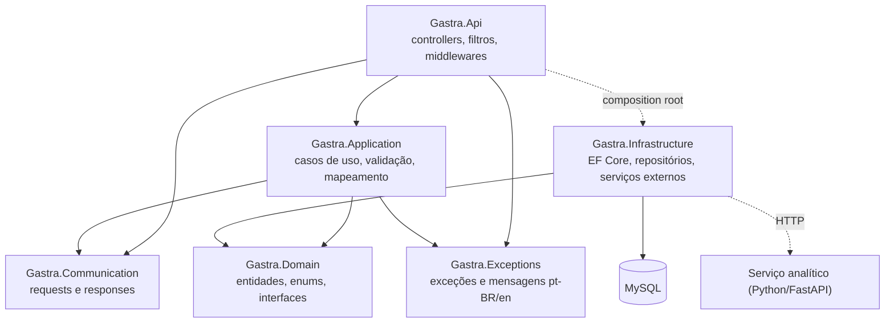
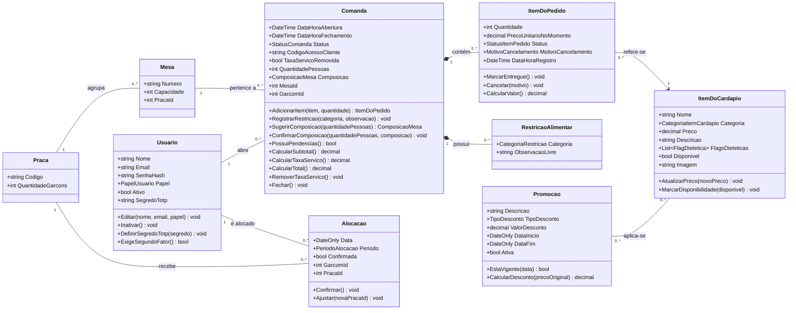
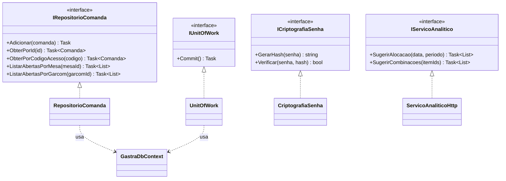
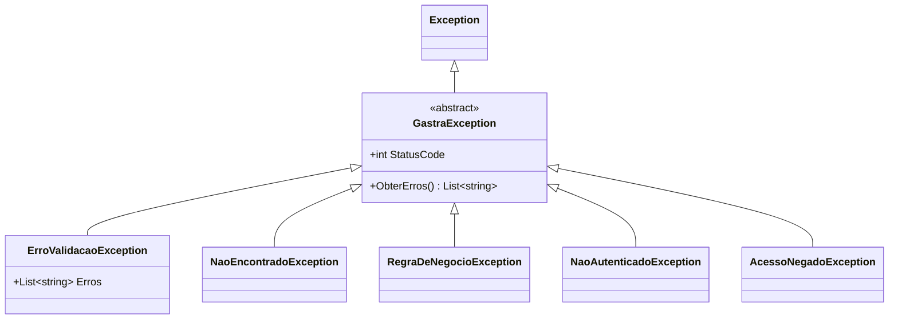
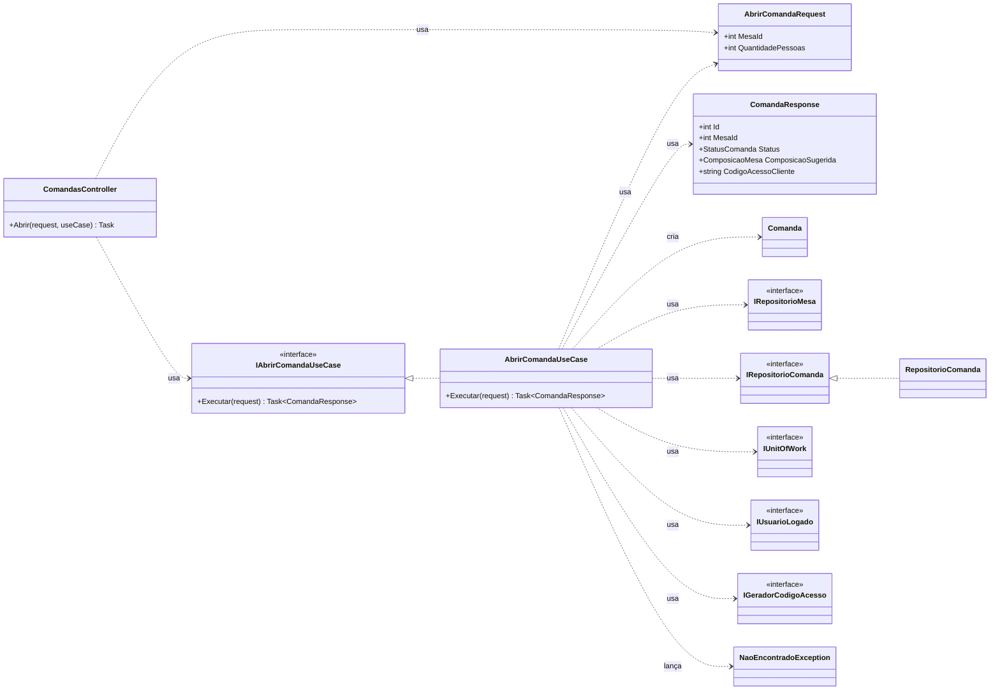

# GASTRA — Diagrama de Classes por Camadas

Especificação do diagrama de classes separado por responsabilidades, conforme a arquitetura em
camadas do backend (issue #79). Serve de referência para redesenhar o diagrama no draw.io: cada
classe traz atributos, métodos, relações, tipo de relação e multiplicidade.

Fontes: MER e DER atuais (`docs/modelagem/`), diagrama de classes da Sprint 2
(`docs/diagramas/classe/`), casos de uso UC01–UC22, RF/RN (`docs/requisitos/`), KPIs e critérios
analíticos, política de log (`GASTRA_Politica_Log_Auditoria.md`) e a estrutura real do backend.

---

## 0. Como usar este documento

### 0.1 Quantos diagramas desenhar

Um diagrama único com todas as camadas fica ilegível (o atual já tem ~30 classes). A proposta é
dividir em **quatro diagramas**, cada um respondendo uma pergunta:

| # | Diagrama | Pergunta que responde | Seção |
|---|---|---|---|
| 1 | Pacotes (camadas) | Quais são as camadas e quem depende de quem? | 2 |
| 2 | Classes do Domínio | Quais são as entidades, seus dados, regras e relações? *(corresponde ao DER)* | 3 |
| 3 | Contratos e implementações | Quais interfaces o domínio define e quem as implementa? | 4 e 8 |
| 4 | Fatia vertical — Comandas | Como uma requisição atravessa as camadas? | 10 |

As seções 5 a 9 detalham as classes das demais camadas em tabelas, para consulta.

### 0.2 Tipos de relação (notação UML)

| Relação | Desenho | Quando usar no GASTRA | Tem multiplicidade? |
|---|---|---|---|
| **Associação** | linha contínua | uma entidade referencia outra (Mesa → Praça) | **sim** |
| **Composição** | linha contínua com **losango preenchido** no lado do todo | a parte não existe sem o todo e morre com ele (ItemDoPedido em Comanda) | **sim**; o lado do todo é sempre `1` |
| **Agregação** | losango vazado | **não usar**: em UML 2 a semântica é vaga; use associação | — |
| **Generalização** | linha contínua com **triângulo vazado** no pai | herança (`Comanda` herda `EntidadeBase`) | não |
| **Realização** | linha **tracejada** com **triângulo vazado** na interface | classe implementa interface (`RepositorioComanda` → `IRepositorioComanda`) | não |
| **Dependência** | linha **tracejada** com **seta aberta**, estereótipo «usa» | uma classe usa outra sem guardá-la como atributo (caso de uso usa repositório, DTO, exceção) | não |

### 0.3 Multiplicidade

No diagrama de classes, a multiplicidade escrita **perto da classe B** diz *quantos objetos de B se
ligam a um objeto de A* — é a leitura inversa do par `(min,max)` do DER no padrão brModelo.

| UML | Leitura | Equivalente DER (ao lado da outra entidade) |
|---|---|---|
| `1` | exatamente um | `(1,1)` |
| `0..1` | nenhum ou um | `(0,1)` |
| `0..*` | nenhum ou vários | `(0,n)` |
| `1..*` | um ou vários | `(1,n)` |

Exemplo: `Praca "1" —— "0..*" Mesa` lê-se *uma praça agrupa de 0 a n mesas; cada mesa pertence a
exatamente uma praça*. No DER isso aparece como Mesa `(1,1)` e Praça `(0,n)`.

### 0.4 Convenções de nomes

| Elemento | Convenção | Exemplo |
|---|---|---|
| Classe, enum, propriedade, método | PascalCase, português | `Comanda`, `DataHoraAbertura`, `Fechar()` |
| Interface | prefixo `I` | `IRepositorioComanda` |
| Caso de uso | nome da ação + sufixo `UseCase` | `AbrirComandaUseCase` |
| Request / Response | nome da ação ou recurso + `Request` / `Response` | `AbrirComandaRequest`, `ComandaResponse` |
| Exceção | sufixo `Exception` | `RegraDeNegocioException` |
| Coluna do banco | snake_case, definida no mapeamento da Infrastructure | `data_hora_abertura` |

**Por que o diagrama de classes não usa `id_mesa`, `data_hora_abertura`:** o MER e o DER descrevem
o **banco**; o diagrama de classes descreve o **código C#**, que segue a convenção da linguagem. A
tradução de `DataHoraAbertura` para a coluna `data_hora_abertura` fica no mapeamento do Entity
Framework, na camada Infrastructure. O identificador de cada entidade vira `Id`, herdado de
`EntidadeBase`.

### 0.5 Visibilidade

`+` público, `-` privado. Nas entidades, as propriedades são públicas para leitura e **só alteradas
pelos métodos da própria entidade** (em C#: `{ get; private set; }`). Isso garante que regras como
a RN02 não sejam contornadas mudando `Status` diretamente.

---

## 1. Resumo das mudanças em relação ao diagrama atual

| # | Mudança | Motivo |
|---|---|---|
| 1 | Diagrama único dividido em 4 diagramas | legibilidade; um diagrama por pergunta (seção 0.1) |
| 2 | Atributos em PascalCase e `Id` herdado de `EntidadeBase` | convenção do C# (seção 0.4) |
| 3 | `Repositorio*` concretos viram **interfaces no Domain** (`IRepositorio*`) + implementações na Infrastructure | regra de dependência: o domínio não conhece o banco |
| 4 | **Removido** `Comanda.consultarComanda(codigoAcesso): ComandaConsultaDTO` | o Domain **não pode** referenciar DTOs da Communication — a regra é verificada pelo `ArquiteturaTests`. A consulta vira o caso de uso `ConsultarComandaClienteUseCase` |
| 5 | `ComandaConsultaDTO` / `ItemConsultaDTO` viram `ComandaClienteResponse` / `ItemComandaClienteResponse` na Communication | DTOs são contratos da API |
| 6 | **Removidos** `Usuario.autenticar()`, `confirmarSegundoFator()`, `encerrarSessao()` | autenticação envolve hash de senha, token e TOTP — serviços técnicos. Viram casos de uso na Application usando interfaces de segurança do Domain (seção 4.2) |
| 7 | **Removido** `Praca.calcularFaturamentoMedioHistorico()` e o atributo derivado da entidade | o valor vem da view de faturamento (decisão da dupla: views no banco) via `IRepositorioIndicadores` |
| 8 | **Removido** `Promocao.remover()` | remover é operação de persistência: `IRepositorioPromocao.Remover()` |
| 9 | `ServicoAlocacao`/`IEstrategiaAlocacao` e `ServicoRecomendacao`/`IRecomendador` viram `IServicoAnalitico` (Domain) + `ServicoAnaliticoHttp` (Infrastructure) | o cálculo acontece no Python (FastAPI); o C# só chama o serviço |
| 10 | Novos métodos com regra de negócio em `Comanda`, `ItemDoPedido`, `Alocacao`, `Promocao`, `Usuario` | modelo de domínio rico: a regra fica junto do dado (seção 3.3) |
| 11 | **Atributos faltantes** adicionados (seção 1.1) | necessários para RF/RN já aprovados |
| 12 | Correções pendentes: `Vegetario` → `Vegetariano`; `listarPorPeriodo(periodo: string)` → `PeriodoAlocacao` | revisão do PR #75 |

### 1.1 Atributos faltantes encontrados

| Classe | Atributo novo | Tipo | Por que falta | Impacto no MER/DER |
|---|---|---|---|---|
| `Praca` | `QuantidadeGarcons` | `int` | a restrição do problema de designação exige o número de garçons que cada praça comporta (Σᵢ xᵢⱼ = Nⱼ — KPIs, seção 1). Sem esse dado a programação linear não tem como ser montada | novo atributo em ENT02 |
| `Comanda` | `QuantidadePessoas` | `int` | a RN01 classifica a composição pelo número de pessoas (Solo 1, Casal 2…) | novo atributo em ENT04 |
| `Comanda` | `Composicao` | `ComposicaoMesa` | a RF02 pede que o garçom **confirme ou ajuste** a composição sugerida — o valor confirmado precisa ser guardado. Também é sinal de consumo para a recomendação (RF09) | novo atributo em ENT04 |
| `ItemDoPedido` | `DataHoraRegistro` | `DateTime` | a lista de pendências (RF03/RN02) e o sinal "horário do pedido" da recomendação dependem do momento de cada item, não só da abertura da comanda | novo atributo em ENT06 |
| `ItemDoCardapio` | `Categoria` passa de `string` para `CategoriaItemCardapio` | enum | os KPIs agregam "faturamento por categoria (entrada, prato principal, sobremesa, bebida)"; texto livre quebra a agregação | domínio fechado em ENT05 |

---

## 2. Diagrama 1 — Pacotes (camadas)

As setas são **dependências**: a camada de origem usa a de destino.

---

## 3. Diagrama 2 — Classes do Domínio (`Gastra.Domain`)

### 3.1 Enumerações

| Enum | Valores | Usado em | Situação |
|---|---|---|---|
| `PapelUsuario` | Gerente, Coordenador, Metre, Garcom | `Usuario.Papel` | existente |
| `StatusComanda` | Aberta, Fechada, Cancelada | `Comanda.Status` | existente — `Cancelada` sem caminho definido (seção 11) |
| `StatusItemPedido` | Pendente, Entregue, Cancelado | `ItemDoPedido.Status` | existente |
| `MotivoCancelamento` | ErroDeLancamento, ClienteDesistiu, ItemEmFalta | `ItemDoPedido.MotivoCancelamento` | existente |
| `CategoriaRestricao` | Vegano, Vegetariano, SemGluten, SemLactose, Alergia, Outro | `RestricaoAlimentar.Categoria` | existente |
| `FlagDietetica` | Vegano, **Vegetariano**, SemGluten, SemLactose, OpcaoInfantil | `ItemDoCardapio.FlagsDieteticas` | corrigir `Vegetario` |
| `TipoDesconto` | Percentual, ValorFixo | `Promocao.TipoDesconto` | existente |
| `PeriodoAlocacao` | Almoco, Jantar | `Alocacao.Periodo` | existente |
| `ComposicaoMesa` | Solo, Casal, GrupoPequeno, Familia, GrupoGrande | `Comanda.Composicao` | **novo** (RN01) |
| `CategoriaItemCardapio` | Entrada, PratoPrincipal, Sobremesa, Bebida | `ItemDoCardapio.Categoria` | **novo** (KPIs) |

### 3.2 Entidades — atributos

Todas herdam de `EntidadeBase` (`+Id: int`).

| Entidade | Atributos |
|---|---|
| **Praca** | `+Codigo: string`, `+QuantidadeGarcons: int` *(novo)* |
| **Mesa** | `+Numero: string`, `+Capacidade: int`, `+PracaId: int` |
| **Usuario** | `+Nome: string`, `+Email: string`, `+SenhaHash: string`, `+Papel: PapelUsuario`, `+Ativo: bool`, `+SegredoTotp: string?` |
| **Comanda** | `+DataHoraAbertura: DateTime`, `+DataHoraFechamento: DateTime?`, `+Status: StatusComanda`, `+CodigoAcessoCliente: string`, `+TaxaServicoRemovida: bool`, `+QuantidadePessoas: int` *(novo)*, `+Composicao: ComposicaoMesa` *(novo)*, `+MesaId: int`, `+GarcomId: int`, `+Itens: IReadOnlyCollection<ItemDoPedido>`, `+Restricoes: IReadOnlyCollection<RestricaoAlimentar>` |
| **ItemDoPedido** | `+Quantidade: int`, `+PrecoUnitarioNoMomento: decimal`, `+Status: StatusItemPedido`, `+MotivoCancelamento: MotivoCancelamento?`, `+DataHoraRegistro: DateTime` *(novo)*, `+ComandaId: int`, `+ItemDoCardapioId: int` |
| **RestricaoAlimentar** | `+Categoria: CategoriaRestricao`, `+ObservacaoLivre: string?`, `+ComandaId: int` |
| **ItemDoCardapio** | `+Nome: string`, `+Categoria: CategoriaItemCardapio` *(alterado)*, `+Preco: decimal`, `+Descricao: string`, `+FlagsDieteticas: IReadOnlyCollection<FlagDietetica>`, `+Disponivel: bool`, `+Imagem: string?` |
| **Promocao** | `+Descricao: string`, `+TipoDesconto: TipoDesconto`, `+ValorDesconto: decimal`, `+DataInicio: DateOnly`, `+DataFim: DateOnly`, `+Ativa: bool`, `+Itens: IReadOnlyCollection<ItemDoCardapio>` |
| **Alocacao** | `+Data: DateOnly`, `+Periodo: PeriodoAlocacao`, `+Confirmada: bool`, `+GarcomId: int`, `+PracaId: int` |

Tipos que mudaram de sentido em relação ao diagrama atual:

- `?` indica valor opcional (anulável): `DataHoraFechamento` só existe depois do fechamento;
  `MotivoCancelamento` só em item cancelado; `SegredoTotp` só para Gerente/Coordenador.
- `DateOnly` para datas sem horário (`Alocacao.Data`, vigência de `Promocao`).
- Coleções expostas como `IReadOnlyCollection<T>`: de fora da entidade é possível ler os itens, mas
  não adicionar diretamente — é preciso chamar `Comanda.AdicionarItem()`, que aplica as regras.

### 3.3 Entidades — métodos (regras de negócio)

| Entidade | Método | Regra |
|---|---|---|
| **Comanda** | `+AdicionarItem(item: ItemDoCardapio, quantidade: int): ItemDoPedido` | só com comanda `Aberta`; item precisa estar `Disponivel`; copia o preço atual para `PrecoUnitarioNoMomento` (RF03) |
| | `+RegistrarRestricao(categoria: CategoriaRestricao, observacao: string?): void` | só com comanda `Aberta` (RF14) |
| | `+SugerirComposicao(quantidadePessoas: int): ComposicaoMesa` | aplica a RN01 com base na quantidade de pessoas e nos itens com `OpcaoInfantil` já pedidos |
| | `+ConfirmarComposicao(quantidadePessoas: int, composicao: ComposicaoMesa): void` | guarda o valor confirmado ou ajustado pelo garçom (RF02) |
| | `+PossuiPendencias(): bool` | existe item `Pendente` (RN02) |
| | `+CalcularSubtotal(): decimal` | soma dos itens não cancelados |
| | `+CalcularTaxaServico(): decimal` | 10% do subtotal, ou 0 se `TaxaServicoRemovida` (RF04) |
| | `+CalcularTotal(): decimal` | subtotal + taxa |
| | `+RemoverTaxaServico(): void` | só com comanda `Aberta` (RF04) |
| | `+Fechar(): void` | só sem pendências (RN02); define `Status = Fechada` e `DataHoraFechamento` |
| **ItemDoPedido** | `+MarcarEntregue(): void` | só se `Pendente` |
| | `+Cancelar(motivo: MotivoCancelamento): void` | exige motivo da lista fechada (RN02) |
| | `+CalcularValor(): decimal` | `Quantidade × PrecoUnitarioNoMomento`; 0 se cancelado |
| **ItemDoCardapio** | `+AtualizarPreco(novoPreco: decimal): void` | preço maior que zero (RF20) |
| | `+MarcarDisponibilidade(disponivel: bool): void` | RF21 |
| **Promocao** | `+EstaVigente(data: DateOnly): bool` | `Ativa` e data entre início e fim |
| | `+CalcularDesconto(precoOriginal: decimal): decimal` | conforme `TipoDesconto` (RF22) |
| **Usuario** | `+Editar(nome: string, email: string, papel: PapelUsuario): void` | RF18 |
| | `+Inativar(): void` | soft delete (RF18) |
| | `+DefinirSegredoTotp(segredo: string): void` | só uma vez, na vinculação do autenticador (RN07) |
| | `+ExigeSegundoFator(): bool` | `true` para Gerente e Coordenador (RF16) |
| **Alocacao** | `+Confirmar(): void` | RF07 |
| | `+Ajustar(novaPracaId: int): void` | só antes de confirmada (RF07) |

### 3.4 Relações e multiplicidades

| Relação | Tipo | Multiplicidade | Leitura | DER |
|---|---|---|---|---|
| Praca — Mesa | associação | Praca `1` — Mesa `0..*` | uma praça agrupa 0..n mesas; toda mesa pertence a exatamente uma praça *(decisão: obrigatória)* | pertence a |
| Mesa — Comanda | associação | Mesa `1` — Comanda `0..*` | uma mesa tem 0..n comandas ao longo do tempo | pertence a |
| Usuario — Comanda | associação | Usuario `1` — Comanda `0..*` | um garçom abre 0..n comandas | é aberta por |
| Comanda ◆— ItemDoPedido | **composição** | Comanda `1` — ItemDoPedido `0..*` | o item não existe fora da comanda | contém *(ver seção 11)* |
| Comanda ◆— RestricaoAlimentar | **composição** | Comanda `1` — RestricaoAlimentar `0..*` | a restrição não existe fora da comanda | possui |
| ItemDoPedido → ItemDoCardapio | associação dirigida | ItemDoPedido `0..*` — ItemDoCardapio `1` | cada item de pedido refere-se a um item do cardápio | refere-se |
| Promocao — ItemDoCardapio | associação | Promocao `0..*` — ItemDoCardapio `0..*` | N:N; no banco vira tabela associativa | refere-se *(REL09 pendente)* |
| Praca — Alocacao | associação | Praca `1` — Alocacao `0..*` | | refere-se |
| Usuario — Alocacao | associação | Usuario `1` — Alocacao `0..*` | um garçom tem 0..n alocações | refere-se |
| EntidadeBase ◁— entidades | generalização | — | todas as entidades herdam `Id` | — |

**Por que composição só em ItemDoPedido e RestricaoAlimentar:** são as únicas partes cujo ciclo de
vida é o da comanda. Uma mesa não deixa de existir quando a praça é alterada, e um item do cardápio
não deixa de existir quando um pedido é apagado — por isso essas relações são associações.

### 3.5 Diagrama

Ficaram fora do desenho acima, para não poluir as relações que importam:

- **`EntidadeBase`**: todas as entidades herdam dela (`+Id: int`). No draw.io, desenhe a
  `EntidadeBase` uma vez, com **uma única** seta de generalização até uma nota "todas as entidades
  do domínio", em vez de nove setas cruzando o diagrama.
- **Enums** da seção 3.1: aparecem como classes com o estereótipo «enumeration», ligadas às
  entidades por **dependência** («usa»).

---

## 4. Contratos definidos pelo Domínio

O Domain define **o que** precisa ser feito (interfaces); a Infrastructure define **como**
(implementações, seção 8). É isso que permite o domínio não depender do banco nem do Python.

### 4.1 Repositórios (`Gastra.Domain/Repositorios`)

Um repositório por **raiz de agregado**. `ItemDoPedido` e `RestricaoAlimentar` não têm repositório
próprio: são salvos junto com a `Comanda` (composição).

| Interface | Métodos |
|---|---|
| `IUnitOfWork` | `+Commit(): Task` — grava todas as alterações de uma vez |
| `IRepositorioComanda` | `+Adicionar(comanda: Comanda): Task` · `+ObterPorId(id: int): Task<Comanda?>` · `+ObterPorCodigoAcesso(codigo: string): Task<Comanda?>` · `+ListarAbertasPorMesa(mesaId: int): Task<List<Comanda>>` · `+ListarAbertasPorGarcom(garcomId: int): Task<List<Comanda>>` |
| `IRepositorioMesa` | `+ObterPorId(id: int): Task<Mesa?>` · `+ListarTodas(): Task<List<Mesa>>` · `+ListarPorPraca(pracaId: int): Task<List<Mesa>>` |
| `IRepositorioPraca` | `+ObterPorId(id: int): Task<Praca?>` · `+ListarTodas(): Task<List<Praca>>` |
| `IRepositorioAlocacao` | `+Adicionar(alocacao: Alocacao): Task` · `+ObterPorId(id: int): Task<Alocacao?>` · `+ListarPorPeriodo(data: DateOnly, periodo: PeriodoAlocacao): Task<List<Alocacao>>` · `+ListarHistorico(inicio: DateOnly, fim: DateOnly): Task<List<Alocacao>>` |
| `IRepositorioUsuario` | `+Adicionar(usuario: Usuario): Task` · `+ObterPorId(id: int): Task<Usuario?>` · `+ObterPorEmail(email: string): Task<Usuario?>` · `+ExisteEmail(email: string): Task<bool>` · `+ListarTodos(): Task<List<Usuario>>` |
| `IRepositorioItemCardapio` | `+Adicionar(item: ItemDoCardapio): Task` · `+ObterPorId(id: int): Task<ItemDoCardapio?>` · `+ListarDisponiveis(): Task<List<ItemDoCardapio>>` · `+BuscarPorNome(nome: string): Task<List<ItemDoCardapio>>` |
| `IRepositorioPromocao` | `+Adicionar(promocao: Promocao): Task` · `+ObterPorId(id: int): Task<Promocao?>` · `+Remover(promocao: Promocao): void` · `+ListarVigentes(data: DateOnly): Task<List<Promocao>>` |
| `IRepositorioIndicadores` | leitura das views de BI (RF08, RF10, RF11): `+ObterFaturamentoMedioPorPraca(): Task<List<FaturamentoPraca>>` · `+ObterFaturamentoPorGarcom(inicio, fim): Task<List<FaturamentoGarcom>>` · `+ObterIndiceDesempenho(inicio, fim): Task<List<IndiceDesempenho>>` |

Os métodos são assíncronos (`Task`) porque acessam o banco. `?` no retorno indica que pode não
encontrar.

### 4.2 Segurança (`Gastra.Domain/Seguranca`)

| Interface | Métodos | Requisito |
|---|---|---|
| `ICriptografiaSenha` | `+GerarHash(senha: string): string` · `+Verificar(senha: string, hash: string): bool` | RN06 |
| `IValidadorTotp` | `+GerarSegredo(): string` · `+Validar(segredo: string, codigo: string): bool` | RF16, RN07 |
| `IGeradorTokenAcesso` | `+Gerar(usuario: Usuario): string` | RF15 |
| `IGeradorCodigoAcesso` | `+Gerar(): string` | código da comanda para o cliente (RF13) |
| `IUsuarioLogado` | `+Obter(): Task<Usuario>` | quem executa a ação (casos de uso e auditoria) |

### 4.3 Serviço analítico (`Gastra.Domain/Servicos`)

| Interface | Métodos | Requisito |
|---|---|---|
| `IServicoAnalitico` | `+SugerirAlocacao(data: DateOnly, periodo: PeriodoAlocacao): Task<List<SugestaoAlocacao>>` · `+SugerirCombinacoes(itemIds: List<int>): Task<List<int>>` | RF06, RF09 |

`SugestaoAlocacao` é um objeto de valor do domínio (`GarcomId`, `PracaId`) — o resultado que o
Python devolve e a Application transforma em `Alocacao`.

### 4.4 Diagrama

O diagrama mostra um exemplo de cada grupo; no draw.io, cada interface da seção 4 ganha a sua
realização correspondente da seção 8.

---

## 5. `Gastra.Application` — casos de uso

Cada caso de uso é uma classe com um único método público, `Executar`, e uma interface (usada pelos
controllers e pela injeção de dependência). Padrão: `IAbrirComandaUseCase` ◁··· `AbrirComandaUseCase`.

| Módulo | Caso de uso (UC) | Classe | Request → Response |
|---|---|---|---|
| Autenticação | UC01 Autenticar-se | `AutenticarUseCase` | `LoginRequest` → `LoginResponse` |
| | UC02 Confirmar segundo fator | `ConfirmarSegundoFatorUseCase` | `SegundoFatorRequest` → `LoginResponse` |
| | UC03 Encerrar sessão | `EncerrarSessaoUseCase` | — |
| Usuários | UC04 Gerenciar contas | `CadastrarUsuarioUseCase`, `EditarUsuarioUseCase`, `InativarUsuarioUseCase`, `ListarUsuariosUseCase` | `UsuarioRequest` → `UsuarioResponse` |
| Cardápio | UC05 Cadastrar item | `CadastrarItemCardapioUseCase` | `ItemCardapioRequest` → `ItemCardapioResponse` |
| | UC06 Atualizar preço | `AtualizarPrecoItemUseCase` | `AtualizarPrecoRequest` → — |
| | UC07 Disponibilidade | `AlterarDisponibilidadeItemUseCase` | `DisponibilidadeRequest` → — |
| | UC08 Criar promoção | `CriarPromocaoUseCase` | `PromocaoRequest` → `PromocaoResponse` |
| | UC09 Remover promoção | `RemoverPromocaoUseCase` | id → — |
| Comandas | UC10 Abrir comanda | `AbrirComandaUseCase` | `AbrirComandaRequest` → `ComandaResponse` |
| | UC11 Composição da mesa | `ConfirmarComposicaoUseCase` | `ComposicaoRequest` → — |
| | UC12 Registrar item | `RegistrarItemPedidoUseCase` | `ItemPedidoRequest` → `ItemPedidoResponse` |
| | (RN02) Entregar / cancelar item | `MarcarItemEntregueUseCase`, `CancelarItemPedidoUseCase` | `CancelarItemRequest` → — |
| | UC13 Registrar restrição | `RegistrarRestricaoUseCase` | `RestricaoRequest` → — |
| | UC14 Fechar comanda | `RemoverTaxaServicoUseCase`, `FecharComandaUseCase` | — → `FechamentoComandaResponse` |
| Alocação | UC15 Gerar sugestão | `GerarSugestaoAlocacaoUseCase` | `SugestaoAlocacaoRequest` → `SugestaoAlocacaoResponse` |
| | UC21 Confirmar | `ConfirmarAlocacaoUseCase` | id → — |
| | UC22 Ajustar | `AjustarAlocacaoUseCase` | `AjustarAlocacaoRequest` → — |
| Análises | UC16 Relatórios de BI | `ObterRelatorioFaturamentoUseCase` | `PeriodoRequest` → `RelatorioFaturamentoResponse` |
| | UC17 Índice de desempenho | `ObterIndiceDesempenhoUseCase` | `PeriodoRequest` → `IndiceDesempenhoResponse` |
| | UC18 Sugestão de pratos | `SugerirCombinacoesUseCase` | `SugestaoPratosRequest` → `SugestaoPratosResponse` |
| Cliente | UC19 Cardápio digital | `ConsultarCardapioDigitalUseCase` | — → `CardapioDigitalResponse` |
| | UC20 Comanda em tempo real | `ConsultarComandaClienteUseCase` | `CodigoAcessoRequest` → `ComandaClienteResponse` |

Outras classes da camada:

| Classe | Responsabilidade |
|---|---|
| `Validador*` (um por request que exige regra de formato) | valida o formato da entrada antes do caso de uso (biblioteca a definir) |
| `MapeamentoConfig` | configuração do Mapster: entidade ↔ response, request ↔ entidade |
| `DependencyInjectionExtension` | `AddApplication()` — registra casos de uso, validadores e mapeamento |

**Diferença entre validação e regra de negócio:** o validador verifica o **formato** ("quantidade
maior que zero", "e-mail válido") e fica na Application. A regra de negócio ("não fecha comanda com
item pendente") depende do estado da entidade e fica no método da entidade, no Domain.

---

## 6. `Gastra.Communication` — requests e responses

Classes simples, só com propriedades públicas, sem métodos. Exemplos do módulo de comandas:

| Classe | Propriedades |
|---|---|
| `AbrirComandaRequest` | `MesaId: int`, `QuantidadePessoas: int` |
| `ComposicaoRequest` | `QuantidadePessoas: int`, `Composicao: ComposicaoMesa` |
| `ItemPedidoRequest` | `ItemDoCardapioId: int`, `Quantidade: int` |
| `CancelarItemRequest` | `Motivo: MotivoCancelamento` |
| `RestricaoRequest` | `Categoria: CategoriaRestricao`, `Observacao: string?` |
| `ComandaResponse` | `Id: int`, `MesaId: int`, `Status: StatusComanda`, `ComposicaoSugerida: ComposicaoMesa`, `CodigoAcessoCliente: string` |
| `ItemPedidoResponse` | `Id: int`, `NomeItem: string`, `Quantidade: int`, `Status: StatusItemPedido`, `Valor: decimal` |
| `FechamentoComandaResponse` | `Subtotal: decimal`, `TaxaServico: decimal`, `Total: decimal` |
| `ComandaClienteResponse` | `Itens: List<ItemComandaClienteResponse>`, `ValorParcial: decimal`, `Status: StatusComanda` — **sem nenhum dado pessoal** (RN04) |
| `ItemComandaClienteResponse` | `NomeItem: string`, `Quantidade: int`, `StatusEntrega: StatusItemPedido`, `Valor: decimal` |
| `ErroResponse` | `Erros: List<string>` — formato único de erro devolvido pela API |

**Enums duplicados:** a Communication **não referencia** o Domain (regra verificada pelo
`ArquiteturaTests`). Os enums usados em requests e responses (`StatusComanda`, `ComposicaoMesa`,
`MotivoCancelamento`, `CategoriaRestricao`, `StatusItemPedido`, `PapelUsuario`, `TipoDesconto`,
`PeriodoAlocacao`, `CategoriaItemCardapio`, `FlagDietetica`) têm uma cópia em
`Gastra.Communication/Enums`, e o Mapster converte um no outro. É a troca aceita para que o contrato
da API não mude quando o domínio mudar.

---

## 7. `Gastra.Exceptions` — exceções

| Exceção | HTTP | Quando |
|---|---|---|
| `ErroValidacaoException` | 400 | request com formato inválido |
| `NaoAutenticadoException` | 401 | sem login, senha incorreta, TOTP inválido |
| `AcessoNegadoException` | 403 | papel sem permissão (RNF04) |
| `NaoEncontradoException` | 404 | mesa, comanda ou item inexistente |
| `RegraDeNegocioException` | 422 | regra do domínio violada (ex.: fechar comanda com pendência — RN02) |

Mensagens em arquivos de recurso: `MensagensErro.resx` (pt-BR, padrão) e `MensagensErro.en.resx`
(inglês).

---

## 8. `Gastra.Infrastructure` — implementações

| Classe | Realiza (interface do Domain) | Observação |
|---|---|---|
| `GastraDbContext` | — | contexto do EF Core (já existe) |
| `UnitOfWork` | `IUnitOfWork` | chama `SaveChangesAsync` do contexto |
| `RepositorioComanda` | `IRepositorioComanda` | |
| `RepositorioMesa` | `IRepositorioMesa` | |
| `RepositorioPraca` | `IRepositorioPraca` | |
| `RepositorioAlocacao` | `IRepositorioAlocacao` | |
| `RepositorioUsuario` | `IRepositorioUsuario` | |
| `RepositorioItemCardapio` | `IRepositorioItemCardapio` | |
| `RepositorioPromocao` | `IRepositorioPromocao` | |
| `RepositorioIndicadores` | `IRepositorioIndicadores` | lê as views de faturamento e desempenho |
| `ComandaConfiguracao`, `MesaConfiguracao`, … (uma por entidade) | `IEntityTypeConfiguration<T>` (EF Core) | nomes de tabela e colunas em snake_case, chaves, tamanhos, enum → texto, tabela associativa promoção × item |
| `CriptografiaSenha` | `ICriptografiaSenha` | algoritmo a definir (ex.: BCrypt) |
| `ValidadorTotp` | `IValidadorTotp` | RFC 6238 (RN07) |
| `GeradorTokenAcesso` | `IGeradorTokenAcesso` | formato do token a definir (ex.: JWT) |
| `GeradorCodigoAcesso` | `IGeradorCodigoAcesso` | |
| `UsuarioLogado` | `IUsuarioLogado` | lê o usuário do token da requisição |
| `ServicoAnaliticoHttp` | `IServicoAnalitico` | chama o FastAPI por HTTP |
| `DependencyInjectionExtension` | — | `AddInfrastructure()` (já existe) |

---

## 9. `Gastra.Api` — entrada

| Classe | Responsabilidade |
|---|---|
| `AutenticacaoController` | UC01–UC03 |
| `UsuariosController` | UC04 |
| `CardapioController` | UC05–UC07, UC19 |
| `PromocoesController` | UC08–UC09 |
| `ComandasController` | UC10–UC14 |
| `AlocacoesController` | UC15, UC21, UC22 |
| `AnalisesController` | UC16–UC18 |
| `ComandaClienteController` | UC20 (acesso público pelo código, sem login) |
| `FiltroExcecao` | converte `GastraException` em `ErroResponse` com o `StatusCode` da exceção; exceções inesperadas viram 500 sem expor detalhes |
| `MiddlewareCultura` | lê o cabeçalho `Accept-Language` e define pt-BR ou en para as mensagens |

Os controllers só dependem de interfaces de caso de uso (`I*UseCase`) e de classes da Communication.

---

## 10. Diagrama 4 — fatia vertical: abrir comanda (UC10)

Mostra como uma requisição atravessa as camadas. Todas as setas são dependências («usa»), exceto
as realizações (tracejado com triângulo).

Passo a passo de `AbrirComandaUseCase.Executar`:

1. valida o `AbrirComandaRequest` (formato);
2. `IUsuarioLogado.Obter()` — o garçom que está abrindo;
3. `IRepositorioMesa.ObterPorId(MesaId)` — se não existir, lança `NaoEncontradoException` (404);
4. cria a `Comanda` com o código de `IGeradorCodigoAcesso.Gerar()`;
5. `Comanda.SugerirComposicao(QuantidadePessoas)` — RN01, regra dentro da entidade;
6. `IRepositorioComanda.Adicionar(comanda)` e `IUnitOfWork.Commit()`;
7. converte a entidade em `ComandaResponse` (Mapster) e devolve.

O mesmo desenho se repete para os outros casos de uso; só mudam o request, o response, os
repositórios e o método da entidade chamado.

---

## 11. Pendências que afetam o diagrama

| # | Pendência | Efeito no diagrama | Decisão |
|---|---|---|---|
| 1 | **"contém"**: DER diz Comanda `(1,n)`, classes dizem `0..*` | este documento usa `0..*` (a comanda é aberta antes do primeiro item) | corrigir o DER para `(0,n)` |
| 2 | **REL09** (promoção × item) ainda `[DECISÃO PENDENTE]` no MER | diagrama assume N:N; se o desconto for por item com período próprio, surge uma classe associativa `PromocaoItem` | Daniel, junto com a revisão dos diagramas |
| 3 | **`StatusComanda.Cancelada`** sem operação, RF ou UC | não há método `Comanda.Cancelar()` | remover o valor ou criar RF/UC de cancelamento |
| 4 | **RN01 ambígua**: 5 pessoas com item infantil são "Família (3+)" ou "Grupo grande (5+)"? | `SugerirComposicao()` precisa de uma ordem de prioridade | definir a precedência na RN01 |
| 5 | **`RestricaoAlimentar`** tratada como dado sensível (issue #40) | sem mudança de estrutura; se optarem por desvincular após o fechamento, surge um método no caso de uso de fechamento | decisão da dupla |
| 6 | **Atributos novos** da seção 1.1 | já incluídos aqui | refletir no MER e no DER |
| 7 | **Registro de auditoria** (política de log, PR #91) | nova entidade `RegistroAuditoria` e `IRepositorioAuditoria`, fora do diagrama por ainda não estar no MER | incluir quando o MER for atualizado |
