# GASTRA — Manual do usuário

Este manual explica como usar o GASTRA no dia a dia do restaurante. Ele é escrito para quem vai operar o sistema —
garçom, metre, gerente, coordenador — e para o cliente que abre a conta pelo celular.

As telas aqui são as do protótipo navegável (`docs/ux-ui/prototipo/`), que é o desenho que as telas implementadas
em Angular seguem. Onde a tela implementada ficou diferente do desenho, o texto avisa.

| Perfil | Onde usa | O que faz |
|---|---|---|
| **Garçom** | Celular | Abre mesa, lança pedido, entrega, fecha a conta |
| **Metre** | Tablet ou computador | Monta o turno, distribui os garçons pelas praças, acompanha o salão |
| **Gerente** | Computador | Análises, cardápio, promoções, praças e mesas, contas de acesso |
| **Coordenador** | Computador | Cardápio e promoções |
| **Cliente** | Celular, pelo QR code da mesa | Vê o cardápio e a própria conta |

---

## Sumário

1. [Entrar e sair do sistema](#1-entrar-e-sair-do-sistema)
2. [Garçom](#2-garçom)
3. [Metre](#3-metre)
4. [Gerente](#4-gerente)
5. [Coordenador](#5-coordenador)
6. [Cliente](#6-cliente)
7. [Quando alguma coisa dá errado](#7-quando-alguma-coisa-dá-errado)
8. [Glossário](#8-glossário)

---

## 1. Entrar e sair do sistema

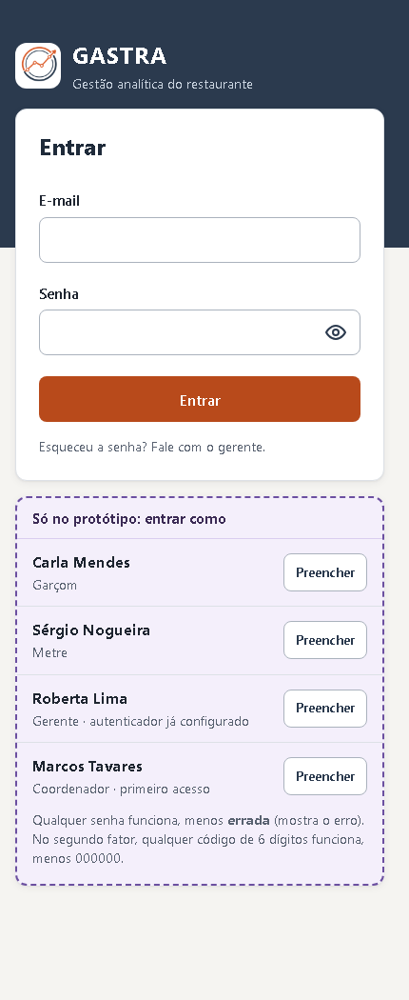

O login é o **e-mail** da pessoa mais a senha. Quem cria as contas é o Gerente (seção 4.5); ninguém se cadastra
sozinho.

Se alguma coisa não confere, o sistema mostra sempre a **mesma mensagem** — para e-mail que não existe, para conta
inativada e para senha errada. É de propósito: mensagens diferentes contariam a quem está tentando adivinhar quais
e-mails têm conta no sistema.

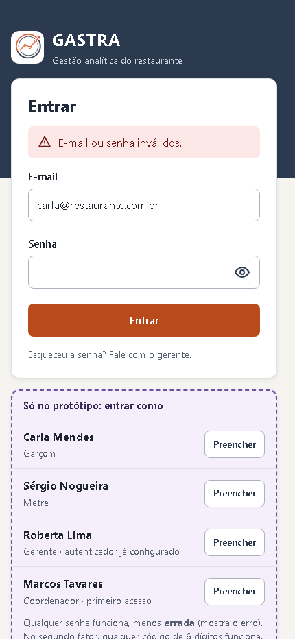

### 1.1 Verificação em duas etapas (Gerente e Coordenador)

Gerente e Coordenador precisam de um segundo passo além da senha: um código de seis dígitos que muda a cada 30
segundos, gerado por um aplicativo autenticador no celular (Google Authenticator, Authy, ou o que a casa preferir).

No **primeiro acesso**, o sistema mostra uma chave para vincular o aplicativo:

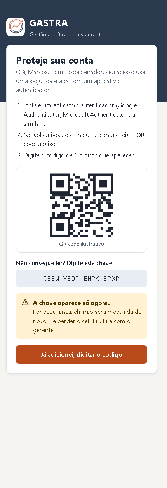

> **A chave aparece uma única vez.** Vincule o aplicativo antes de sair dessa tela. Se perder, não dá para ver de
> novo: o Gerente precisa zerar a verificação da conta (seção 4.5) para o sistema gerar uma chave nova.

Dos acessos seguintes em diante, depois da senha vem só o código de seis dígitos, que confirma sozinho ao
completar:

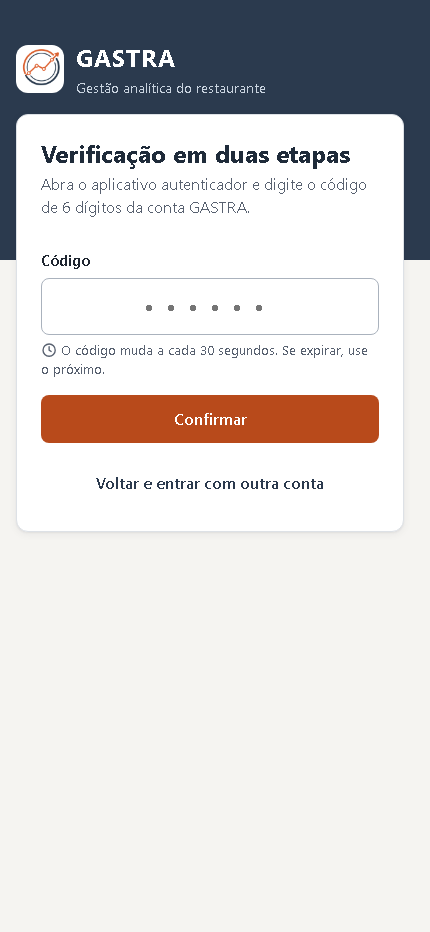

Se o código expirar antes de você terminar de digitar, espere o próximo no aplicativo e digite de novo — cada
código vale por 30 segundos.

Garçom e Metre não usam a verificação em duas etapas. É uma escolha de projeto: eles entram muitas vezes por turno,
muitas vezes com as mãos ocupadas, e o ganho de segurança não compensaria a fricção no salão.

### 1.2 Sair

O botão de sair fica no canto direito da barra do topo, em todas as telas. Sair encerra a sessão naquele aparelho.

Algumas ações do Gerente também derrubam sessões, e isso é intencional: quando alguém tem a senha redefinida, é
inativado, ou tem a verificação em duas etapas zerada, as sessões abertas daquela conta caem na hora.

---

## 2. Garçom

O garçom trabalha pelo celular. O menu de baixo tem três telas: **Comandas**, **A entregar** e **Desempenho**.

### 2.1 Abrir uma mesa

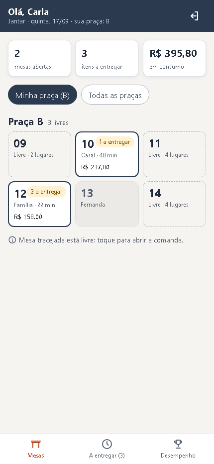

A tela abre no mapa das mesas da praça do garçom naquele turno. Mesa tracejada está livre; mesa com borda escura é
dele, e mostra há quanto tempo está aberta, o valor da conta e os itens a entregar; mesa cinza é de um colega.

Para abrir: **toque na mesa livre** e, na lista que aparece, **toque no número de pessoas** que sentaram. A comanda
abre nesse segundo toque — tocar no número já é a confirmação. O número igual à capacidade da mesa vem destacado,
que é o caso mais comum.

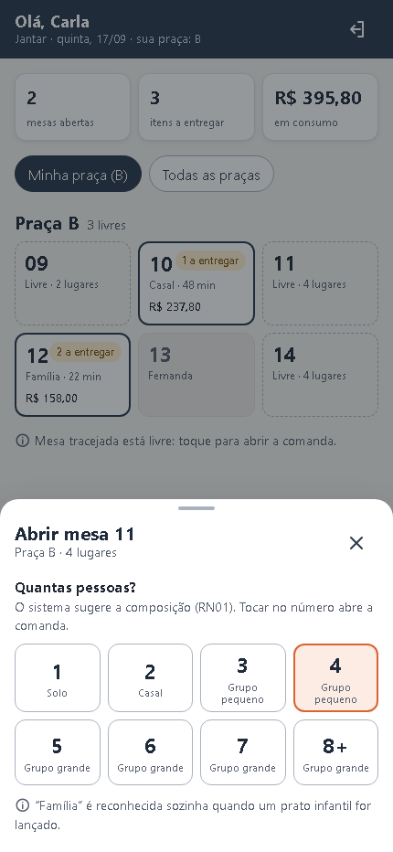

São **dois toques** até a mesa aberta. Isso não é detalhe de desenho: é um requisito do sistema (RNF02), porque
abrir mesa é a ação mais repetida do turno.

O sistema sugere sozinho a **composição da mesa** a partir do número de pessoas:

| Pessoas | Composição sugerida |
|---|---|
| 1 | Solo |
| 2 | Casal |
| 3 ou 4 | Grupo pequeno |
| 5 ou mais | Grupo grande |
| Qualquer número, com item infantil na conta | Família |

A sugestão pode ser trocada à mão quando não bate com a realidade — uma mesa de 4 que é claramente uma família,
por exemplo. Depois de trocada à mão, o sistema **para de reclassificar** aquela mesa sozinho, para não desfazer a
decisão de quem está vendo o salão.

### 2.2 Lançar um item

Dentro da comanda, o botão **Lançar item** abre o cardápio; escolha o item e a quantidade.

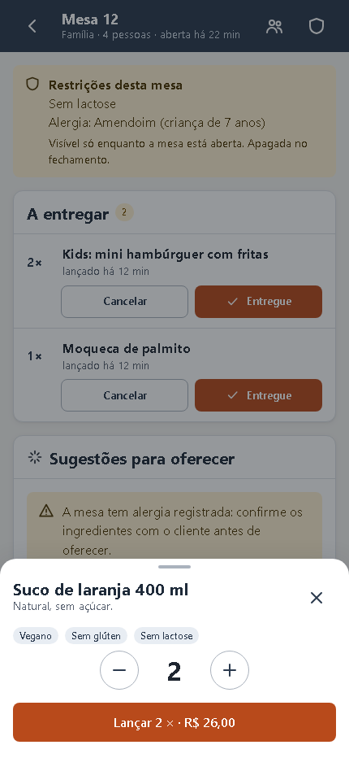

São **três toques** do cardápio até o item na conta (também RNF02). Logo depois do lançamento aparece um aviso com
**Desfazer**, para o caso de ter tocado no item errado — desfazer aqui cancela o item com o motivo "erro de
lançamento".

O preço que entra na conta é o **do momento do lançamento**. Se o Gerente mudar o preço no cardápio depois, as
comandas que já estavam abertas continuam com o preço antigo.

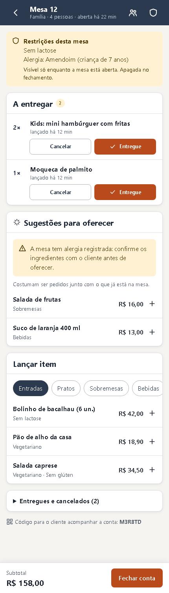

### 2.3 Restrições alimentares

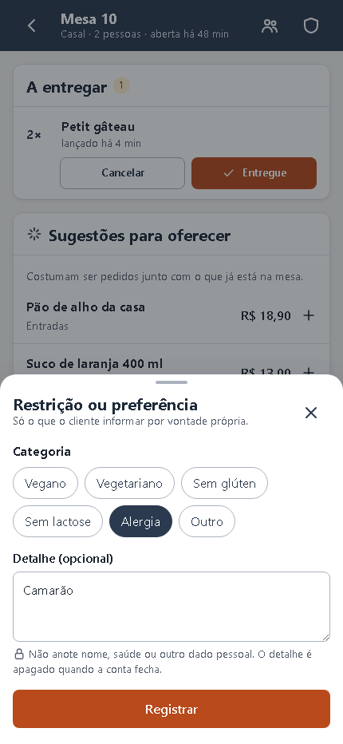

Dá para registrar restrições da mesa: vegano, vegetariano, sem glúten, sem lactose, alergia ou outro (com
observação livre).

> No campo de observação, **escreva só o que a cozinha precisa saber** — "alergia a camarão", não o nome nem
> qualquer outro dado da pessoa. A própria tela avisa isso. Esse campo é apagado quando a conta fecha.

As restrições aparecem **só para o garçom e o metre, e só enquanto a mesa está aberta**. Quando a conta fecha, elas
somem do sistema: são dado de saúde, e o GASTRA não guarda isso além do necessário para atender a mesa (RN04). O
cliente, na conta dele pelo celular, nunca vê essa informação.

### 2.4 Sugestões da cozinha

Com as restrições registradas, o sistema sugere itens do cardápio que combinam com a mesa. As sugestões vêm da
camada analítica, que cruza o histórico de pedidos.

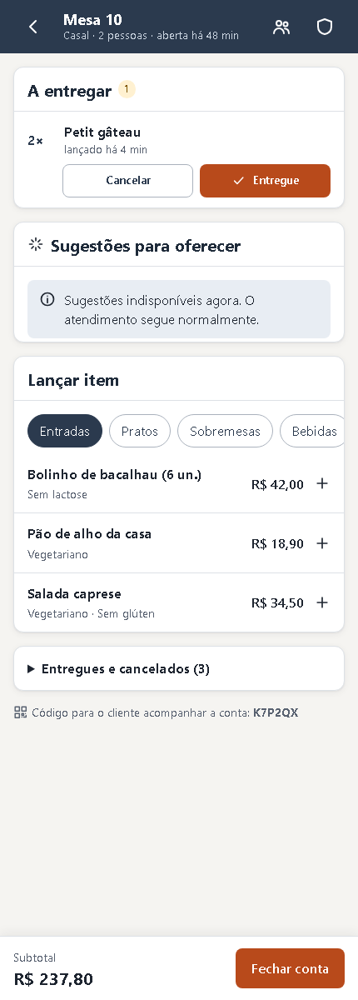

Quando há alergia registrada, o sistema pede que o garçom **confirme com o cliente** antes de lançar — sugestão é
sugestão, não garantia.

E quando o serviço de análise está fora do ar, a tela diz isso e **o resto da comanda continua funcionando**.
Sugestão é um extra; o salão não para por causa dela.

### 2.5 Entregar e cancelar

Cada item lançado fica **Pendente** até alguém dizer o que aconteceu com ele.

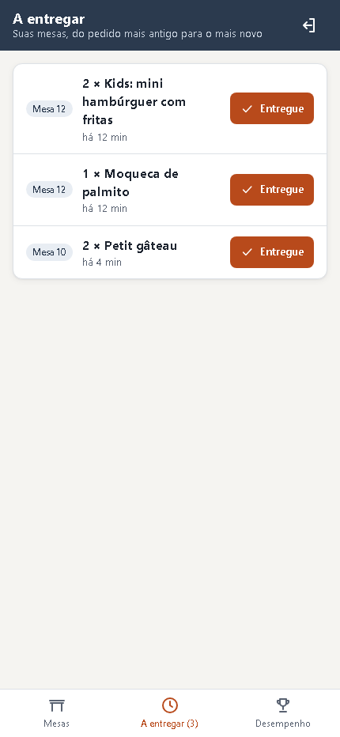

A tela **A entregar** junta os itens pendentes de todas as mesas do garçom, do mais antigo para o mais novo.

- **Entregar** não pede confirmação e não oferece desfazer — a API não volta atrás nessa.
- **Cancelar** exige um motivo: erro de lançamento, cliente desistiu ou item em falta. O motivo é o que permite
  depois separar erro de operação de falta de estoque nos relatórios.

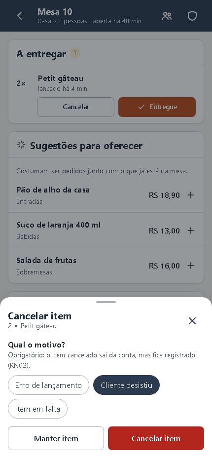

Item cancelado sai da conta, mas não some do histórico.

### 2.6 Fechar a conta

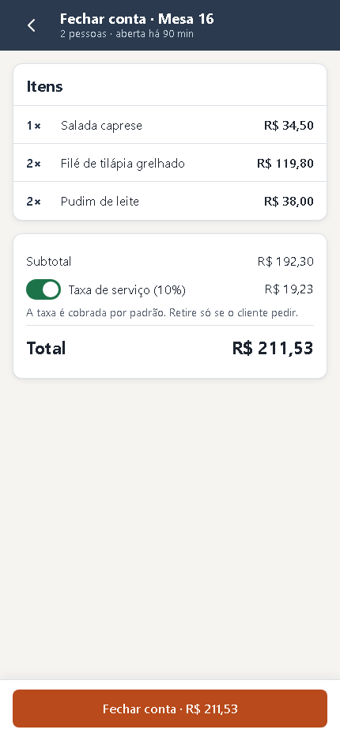

A tela de fechamento mostra o subtotal, a **taxa de serviço de 10%** e o total. A taxa vem ligada por padrão e pode
ser retirada a pedido do cliente, com um toque — é direito dele, e o sistema não esconde isso. O fechamento em si
pede confirmação, porque conta fechada não reabre.

**A conta só fecha sem itens pendentes.** Se ainda houver item esperando, o sistema mostra quais são e não deixa
fechar:

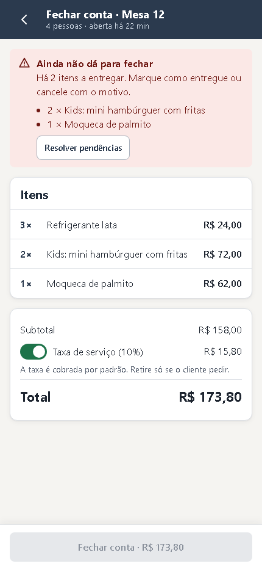

Entregue ou cancele cada um e tente de novo. É a regra que impede a mesa de ir embora com item que ninguém sabe se
saiu da cozinha.

### 2.7 Desempenho

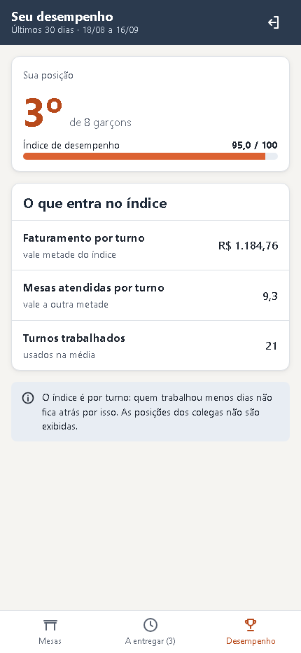

Cada garçom vê a própria posição no ranking do período, com o faturamento por turno e a média de mesas atendidas.
O garçom vê **só os próprios números** e a posição; não vê o desempenho dos colegas.

---

## 3. Metre

O metre monta o turno: quem está presente e em qual praça cada um atende.

### 3.1 Montar o turno, em três passos

**Passo 1 — presença.** Marque quem chegou.

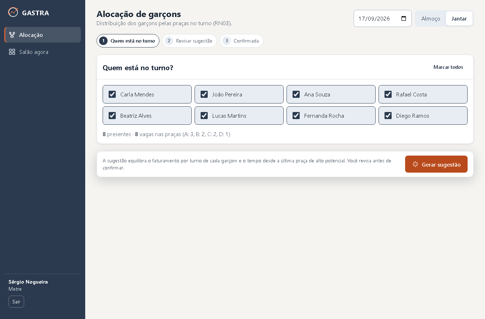

A tela mostra **presentes × vagas**. Se chegou mais gente do que existe vaga nas praças, o sistema explica o
problema e não deixa gerar a sugestão: alguém vai ter que ficar de fora do salão, e essa é uma decisão do metre,
não do cálculo.

**Passo 2 — sugestão.** O sistema distribui os presentes pelas praças e mostra por que cada um foi para onde foi.

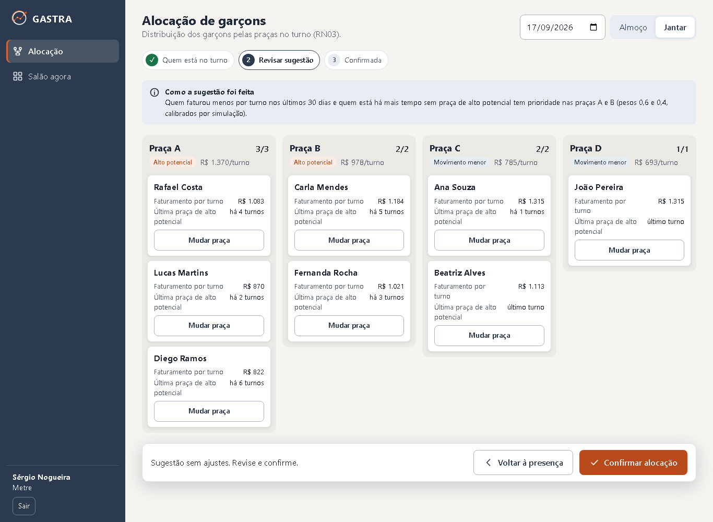

A distribuição não é sorteio. Cada garçom recebe um índice que pesa duas coisas:

- **60%** — o faturamento médio por turno dele nos últimos 30 dias;
- **40%** — há quantos turnos ele não pega uma praça de alto potencial.

"Praça de alto potencial" é a que fatura acima da média das praças com movimento. O segundo peso existe para o
rodízio: sem ele, o mesmo garçom pegaria sempre a praça boa, e os outros nunca teriam chance de melhorar o próprio
número.

**Passo 3 — confirmar.** Depois de confirmada, a alocação do turno **não muda mais**. O quadro fica só para
leitura.

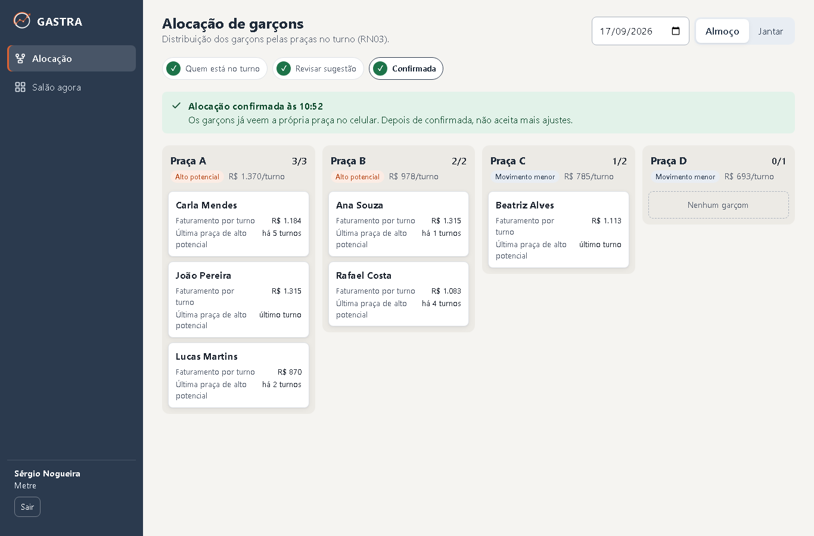

### 3.2 Ajustar antes de confirmar

Antes de confirmar, o metre pode mover qualquer garçom — quem está no salão sabe coisas que o histórico não sabe.

Se a praça de destino já está com todas as vagas ocupadas, o sistema não recusa e pronto: ele pede **com quem
trocar**, e faz a troca nos dois sentidos.

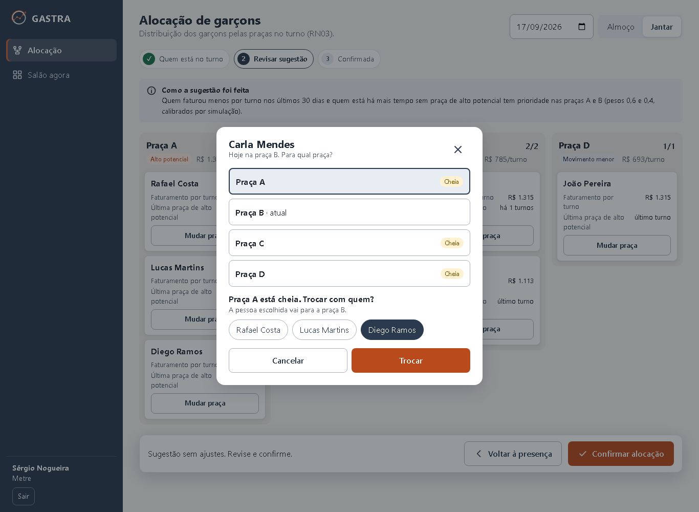

Quem foi movido à mão ganha a etiqueta **Ajustado**, para ficar registrado que aquela posição foi decisão do metre
e não do cálculo.

### 3.3 Quando o serviço de análise está fora

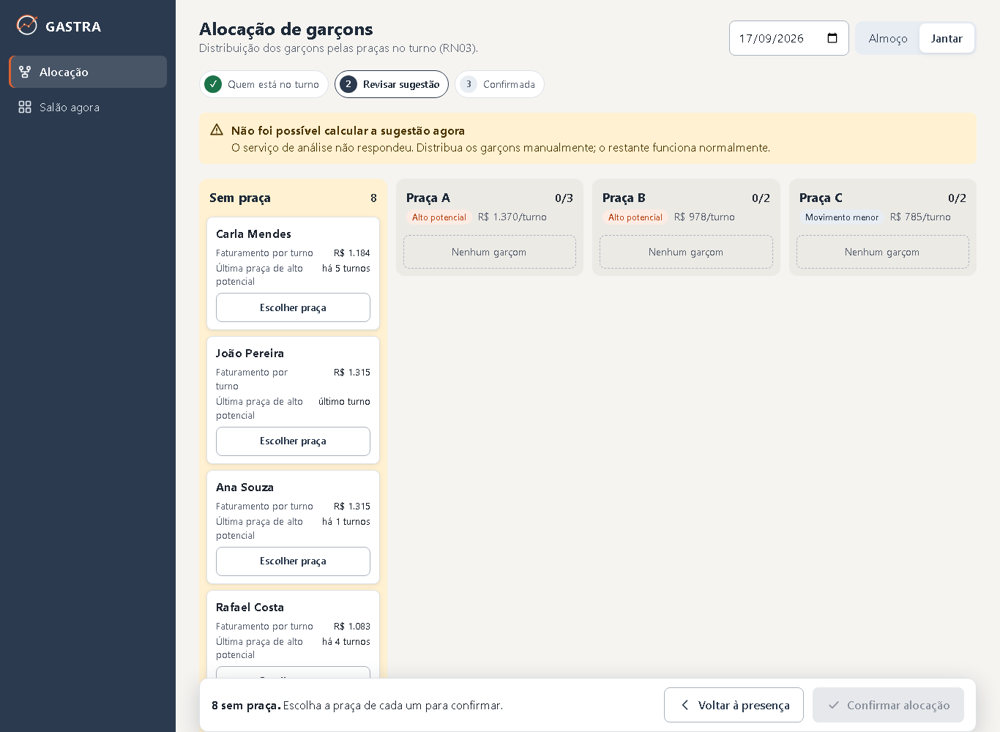

O metre monta o turno à mão, e o sistema avisa que a sugestão automática não está disponível. O salão não para.

### 3.4 Salão agora

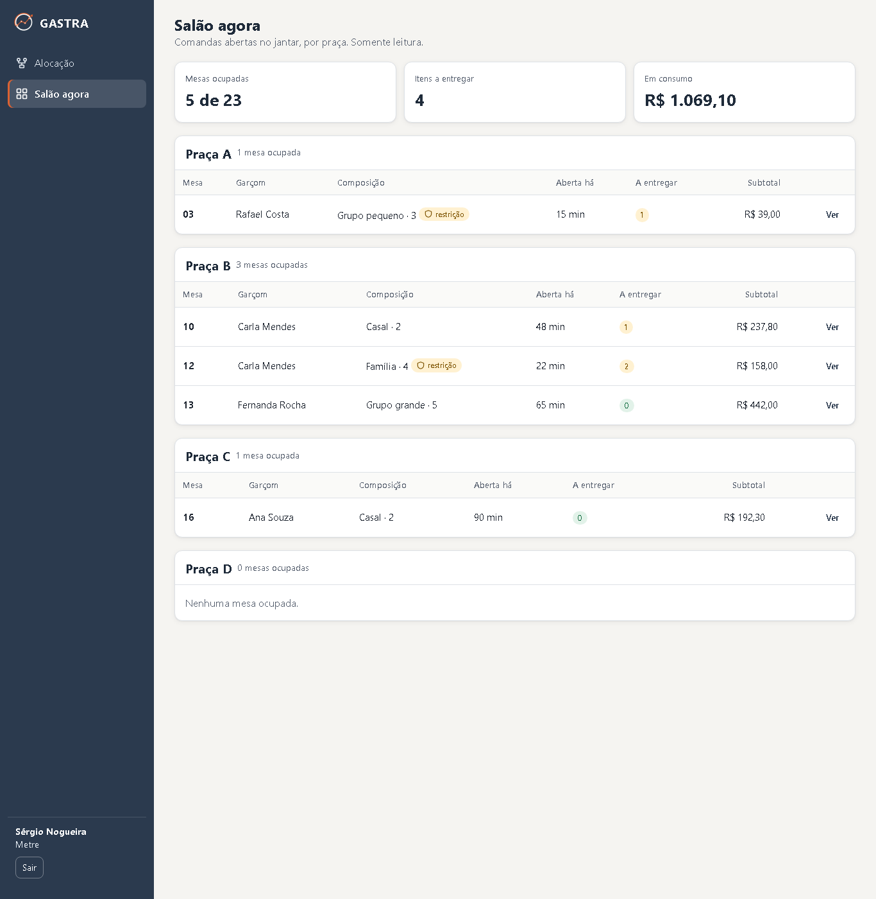

Visão do salão em tempo real: praças, mesas ocupadas, há quanto tempo, quanto já está na conta e qual garçom
atende. Serve para o metre saber onde está o gargalo sem ter que atravessar o salão.

---

## 4. Gerente

O menu do Gerente tem quatro telas: **Análises**, **Cardápio**, **Salão** e **Usuários**.

### 4.1 Análises

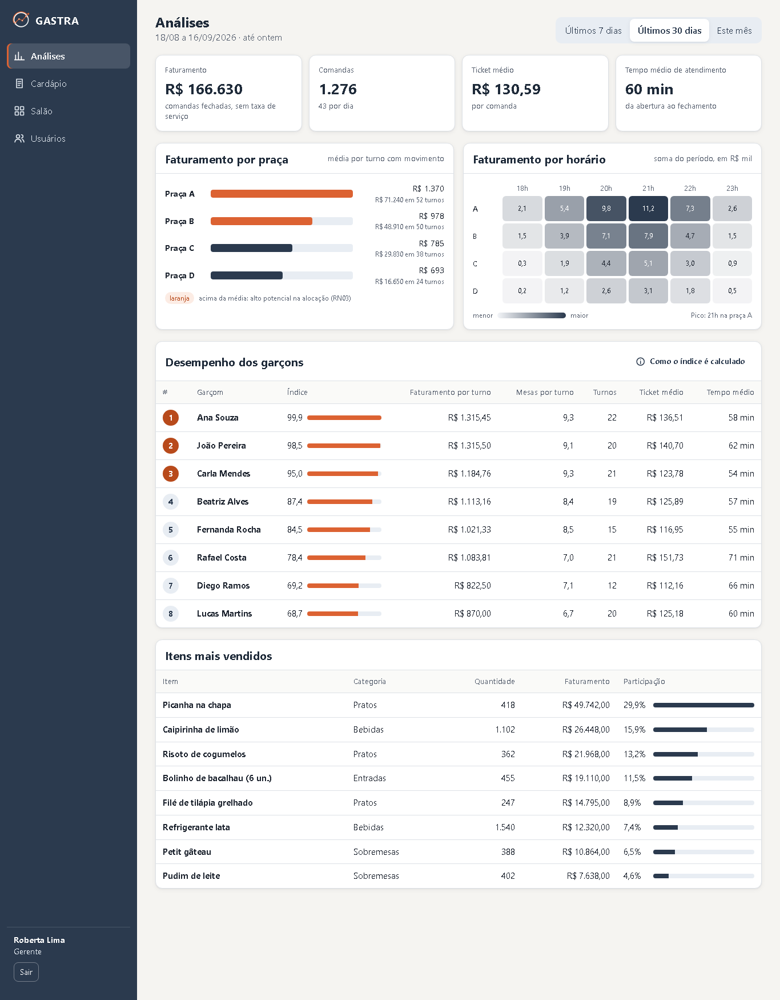

Os indicadores do período escolhido: faturamento, ticket médio, mesas atendidas, faturamento por praça, movimento
por horário e o ranking de garçons.

Todos os números vêm calculados da API. A tela não faz conta nenhuma — é regra do projeto, para não existirem duas
versões do mesmo número (uma na tela, outra no relatório).

### 4.2 Cardápio

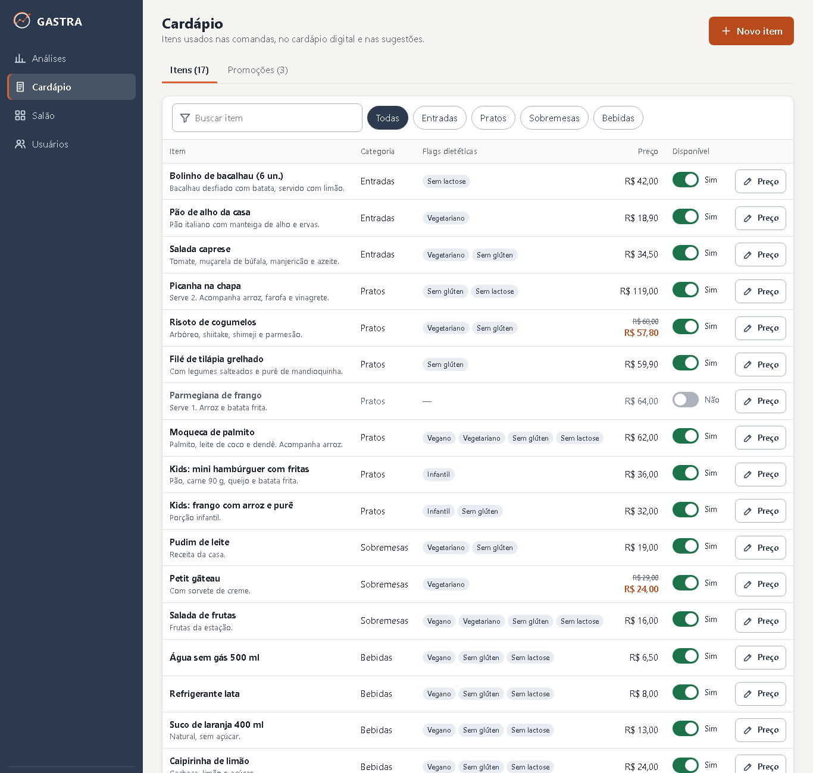

Cadastrar item, editar, mudar preço, marcar como indisponível e pôr foto.

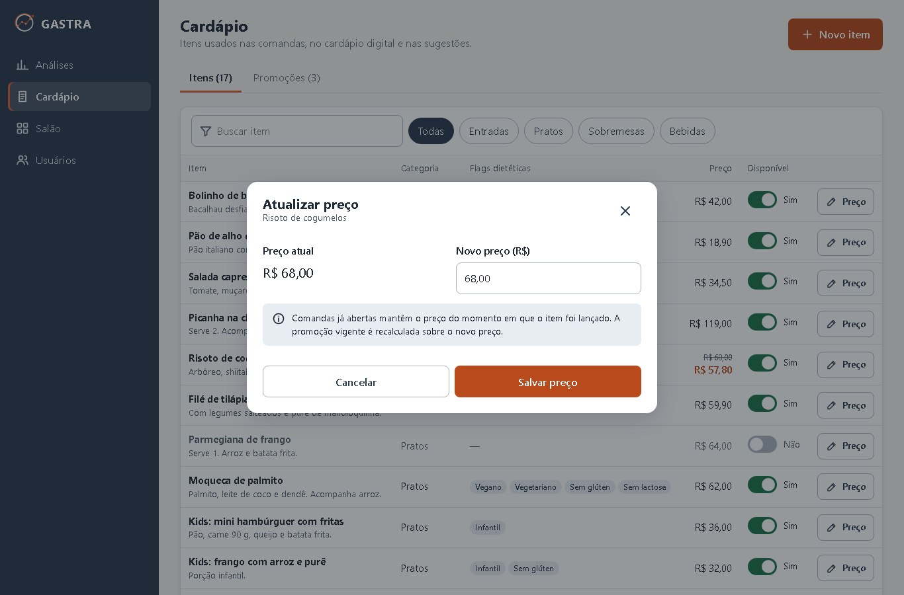

Ao mudar o preço, o sistema lembra: **comandas já abertas mantêm o preço do momento do lançamento**. A mudança vale
para o que for lançado daqui para frente.

Marcar um item como indisponível tira ele do cardápio digital do cliente e impede novos lançamentos; o aviso
oferece **Desfazer**, porque errar o item na pressa é fácil.

### 4.3 Promoções

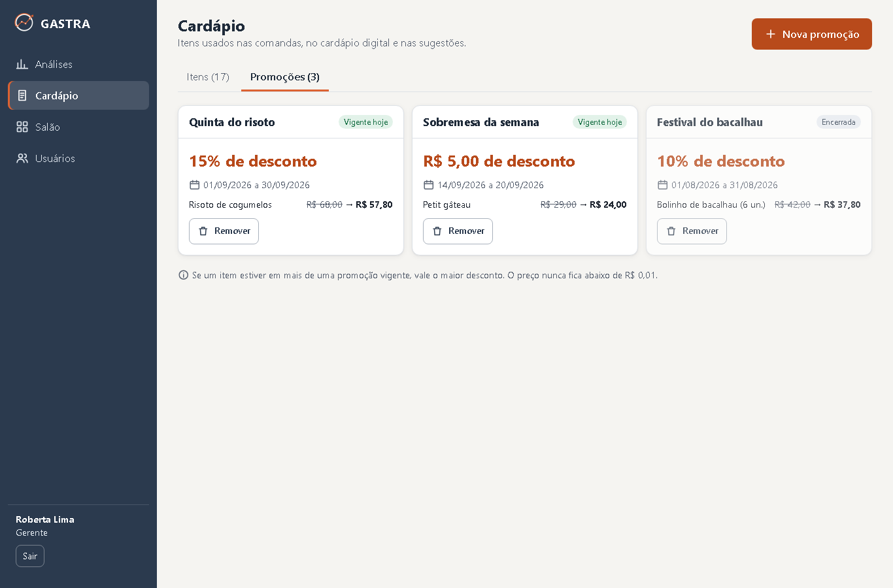

Cada promoção mostra a situação: **Vigente hoje**, **Agendada** ou **Encerrada**.

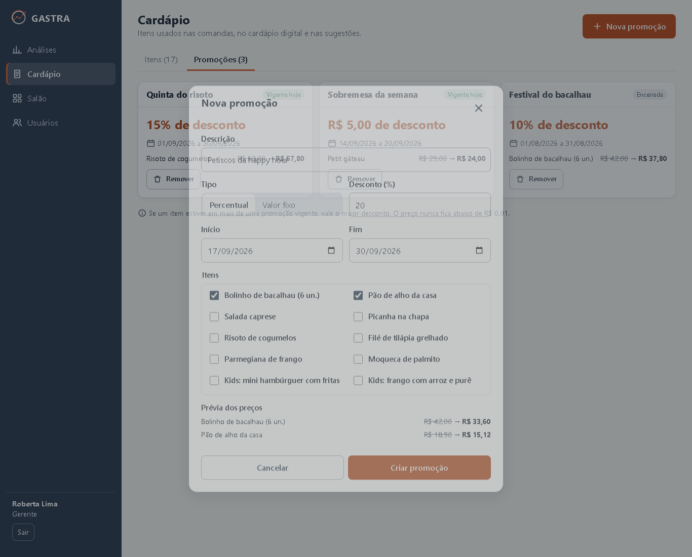

Ao criar, escolha desconto em valor ou em porcentagem e os itens participantes. A **prévia dos preços** aparece
enquanto se preenche, com o preço de antes e o de depois de cada item — dá para ver o efeito antes de salvar.

O sistema recusa desconto fixo maior que o preço do item e porcentagem de 100% ou mais, e explica o motivo no
próprio formulário:

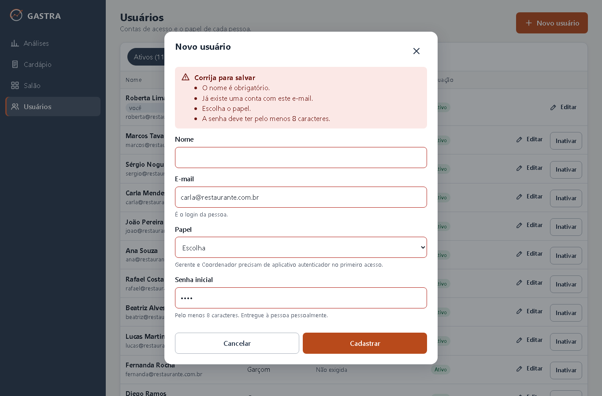

### 4.4 Salão: praças e mesas

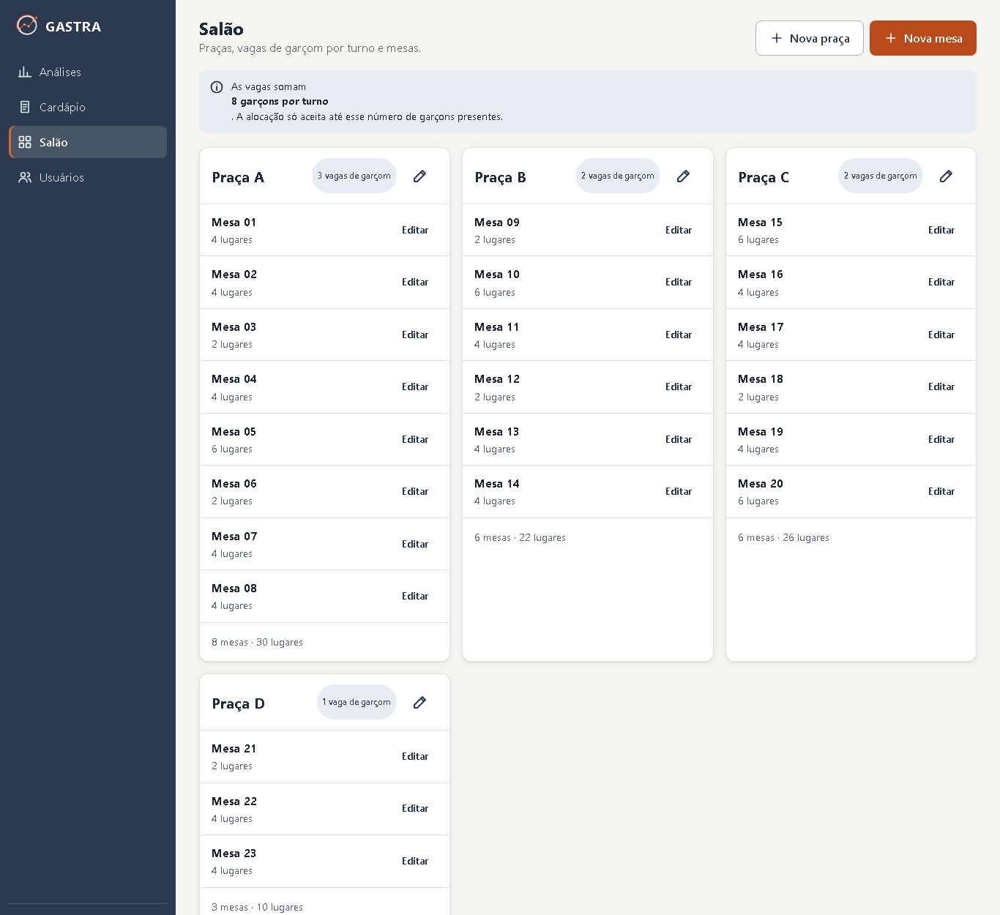

Cada praça é um cartão, com as **vagas de garçom por turno** e as mesas dela. O total de vagas é o teto que o metre
enxerga ao montar o turno: mexer aqui muda o que ele pode fazer lá.

Para criar mesa, use o botão do cartão da praça — a mesa já nasce nela.

> **A praça de uma mesa não muda depois de criada.** Na edição, o campo nem aparece: no lugar dele o sistema mostra
> a praça atual e explica o motivo. Se a mesa pudesse trocar de praça, o histórico de faturamento por praça
> perderia o sentido, porque o passado passaria a ser contado no lugar errado. Se a planta do salão mudar de
> verdade, o caminho é criar a mesa na praça nova.
>
> *(Diferença em relação ao protótipo: lá o campo existia e a tela avisava antes de salvar. Na implementação o
> campo não aparece — avisar depois de deixar escolher era pedir para a pessoa errar.)*

Sem nenhuma praça cadastrada, o botão de nova mesa fica desligado e a tela explica que o primeiro passo é criar uma
praça.

### 4.5 Usuários

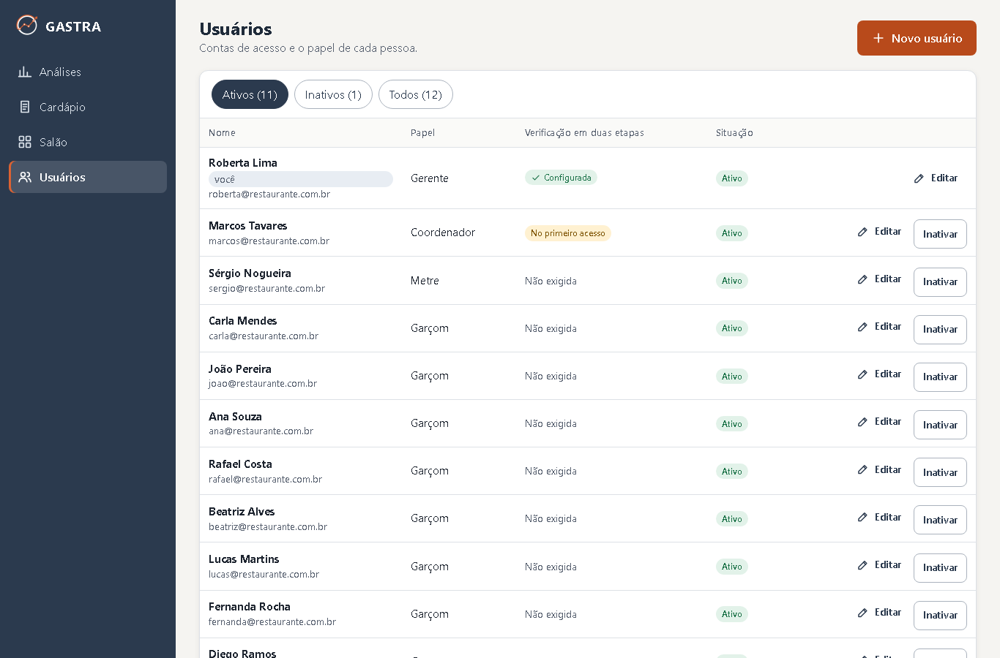

Cadastrar, editar, inativar e reativar contas; redefinir senha; zerar a verificação em duas etapas.

- **Contas não são apagadas.** Inativar bloqueia o acesso na hora — inclusive de quem está com o sistema aberto — e
  preserva o histórico de comandas e alocações daquela pessoa. Dá para reativar depois. Apagar a conta apagaria o
  passado do restaurante junto.
- **Reativar** não pede confirmação: é ação sem perda.
- **Redefinir senha** derruba as sessões abertas daquela conta e invalida a senha antiga. O sistema não mostra a
  senha anterior a ninguém — ele guarda só o resumo criptografado dela.
- **Zerar a verificação em duas etapas** é o que se faz quando a pessoa perdeu o celular: no próximo login ela
  vincula o aplicativo de novo, com uma chave nova, e a antiga é descartada.
- **Na própria conta**, a tela oferece só "Editar", e o campo de papel fica travado. Ninguém se inativa, redefine a
  própria senha por aqui nem zera o próprio segundo fator — a API recusa de qualquer jeito, e a tela explica em vez
  de deixar tentar.

A coluna de verificação em duas etapas mostra "Não exigida" para Garçom e Metre, que não usam o recurso.

---

## 5. Coordenador

O Coordenador vê uma tela só: **Cardápio** — que é onde ficam também as promoções, em abas. Vale para ele tudo o
que está nas seções 4.2 e 4.3.

Ele **não** vê análises, salão nem usuários. Isso é garantido dos dois lados: o menu não mostra, e a API recusa o
acesso mesmo que alguém digite o endereço na mão.

Como o Coordenador mexe em preço e em promoção, ele também usa a verificação em duas etapas (seção 1.1).

---

## 6. Cliente

O cliente não faz login. Ele lê o **QR code da mesa** com a câmera do celular. A tela inicial oferece duas coisas:
ver o cardápio ou acompanhar a conta.

> **Hoje só o QR funciona.** A tela tem um campo para digitar o código da mesa, mas ele espera um código de seis
> caracteres, e o que o sistema gera hoje tem trinta e dois. Enquanto a [#217](https://github.com/danih-vb/gastra-tg/issues/217)
> não for resolvida, quem não conseguir ler o QR precisa pedir ajuda ao garçom.

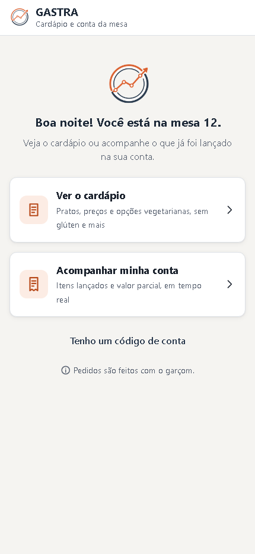

O pedido continua sendo feito com o garçom — a tela diz isso, para o cliente não ficar esperando que o sistema
mande o pedido para a cozinha.

### 6.1 Cardápio digital

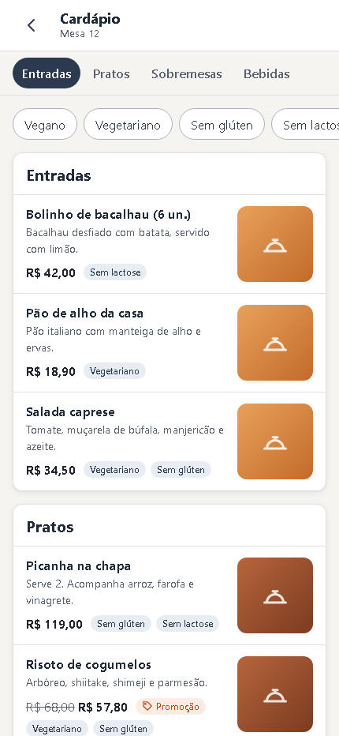

O cardápio com foto, descrição, preço e as marcações de vegano, vegetariano, sem glúten, sem lactose e infantil.
Item indisponível não aparece.

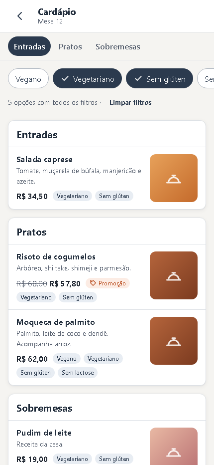

O filtro por categoria e por marcação ajuda quem tem restrição a achar o que pode comer — sem precisar contar a
restrição para o sistema.

### 6.2 A conta

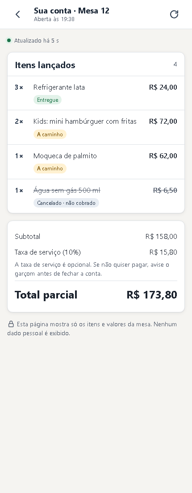

O que já foi lançado, o subtotal, a taxa de serviço e o total. A tela se atualiza sozinha a cada 15 segundos
enquanto a mesa está aberta, e para quando a conta fecha. Item cancelado aparece riscado e marcado como **não
cobrado**, para o cliente conferir que aquilo saiu mesmo da conta.

O cliente vê **só a própria conta**, e nada que identifique pessoas: nem o nome do garçom, nem as restrições
registradas pela mesa.

Se o código não existir, a tela diz que não encontrou aquela mesa e sugere conferir o código — isso não é erro de
sistema, é o caso normal de quem digitou errado.

---

## 7. Quando alguma coisa dá errado

| O que aparece | O que está acontecendo | O que fazer |
|---|---|---|
| "Há itens pendentes: entregue ou cancele cada um antes de fechar" | A conta tem item que ninguém disse se saiu | Resolva cada pendência na tela da comanda e feche de novo |
| "A praça escolhida já está com todas as vagas ocupadas neste turno" | Não há vaga livre na praça de destino | Use a troca: o sistema pergunta com quem trocar |
| "A alocação deste turno já foi confirmada e não pode mais mudar" | O turno foi confirmado | Alocação confirmada é definitiva. Ajustes ficam para o próximo turno |
| Mais presentes do que vagas, e a sugestão não gera | Chegou mais gente do que cabe nas praças | Decida quem fica de fora, ou crie/aumente uma praça na tela de Salão (seção 4.4) |
| "O serviço de análise não respondeu" (sugestões ou alocação) | A camada analítica está fora do ar | Siga sem ela: lançar item, fechar conta e montar o turno à mão continuam funcionando |
| "E-mail ou senha não conferem" | Um dos dois está errado | Confira o e-mail. Se esqueceu a senha, o Gerente redefine (seção 4.5) |
| "Não encontramos essa mesa" (cliente) | O código não existe ou a conta já fechou | Leia o QR de novo ou chame o garçom. Digitar o código ainda não funciona: ver [#217](https://github.com/danih-vb/gastra-tg/issues/217) |
| A pessoa foi desconectada de repente | A conta foi inativada, teve a senha redefinida ou o segundo fator zerado | Fale com o Gerente |
| "Já existe uma praça com este código" / "com este número" | Código de praça e número de mesa não se repetem | Escolha outro, ou edite a que já existe |

---

## 8. Glossário

| Termo | O que é |
|---|---|
| **Praça** | Conjunto de mesas que um ou mais garçons atendem. Cada praça tem um número de vagas por turno |
| **Comanda** | A conta de uma mesa, do momento em que abre até fechar |
| **Composição da mesa** | Classificação do grupo que sentou: solo, casal, grupo pequeno, família, grupo grande |
| **Turno** | Almoço ou jantar de um dia. A alocação vale por turno |
| **Praça de alto potencial** | Praça que fatura acima da média das praças com movimento |
| **Taxa de serviço** | Os 10% sobre o subtotal. Pode ser retirada a pedido do cliente |
| **Índice de desempenho** | Nota do garçom no período: 60% faturamento médio por turno, 40% rodízio de praça |
| **Item pendente** | Item lançado que ainda não foi entregue nem cancelado |
| **Verificação em duas etapas** | Código de seis dígitos do aplicativo autenticador, exigido de Gerente e Coordenador |

---

*Este manual acompanha o sistema: telas novas ou regras que mudarem precisam ser refletidas aqui. As imagens são
geradas pelo script `docs/ux-ui/gerar_telas.py`.*
