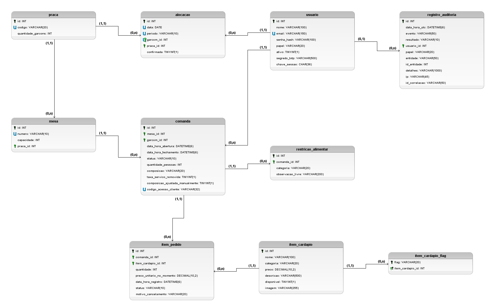

# Validação do modelo físico — GASTRA

Este documento verifica o banco implementado em três frentes:

| Seção | Pergunta | Issue |
|---|---|---|
| [1. Engenharia reversa](#1-engenharia-reversa) | O banco criado pelas migrations corresponde ao DER conceitual? | #84 |
| [2. Formas normais](#2-formas-normais) | As tabelas finais estão na 1FN, 2FN e 3FN? | #41 |
| [3. LGPD na modelagem](#3-lgpd-na-modelagem) | Quais colunas guardam dado pessoal e como cada uma é protegida? | #40 |

Base analisada: o schema `gastra_dev` depois de todas as migrations até
`GaranteConsistenciaDeStatus` (10 tabelas, 64 colunas, 10 chaves estrangeiras).

## Resumo do que a validação encontrou e corrigiu

| # | Achado | Correção |
|---|---|---|
| 1 | O DER não marcava como opcionais 11 atributos que o banco aceita vazios (ex.: data de fechamento, observação livre, IP da auditoria) | Atributos marcados como opcionais no DER (círculo tracejado); texto do MER alinhado |
| 2 | O trigger de auditoria bloqueava **qualquer** exclusão, o que impediria a eliminação ao fim dos 6 meses de retenção (LGPD, art. 16) | Migration `PermiteEliminarAuditoriaAposRetencao`: bloqueia só registros dentro do prazo |
| 3 | `comanda.status` repete o que `data_hora_fechamento` já diz, e as duas podiam se contradizer | `CHECK` que obriga as duas a concordarem (migration `GaranteConsistenciaDeStatus`) |
| 4 | `item_pedido.motivo_cancelamento` podia existir em item não cancelado, ou faltar em item cancelado | `CHECK` com a regra RN02 (mesma migration) |
| 5 | A API mostrava a restrição alimentar do cliente a Gerente e Coordenador, contra a RN04 | Correção na API, no PR #118 (seção 3.3) |

---

## 1. Engenharia reversa

### 1.1 Método

O brModelo 3.31 **não importa um banco existente**: não conecta no MySQL nem lê SQL. Ele só
converte do conceitual para o lógico e do lógico para SQL. Conferimos isso no código-fonte da
ferramenta, que não tem nenhuma leitura de banco (JDBC).

Por isso, a engenharia reversa foi feita em quatro passos. Os arquivos ficam em
[`engenharia-reversa/`](engenharia-reversa/):

| Passo | Arquivo | O que faz |
|---|---|---|
| 1 | `extrair_schema.sql` | Lê o catálogo do MySQL (`information_schema`): colunas, tipos, nulos, chaves primárias, chaves estrangeiras e índices únicos |
| 2 | `comparar.py` | Converte o resultado em JSON |
| 3 | `gerar_logico.js` | Monta o **modelo lógico no brModelo**, usando as classes da própria ferramenta (tabela, campo, restrição, ligação). O `.brM3` gerado abre normalmente no brModelo |
| 4 | `comparar.py` | Compara, de forma automática, o banco com o DER conceitual exportado do brModelo: entidade × tabela, atributo × coluna, relacionamento × chave estrangeira. Resultado em `comparacao.txt` |

A comparação é automática para que nenhuma divergência passe despercebida. Cada diferença que ela
aponta está justificada na seção 1.3.

*Modelo lógico obtido do banco. Chave preta: chave primária. Chave verde: chave estrangeira. "U":
valor único. Cardinalidade junto à tabela referenciada: (1,1) quando a chave estrangeira é
obrigatória e (0,1) quando aceita vazio.*

### 1.2 O que confere

**Entidades.** 9 das 10 entidades do DER viraram tabela. A que falta é `Promocao` (item 5 da
tabela abaixo).

**Relacionamentos.** Os 9 relacionamentos 1:N implementados conferem com as chaves estrangeiras,
inclusive na obrigatoriedade:

| Relacionamento no DER | Chave estrangeira | Confere |
|---|---|---|
| Mesa (1,1) pertence a Praca (0,n) | `mesa.praca_id` NOT NULL | ✅ |
| Comanda (1,1) pertence a Mesa (0,n) | `comanda.mesa_id` NOT NULL | ✅ |
| Comanda (1,1) é aberta por Usuario (0,n) | `comanda.garcom_id` NOT NULL | ✅ |
| ItemDoPedido (1,1) contém Comanda (0,n) | `item_pedido.comanda_id` NOT NULL | ✅ |
| ItemDoPedido (1,1) refere-se a ItemDoCardapio (0,n) | `item_pedido.item_cardapio_id` NOT NULL | ✅ |
| Alocacao (1,1) refere-se a Usuario (0,n) | `alocacao.garcom_id` NOT NULL | ✅ |
| Alocacao (1,1) refere-se a Praca (0,n) | `alocacao.praca_id` NOT NULL | ✅ |
| RestricaoAlimentar (1,1) possui Comanda (0,n) | `restricao_alimentar.comanda_id` NOT NULL | ✅ |
| RegistroAuditoria (0,1) é gerado por Usuario (0,n) | `registro_auditoria.usuario_id` **NULL** | ✅ |

**Atributos.** Todos os atributos simples do DER existem como coluna, com o mesmo nome.

### 1.3 Diferenças e justificativas

| # | Diferença | Natureza | Justificativa |
|---|---|---|---|
| 1 | O identificador `id_<entidade>` virou a coluna `id` | Convenção de nomes | O nome da tabela já dá o contexto (`mesa.id`). A chave estrangeira é que leva o nome da tabela referenciada (`comanda.mesa_id`) |
| 2 | Colunas `*_id` que não aparecem como atributo no DER | Mapeamento padrão | Relacionamento 1:N vira chave estrangeira no lado N. Nenhuma chave estrangeira existe sem o relacionamento correspondente (seção 1.2) |
| 3 | `flags_dieteticas` virou a tabela `item_cardapio_flag` | Mapeamento padrão | Atributo multivalorado não cabe numa coluna sem ferir a 1FN. A chave primária é composta (`item_cardapio_id`, `flag`) e impede a mesma flag duas vezes no mesmo item |
| 4 | `faturamento_medio_historico` não é coluna | Atributo derivado | É calculado a cada leitura pela view `vw_faturamento_medio_praca` (`GASTRA_Objetos_Banco.md`). Gravado, ficaria desatualizado a cada comanda fechada |
| 5 | `Promocao` e o relacionamento N:N com `ItemDoCardapio` não têm tabela | **Pendência de implementação** | Os casos de uso de promoção (UC08, UC09) ainda não foram implementados. Quando forem, entram as tabelas `promocao` e `promocao_item_cardapio` (a N:N vira tabela associativa) |
| 6 | 11 colunas aceitam vazio, mas o DER não marcava o atributo como opcional | **Divergência corrigida no DER** | Ver 1.4 |
| 7 | Restrições que existem só no banco | Detalhe físico | O DER conceitual não tem notação para elas. Ver 1.5 |
| 8 | `comanda.garcom_id` e `alocacao.garcom_id` apontam para `usuario`, e não para uma entidade Garçom | Regra fora do alcance do banco | Uma chave estrangeira não consegue exigir que o usuário tenha papel Garçom. A regra é garantida na aplicação: só o Garçom abre comanda (autorização por papel, RNF04) |

### 1.4 Opcionalidade corrigida no DER

A comparação com o DER anterior apontou 11 atributos obrigatórios no desenho e opcionais no
banco:

| Entidade | Atributo | Por que pode ficar vazio |
|---|---|---|
| Comanda | `data_hora_fechamento` | Não existe enquanto a comanda está aberta |
| ItemDoPedido | `motivo_cancelamento` | Só existe em item cancelado (RN02) |
| ItemDoCardapio | `imagem` | Nem todo item tem foto |
| Usuario | `segredo_totp` | Só Gerente e Coordenador usam segundo fator (RN07) |
| RestricaoAlimentar | `observacao_livre` | É complemento voluntário e é apagada no fechamento |
| RegistroAuditoria | `papel` | Falha de login com e-mail inexistente não tem usuário |
| RegistroAuditoria | `entidade`, `id_entidade` | Eventos como login não têm alvo |
| RegistroAuditoria | `detalhes` | Nem todo evento tem detalhe |
| RegistroAuditoria | `ip` | Só em eventos de autenticação (política de log, 4.1) |
| RegistroAuditoria | `id_correlacao` | Rotinas fora de uma requisição (ex.: eliminação por prazo) não têm requisição a correlacionar |

O **banco estava certo**: em todos os casos, o vazio é exigido pela regra de negócio. O MER já
descrevia 4 deles como opcionais, mas o desenho do DER não refletia isso.

- **O que foi corrigido:** os 11 atributos passaram a opcionais no DER (círculo tracejado) e o
  texto do MER foi alinhado nos outros 7.
- **Resultado:** depois da correção, a comparação automática não aponta mais nenhuma diferença
  de opcionalidade.

### 1.5 Restrições que só existem no banco

| Restrição | Onde | Motivo |
|---|---|---|
| Valor único | `usuario.email` | O e-mail é o login |
| Valor único | `praca.codigo`, `mesa.numero` | Duas praças ou mesas com o mesmo código confundiriam o salão e a alocação |
| Valor único | `comanda.codigo_acesso_cliente` | Dois códigos iguais dariam ao cliente acesso à conta de outra mesa (UC20) |
| Valor único composto | `alocacao (data, periodo, garcom_id)` | Um garçom fica em uma única praça por turno |
| `ON DELETE CASCADE` | `item_pedido`, `restricao_alimentar`, `item_cardapio_flag` | São partes do todo: não existem sem a comanda ou o item |
| `ON DELETE RESTRICT` | Demais chaves estrangeiras | Protege o histórico: não se apaga mesa, praça, item do cardápio ou usuário com comanda, alocação ou auditoria ligada (usuário é inativado, e não apagado) |
| `CHECK` | `comanda`, `item_pedido` | Seção 2.3 |
| Tipos | Todas | Valores em dinheiro em `decimal(10,2)`, que não arredonda como ponto flutuante; datas em UTC com microssegundos; enums gravados como texto, legíveis no BI |

**Limite conhecido.** Os enums não têm `CHECK` de valores válidos: quem garante o domínio é a
aplicação, que só grava os valores do enum. Um `CHECK` por enum precisaria de uma migration a cada
valor novo. Isso fica registrado como possível endurecimento futuro.

---

## 2. Formas normais

### 2.1 Método

Para cada tabela, levantamos as dependências funcionais a partir das regras de negócio e
verificamos três condições:

- **1FN:** todo valor é atômico e não há grupo repetido.
- **2FN:** nenhum atributo depende de só parte de uma chave composta.
- **3FN:** nenhum atributo não chave depende de outro atributo não chave.

Também conferimos a FNBC: todo determinante precisa ser chave candidata.

### 2.2 Resultado por tabela

| Tabela | Chave primária | Chaves candidatas | 1FN | 2FN | 3FN | Observação |
|---|---|---|---|---|---|---|
| `praca` | `id` | `codigo` | ✅ | ✅ | ✅ | O faturamento médio não é gravado (derivado) |
| `mesa` | `id` | `numero` | ✅ | ✅ | ✅ | |
| `usuario` | `id` | `email` | ✅ | ✅ | ✅ | |
| `item_cardapio` | `id` | — | ✅ | ✅ | ✅ | As flags ficam em tabela própria |
| `item_cardapio_flag` | (`item_cardapio_id`, `flag`) | — | ✅ | ✅ | ✅ | Não há atributo fora da chave, então não há dependência parcial |
| `comanda` | `id` | `codigo_acesso_cliente` | ✅ | ✅ | ⚠️ | `status` × `data_hora_fechamento` (2.3) |
| `item_pedido` | `id` | — | ✅ | ✅ | ✅ | O preço gravado é histórico (2.4) |
| `restricao_alimentar` | `id` | — | ✅ | ✅ | ✅ | |
| `alocacao` | `id` | (`data`, `periodo`, `garcom_id`) | ✅ | ✅ | ✅ | |
| `registro_auditoria` | `id` | — | ✅ | ✅ | ✅ | O papel gravado é histórico (2.4) |

**2FN.** Todas as tabelas, menos `item_cardapio_flag`, têm chave primária de uma coluna só, então
não há como um atributo depender de parte da chave. Em `item_cardapio_flag`, todas as colunas
fazem parte da chave.

**Nenhum total é gravado.** Subtotal, taxa de serviço e total da comanda, valor do item e
faturamento médio da praça são **calculados**, no domínio ou nas views. Gravar qualquer um deles
criaria uma dependência transitiva (ex.: `id → itens → total`) e o risco de o valor gravado
divergir da soma dos itens.

### 2.3 A exceção consciente: `comanda.status`

Com o `status` reduzido a Aberta e Fechada (decisão de 15/09), ele passou a ser deduzível da data
de fechamento: vazia é Aberta, preenchida é Fechada. Isso é uma dependência funcional entre dois
atributos não chave, o que viola a 3FN em sentido estrito.

**Por que a coluna foi mantida:**

- **Legibilidade:** as views e as consultas de BI filtram por `status = 'Fechada'`, o que é mais
  claro que `data_hora_fechamento IS NOT NULL`.
- **Desempenho:** o índice (`mesa_id`, `status`) atende a consulta mais comum do salão, as comandas
  abertas de cada mesa.
- **Evolução:** se surgir um estado novo, ele não caberia na data de fechamento.

**O risco foi eliminado, não só aceito.** O problema real de uma redundância é as duas colunas se
contradizerem. O `CHECK CK_comanda_status_fechamento` impede isso no banco: Aberta exige a data
vazia, e Fechada exige a data preenchida. No domínio, as duas também só mudam juntas, em
`Comanda.Fechar()`.

O mesmo cuidado vale para `item_pedido.motivo_cancelamento`. O
`CHECK CK_item_pedido_motivo_cancelamento` garante que o motivo existe se, e somente se, o item
foi cancelado (RN02).

Os dois `CHECK` são testados contra o MySQL real (`ObjetosDoBancoTests`).

### 2.4 Casos que parecem violação, mas não são

| Coluna | Parece depender de | Por que não depende |
|---|---|---|
| `item_pedido.preco_unitario_no_momento` | `item_cardapio.preco` | É o preço **no momento do pedido** (RF03). O preço do cardápio pode mudar depois, e a comanda não pode mudar junto. Depende do item do pedido, e não do item do cardápio |
| `registro_auditoria.papel` | `usuario.papel` | É o papel **no momento da ação**. Se o usuário mudar de papel, a auditoria precisa continuar mostrando com qual papel ele agiu |
| `comanda.composicao` | `comanda.quantidade_pessoas` | Não é uma função: a mesma quantidade pode ter composições diferentes (item infantil muda para Família, e o garçom pode ajustar na mão, RN01) |
| `praca.quantidade_garcons` | quantidade de alocações | É a capacidade planejada da praça. As alocações de um turno são outra informação |

### 2.5 Referência sem chave estrangeira

`registro_auditoria.entidade` e `id_entidade` apontam para registros de tabelas diferentes, conforme
o evento. Isso não fere as formas normais, mas fica sem chave estrangeira de propósito:

- uma chave estrangeira só aponta para uma tabela;
- a auditoria precisa continuar existindo mesmo se o alvo deixar de existir.

---

## 3. LGPD na modelagem

### 3.1 Princípio que orientou o modelo

O cliente do restaurante é **anônimo** para o sistema. Não há cadastro de cliente nem nome, CPF,
telefone ou e-mail. A comanda identifica a **mesa**, e não a pessoa (RNF03, minimização). Os dados
pessoais que existem são dos **funcionários**, e o único dado de cliente com risco é a restrição
alimentar.

### 3.2 Mapa de dados pessoais

Legenda:

- **Pessoal:** identifica ou torna identificável uma pessoa (LGPD, art. 5º, I).
- **Sensível:** dado referente à saúde (art. 5º, II).
- **Credencial:** não é dado pessoal em si, mas dá acesso a ele.

| Tabela.coluna | Classificação | Titular | Proteção no modelo e na aplicação |
|---|---|---|---|
| `usuario.nome`, `usuario.email` | Pessoal | Funcionário | Só o Gerente gerencia contas (UC04). Nunca vão para view nem para log (política de log, seção 5) |
| `usuario.senha_hash` | Credencial | Funcionário | Hash BCrypt, irreversível. Nunca volta em resposta da API |
| `usuario.segredo_totp` | Credencial | Funcionário | Criptografado (Data Protection). Nunca é reexibido depois da vinculação (RN07) |
| `usuario.chave_sessao` | Credencial | Funcionário | Trocada no logoff, na mudança de papel e na inativação, invalidando os tokens anteriores |
| `comanda.garcom_id`, `alocacao.garcom_id`, `registro_auditoria.usuario_id` | Pessoal, por vínculo | Funcionário | As views expõem só o id; o nome é juntado pela API apenas para quem pode ver |
| `registro_auditoria.ip` | Pessoal | Funcionário | Só em eventos de autenticação. Retenção de 6 meses, com eliminação garantida pelo trigger ajustado (3.4) |
| `registro_auditoria.detalhes` | Pode virar pessoal se mal usado | Funcionário | Só os campos permitidos pela política de log (seção 4): nunca senha, token, código de acesso ou restrição |
| `restricao_alimentar.observacao_livre` | **Sensível** (pode descrever doença ou alergia) | Cliente | Opcional. Nunca vai para log nem para view. **Apagada no fechamento da comanda** (`Comanda.Fechar`) |
| `restricao_alimentar.categoria` | Sensível na mesa ativa, **sem titular identificável depois** | Cliente | Fica ligada só à comanda, que não identifica o cliente. Após o fechamento, só a categoria permanece. Acesso restrito pela RN04 (3.3) |
| `comanda.codigo_acesso_cliente` | Credencial | Cliente | Dá acesso à conta da mesa (UC20). Único, nunca vai para log |
| `comanda.quantidade_pessoas`, `comanda.composicao` | Não pessoal | — | Informação observável da mesa (RN01), sem identidade. Não é usada para inferir atributo sensível (RN05) |
| `item_pedido.*` | Não pessoal | — | Consumo de uma comanda anônima. As views de BI e das regras de associação só usam ids |
| Views `vw_*` | Não pessoal | — | Teste automático garante que nenhuma coluna de view é nome, e-mail, observação livre ou código de acesso |

### 3.3 Achado: acesso à restrição alimentar fora da RN04

A **RN04** diz que dado do cliente só é acessível por **Garçom ou Metre, no contexto da mesa
ativa**. Fora disso, só de forma agregada ou anonimizada.

**O problema:** hoje, `GET /api/comandas/{id}` e `GET /api/comandas` estão liberados também para
Coordenador e Gerente e devolvem a lista de restrições, **incluindo a observação livre** enquanto
a comanda está aberta. O modelo de dados está correto; a exposição acontece na API.

**Correção:** as restrições só aparecem na resposta para Garçom e Metre, e só com a comanda
aberta. Para os demais papéis, e depois do fechamento, a lista vem vazia. Por ser mudança de
código da API, a correção está no PR #118.

### 3.4 Retenção e eliminação no banco

| Dado | Retenção | Como o banco garante |
|---|---|---|
| Observação livre da restrição | Até o fechamento da comanda | Apagada pelo domínio no fechamento |
| Auditoria | 6 meses (política de log, seção 7) | O trigger impede alteração sempre e impede exclusão **durante** o prazo. Depois do prazo, a rotina de eliminação consegue apagar (migration `PermiteEliminarAuditoriaAposRetencao`) |
| Conta de funcionário | Enquanto houver vínculo com comandas e auditoria | Inativação lógica: `ON DELETE RESTRICT` impede apagar o usuário com histórico |

**Pendências para validar com o orientador:**

- o prazo final da auditoria (hoje 6 meses, política de log, seção 9);
- se nome e e-mail de funcionário **desligado** devem ser anonimizados depois de um prazo, já que a
  conta não pode ser apagada sem perder o histórico.
