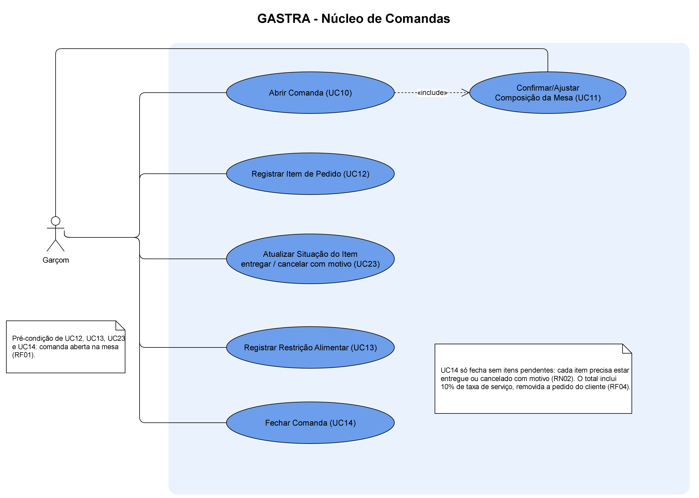
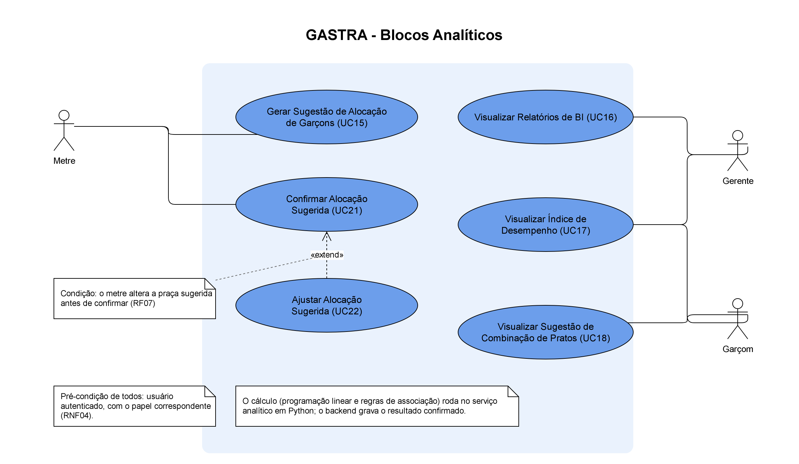
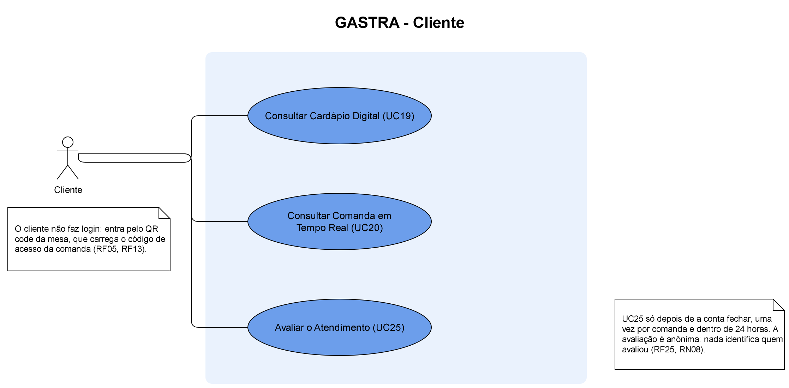
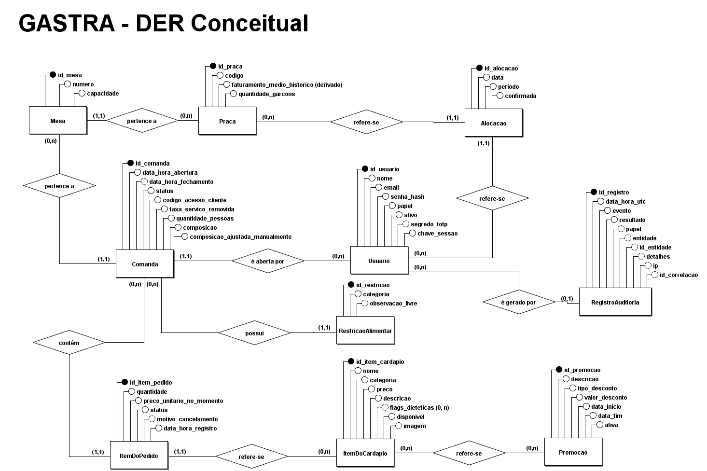
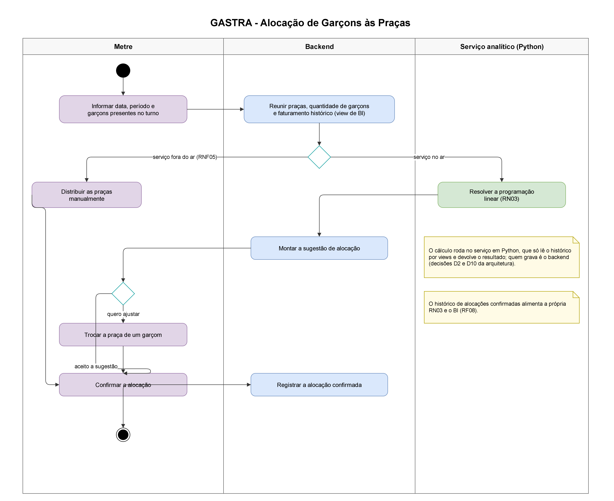

# 4 ENGENHARIA DE SOFTWARE E PROJETO DO SISTEMA

Este capítulo apresenta os artefatos de engenharia de software produzidos para o GASTRA, na ordem em que um
depende do outro: os requisitos levantados na pesquisa de campo (seção 4.1), os casos de uso e as histórias de
usuário que os detalham (seção 4.2), a modelagem de dados, do modelo conceitual ao banco implementado (seção 4.3),
e a arquitetura da solução, com o protótipo que antecedeu as telas definitivas (seção 4.4). Todos os artefatos
citados estão versionados no repositório do projeto, junto do código que os implementa, e foram revisados contra
esse código antes de entrarem neste documento: quando o sistema e a documentação divergiram, a divergência foi
registrada e corrigida em um dos dois lados, e não apenas neste texto.

## 4.1 REQUISITOS

Os requisitos do GASTRA resultam do cruzamento das duas frentes de levantamento descritas na seção 1.5 — os
questionários aplicados a clientes (n = 13) e a garçons (n = 2) e a entrevista semiestruturada com um garçom de
restaurante à la carte — com o escopo definido no projeto de pesquisa. Seguindo a distinção proposta por
Sommerville (2019), eles foram separados em requisitos funcionais, que descrevem o que o sistema deve fazer,
requisitos não funcionais, que restringem como ele deve fazê-lo, e regras de negócio, que registram as políticas
do domínio que o sistema precisa respeitar independentemente da tela ou da funcionalidade em que apareçam.

Alguns achados da pesquisa de campo orientaram diretamente a especificação. Entre os clientes, 77% (10 de 13)
relataram dificuldade para identificar opções compatíveis com restrições alimentares no cardápio, o que deu origem
ao cardápio digital com sinalização dietética (RF05) e ao registro da restrição informada pelo cliente (RF14);
85% (11 de 13) declararam-se confortáveis com o uso de histórico de consumo desde que anonimizado, condição que
fundamenta a recomendação de pratos (RF09) sob a restrição de não usar atributo pessoal (RN05). Entre os garçons,
a amostra de dois respondentes não sustenta porcentagem e foi tratada como indício qualitativo, aprofundado na
entrevista: os dois perceberam diferença de potencial de faturamento entre as praças, e a entrevista confirmou que
a distribuição atual depende de hierarquia informal — evidência que sustenta a alocação por programação linear
(RF06, RN03) e o índice de desempenho que não se limita ao volume de venda (RF11).

Cada requisito foi registrado com identificador, descrição, fonte, artefatos relacionados, método de verificação e
situação na Matriz de Rastreabilidade, que liga o requisito aos casos de uso, às histórias de usuário e às
entidades do modelo de dados. O processo iterativo adotado (seção 1.5) fez a especificação evoluir ao longo do
desenvolvimento: os requisitos RF23 a RF25 e as regras RN06 a RN09 não vieram do levantamento inicial, mas de
decisões da dupla tomadas durante as sprints, e a coluna de fonte registra essa origem de forma explícita, para
distinguir o que foi pedido pelos usuários do que foi decidido no projeto.

### 4.1.1 Requisitos funcionais

Foram especificados 25 requisitos funcionais, dos quais 24 foram aprovados e um foi reprovado, conforme o
Quadro 1.

**Quadro 1 – Requisitos funcionais do GASTRA**

| ID | Descrição | Ator | Fonte |
|---|---|---|---|
| RF01 | Abrir uma comanda vinculada a uma mesa | Garçom | Núcleo do módulo de comandas |
| RF02 | Sugerir a composição da mesa, que o garçom confirma ou ajusta | Garçom | Decisão de projeto e entrevista |
| RF03 | Registrar os itens do pedido na comanda aberta, com lista de pendências visível | Garçom | Núcleo de comandas e entrevista |
| RF04 | Fechar a comanda, calculando o total com ou sem taxa de serviço, a pedido do cliente | Garçom | Núcleo do módulo de comandas |
| RF05 | Consultar o cardápio digital por QR code, com fotos, preço e sinalização dietética, sem função de pedido | Cliente | Questionário de clientes e entrevista |
| RF06 | Calcular uma sugestão de alocação de garçons às praças por programação linear (RN03) | Sistema, Metre | Escopo original |
| RF07 | Visualizar e ajustar a alocação sugerida antes de confirmá-la | Metre | Escopo original e entrevista |
| RF08 | Registrar o histórico de alocações e de faturamento por praça, para a RN03 e para o BI | Sistema | Questionário de garçons e entrevista |
| RF09 | Sugerir combinações de pratos ao garçom a partir de padrões de consumo | Garçom | Escopo original |
| RF10 | Exibir relatórios agregados de faturamento por praça e por garçom, com os KPIs definidos | Gerente | Escopo original |
| RF11 | Exibir um índice composto de desempenho dos garçons, que não se limite ao volume de venda | Gerente, Garçom | Questionário de garçons e entrevista |
| RF12 | Permitir ao cliente solicitar a exclusão do seu histórico de pedidos (**reprovado**) | Cliente | Questionário de clientes (LGPD) |
| RF13 | Consultar a própria comanda em tempo real: itens lançados e valor parcial | Cliente | Entrevista |
| RF14 | Registrar a restrição alimentar informada voluntariamente pelo cliente, com categoria e observação livre ligadas à comanda ativa | Garçom | Decisão da dupla, informada pela entrevista |
| RF15 | Autenticar-se com e-mail e senha | Usuário | Decisão da dupla |
| RF16 | Exigir segunda etapa de verificação por aplicativo autenticador (TOTP) para Gerente e Coordenador | Gerente, Coordenador | Decisão da dupla |
| RF17 | Encerrar a sessão | Usuário | Decisão da dupla |
| RF18 | Cadastrar, editar, inativar e reativar contas, redefinir senha e reiniciar a verificação em duas etapas de outra conta | Gerente | Decisão da dupla |
| RF19 | Cadastrar itens do cardápio com nome, categoria, preço, descrição e sinalização dietética | Gerente, Coordenador | Decisão da dupla |
| RF20 | Atualizar o preço de um item do cardápio | Gerente, Coordenador | Decisão da dupla |
| RF21 | Marcar um item do cardápio como disponível ou indisponível | Gerente, Coordenador | Decisão da dupla |
| RF22 | Criar e remover promoções vinculadas a um ou mais itens do cardápio | Gerente, Coordenador | Decisão da dupla |
| RF23 | Cadastrar e editar praças e mesas, vinculando cada mesa a uma praça | Gerente | Decisão da dupla (16/09) |
| RF24 | Marcar um item do pedido como entregue ou cancelá-lo com justificativa de uma lista fechada | Garçom | Decisão da dupla (16/09), necessária à RN02 |
| RF25 | Avaliar o atendimento depois do fechamento da conta, com nota de 1 a 5 e comentário opcional | Cliente | Decisão da dupla (21/09) |

Fonte: elaborado pelos autores.

O RF12 merece registro à parte, porque a sua reprovação é também um resultado da modelagem. Ele nasceu do
questionário de clientes, na parte dedicada à Lei Geral de Proteção de Dados, como o direito de o cliente pedir a
exclusão do seu histórico de pedidos. Ao longo da modelagem, porém, decidiu-se que o sistema não identifica o
cliente em momento algum: a comanda identifica a mesa, e não a pessoa, e não há cadastro, nome, documento ou
contato de cliente em nenhuma tabela (RN04, RN08). Sem identificação, não existe um histórico de cliente a ser
excluído, e o requisito perde o objeto. A preocupação que o originou — o controle do titular sobre os próprios
dados — foi atendida de forma mais forte pelo princípio da necessidade previsto na LGPD (BRASIL, 2018): o dado
pessoal do cliente não é coletado, em vez de ser coletado e depois excluído a pedido. A linha do RF12 foi mantida
na Matriz de Rastreabilidade com a situação "reprovado" e o motivo, e os requisitos seguintes não foram
renumerados, para não quebrar as referências cruzadas entre os documentos.

### 4.1.2 Requisitos não funcionais

Os cinco requisitos não funcionais, apresentados no Quadro 2, cobrem desempenho, usabilidade, privacidade,
segurança e disponibilidade.

**Quadro 2 – Requisitos não funcionais do GASTRA**

| ID | Descrição | Categoria | Fonte |
|---|---|---|---|
| RNF01 | Refletir um novo pedido registrado na comanda em, no máximo, 2 segundos | Desempenho | Questionário de clientes, entrevista e Nielsen (1993) |
| RNF02 | Abrir mesa e registrar um item em, no máximo, 5 toques: 2 para abrir a mesa e 3 para lançar o item | Usabilidade | Questionário de clientes e Nielsen (1993) |
| RNF03 | Armazenar dados pessoais do cliente com minimização e acesso restrito por papel | Privacidade (LGPD) | Decisão de projeto |
| RNF04 | Dar a cada papel (Gerente, Coordenador, Metre, Garçom) permissões de leitura e escrita distintas | Segurança | Decisão de projeto |
| RNF05 | Manter o núcleo de comandas operacional durante todo o horário de funcionamento | Disponibilidade | Decisão de escopo |

Fonte: elaborado pelos autores.

Os limites do RNF01 e do RNF02 foram definidos a partir dos limites de tempo de resposta descritos por
Nielsen (1993): até cerca de um segundo, o fluxo de pensamento do usuário não é interrompido, e até cerca de dez
segundos a atenção ainda se mantém na tarefa. No salão, o garçom opera o sistema entre uma mesa e outra, muitas
vezes com o cliente à frente, e por isso os dois requisitos buscam manter o registro do pedido dentro da faixa em
que ele não percebe espera nem precisa pensar na interface. O RNF05 teve consequência direta na arquitetura, como
se verá na seção 4.4: o núcleo de comandas não depende do serviço analítico para funcionar.

### 4.1.3 Regras de negócio

As nove regras de negócio estão no Quadro 3. As regras RN01 a RN05 vieram do levantamento e da modelagem do
domínio; as regras RN06 a RN09 registram decisões de segurança e privacidade tomadas durante o desenvolvimento.

**Quadro 3 – Regras de negócio do GASTRA**

| ID | Regra | Fonte |
|---|---|---|
| RN01 | Composição da mesa: Solo (1), Casal (2), Grupo pequeno (3 a 4, sem item infantil), Família (3 ou mais, com item infantil) e Grupo grande (5 ou mais) | Decisão de projeto e entrevista |
| RN02 | A comanda só pode ser fechada se todos os itens estiverem entregues ou cancelados com justificativa; itens pendentes ficam visíveis como lembrete | Dupla e entrevista |
| RN03 | A alocação equilibra o faturamento médio por turno de cada garçom nos últimos 30 dias, ponderado pelo potencial da praça, e considera o tempo desde a última praça de alto potencial, em soma ponderada com w1 = 0,6 e w2 = 0,4, pesos calibrados por simulação | Proposta da dupla, com evidência do questionário e da entrevista |
| RN04 | Dados do cliente só são acessíveis ao Garçom e ao Metre, no contexto da mesa ativa; fora disso, apenas de forma agregada ou anonimizada | Decisão de projeto (LGPD) |
| RN05 | O sistema não captura, infere nem armazena atributos sensíveis do cliente para segmentação | Decisão de projeto (LGPD) |
| RN06 | Senhas são armazenadas apenas em hash, e o login compara somente hashes | Decisão da dupla |
| RN07 | O código do segundo fator segue a RFC 6238 (janela de 30 segundos); a chave secreta é gerada uma única vez e nunca é reexibida | Decisão da dupla |
| RN08 | A avaliação do atendimento é anônima, uma por comanda, só depois do fechamento e em até 24 horas; o Gerente vê apenas números agregados, e a média por garçom só entra no índice de desempenho com pelo menos 5 avaliações no período | Decisão da dupla (21/09) |
| RN09 | Cinco tentativas de acesso erradas seguidas, de senha ou de código, bloqueiam a conta por 15 minutos; durante o bloqueio, o login responde a mesma mensagem da senha errada | Decisão da dupla (23/09) |

Fonte: elaborado pelos autores.

## 4.2 CASOS DE USO E HISTÓRIAS DE USUÁRIO

Os requisitos funcionais foram detalhados em 25 casos de uso, organizados em seis grupos, cada um com o seu
diagrama na notação da UML (Quadro 4). Os atores são os quatro papéis de funcionário — Gerente, Coordenador,
Metre e Garçom, especializações de um ator genérico Usuário, que concentra os casos de uso de acesso — e o
Cliente, que usa o sistema sem autenticação, pelo código de acesso da sua mesa.

**Quadro 4 – Casos de uso do GASTRA por grupo**

| Grupo | Casos de uso | Atores |
|---|---|---|
| Autenticação e controle de acesso | UC01 Autenticar-se; UC02 Confirmar segundo fator; UC03 Encerrar sessão; UC04 Gerenciar contas de usuário | Usuário, Gerente, Coordenador |
| Gestão de cardápio | UC05 Cadastrar item; UC06 Atualizar preço; UC07 Marcar item disponível ou indisponível; UC08 Criar promoção; UC09 Remover promoção | Gerente, Coordenador |
| Núcleo de comandas | UC10 Abrir comanda; UC11 Confirmar ou ajustar composição da mesa; UC12 Registrar item de pedido; UC13 Registrar restrição alimentar; UC14 Fechar comanda; UC23 Atualizar situação do item | Garçom |
| Blocos analíticos | UC15 Gerar sugestão de alocação; UC16 Visualizar relatórios de BI; UC17 Visualizar índice de desempenho; UC18 Visualizar sugestão de pratos; UC21 Confirmar alocação; UC22 Ajustar alocação | Metre, Gerente, Garçom |
| Cliente | UC19 Consultar cardápio digital; UC20 Consultar comanda em tempo real; UC25 Avaliar o atendimento | Cliente |
| Configuração do salão | UC24 Gerenciar praças e mesas | Gerente |

Fonte: elaborado pelos autores.

A numeração dos casos de uso não segue a ordem dos grupos porque acompanha a ordem em que foram especificados: o
UC23 surgiu com o RF24, quando se percebeu que a regra de fechamento (RN02) exigia marcar a entrega e o
cancelamento de cada item, e o UC25 surgiu com a avaliação do atendimento (RF25). Pelo mesmo motivo do RF12, os
números não foram reorganizados depois.

A Figura 2 apresenta o diagrama do núcleo de comandas, que concentra a operação diária do salão.

**Figura 2 – Diagrama de casos de uso do núcleo de comandas**

Fonte: elaborado pelos autores.

Dois relacionamentos do diagrama merecem destaque. A confirmação da composição da mesa (UC11) é incluída na
abertura da comanda (UC10), porque toda abertura termina com a composição sugerida pela RN01 confirmada ou
ajustada pelo garçom; ela também aparece associada diretamente ao Garçom, porque a composição pode ser corrigida
depois, com a comanda já aberta — por exemplo, quando chega mais uma pessoa à mesa. Já o lançamento de um item
infantil pode reclassificar a composição automaticamente para Família, desde que o garçom não a tenha ajustado à
mão: o ajuste manual prevalece sobre a regra automática.

Os blocos analíticos, na Figura 3, reúnem os casos de uso que dependem de dado histórico: a alocação de garçons,
com geração, ajuste e confirmação separados, porque o Metre mantém a decisão final sobre a sugestão do sistema
(RF07), e os relatórios, o índice de desempenho e a sugestão de pratos.

**Figura 3 – Diagrama de casos de uso dos blocos analíticos**

Fonte: elaborado pelos autores.

O Cliente, na Figura 4, é o único ator que não se autentica. Ele acessa o cardápio digital (UC19) e a conta da
própria mesa (UC20) pelo QR code, e, depois do fechamento, pode avaliar o atendimento (UC25). O código de acesso
funciona como a senha da comanda: dá acesso somente àquela conta e nunca é gravado em log.

**Figura 4 – Diagrama de casos de uso do Cliente**

Fonte: elaborado pelos autores.

Os diagramas dos demais grupos — autenticação, gestão de cardápio e configuração do salão — seguem a mesma
notação e estão no repositório do projeto.

Os requisitos também foram escritos como 24 histórias de usuário, no formato "Como [papel], quero [ação], para
[benefício]", que registra, além do que o sistema deve fazer, quem se beneficia e por quê. Cada história está
ligada ao requisito funcional de origem e recebeu critérios de aceite, apresentados no Quadro 5. Para cada
critério, indica-se o teste automatizado que o comprova, pelo nome da classe e do método no código, de modo que a
verificação possa ser repetida a qualquer momento: se a regra deixar de valer, o teste deixa de passar. Os testes
e os seus resultados são discutidos no capítulo 5.

**Quadro 5 – Histórias de usuário, critérios de aceite e testes que os comprovam**

| História | Critérios de aceite | Teste que comprova |
|---|---|---|
| US01 — Como Metre, quero receber uma sugestão automática de alocação (RF06) | Cada garçom presente recebe exatamente uma praça, sem exceder as vagas; a praça de maior potencial vai para quem faturou menos por turno | `AlocacaoControllerTests.Sugestao_EnviaAoPythonOsFatoresDaRN03_EGravaOResultado`; `test_alocacao::test_praca_de_alto_potencial_vai_para_quem_faturou_menos` |
| US02 — Como Metre, quero ajustar a alocação antes de confirmá-la (RF07) | Antes da confirmação, é possível mudar um garçom de praça; em praça cheia, a mudança exige uma troca; depois da confirmação, nenhum ajuste é aceito | `AlocacaoControllerTests.Ajuste_TrocaAPraca_ERegistraSugeridaEEscolhida`; `AlocacaoControllerTests.Ajuste_DepoisDeConfirmado_Retorna422` |
| US03 — Como Gerente, quero o histórico de faturamento por praça e por garçom (RF08) | O potencial da praça é o faturamento médio por turno, incluindo praças sem movimento; só alocações confirmadas contam como histórico | `ObjetosDoBancoTests.Faturamento_medio_da_praca_e_calculado_por_turno_e_inclui_praca_sem_movimento`; `AlocacaoControllerTests.Confirmacao_TravaOTurno_ERegistraNaAuditoria` |
| US04 — Como Garçom, quero sugestões de combinação de pratos (RF09) | Só são sugeridos itens disponíveis que ainda não estão na comanda; se o serviço analítico estiver fora do ar, a comanda continua funcionando sem sugestão | `SugestoesComandaTests.EnviaAoServicoSoOQuePodeSerOferecido`; `SugestoesComandaTests.ServicoFora_Responde200ComListaVazia_ESemTravarAComanda` |
| US05 — Como Gerente, quero relatórios agregados com os KPIs (RF10) | Sem filtro, o período são os últimos 30 dias; todas as praças aparecem, inclusive as sem movimento; os relatórios são exclusivos do Gerente e a consulta é auditada | `IndicadoresControllerTests.RelatorioDePracas_MostraTodasAsPracas_InclusiveSemMovimento`; `IndicadoresControllerTests.Relatorios_SaoDoGerente_ERegistramAConsulta` |
| US06 — Como Garçom, quero um índice de desempenho que não seja só venda (RF11) | O índice é calculado por turno trabalhado; o garçom vê apenas a própria posição; a avaliação do cliente só entra com o mínimo de avaliações | `IndiceDeDesempenhoTests.ComparaPorTurno_QuemTrabalhouMaisNaoGanhaSoPorIsso`; `IndicadoresControllerTests.Ranking_OGarcomVeSoAPropriaPosicao_SemNomeDosColegas` |
| US07 — Como Garçom, quero abrir uma comanda vinculada a uma mesa (RF01) | Com mesa e quantidade de pessoas, a comanda nasce com a composição sugerida e o código de acesso do cliente; mesa inexistente é recusada | `ComandaControllerTests.Abrir_ComMesaEPessoas_Retorna201ComComposicaoSugeridaECodigoDeAcesso`; `ComandaControllerTests.Abrir_ComMesaInexistente_Retorna404` |
| US08 — Como Garçom, quero que o sistema sugira a composição da mesa (RF02) | A composição segue a RN01 pela quantidade de pessoas; item infantil em mesa de três ou mais muda para Família; o ajuste manual impede a reclassificação | `ComandaTests.Abrir_SugereAComposicaoPelaQuantidadeDePessoas`; `ComandaTests.AjustarComposicaoNaMao_CongelaARegraAutomatica` |
| US09 — Como Garçom, quero registrar itens com lista de pendências (RF03) | O item guarda o preço do momento, que não muda se o cardápio mudar; item indisponível não pode ser lançado; os pendentes aparecem destacados | `ComandaTests.AdicionarItem_CopiaOPrecoDoMomentoENaoMudaDepois`; `ComandaControllerTests.LancarItem_Indisponivel_Retorna422` |
| US10 — Como Garçom, quero fechar a comanda com o total calculado (RF04) | O total soma 10% de taxa de serviço, removível a pedido do cliente; com item pendente, o fechamento é recusado (RN02) | `ComandaControllerTests.Fechar_ComItemEntregue_CalculaTotalComTaxaDeDezPorCento`; `ComandaControllerTests.Fechar_ComItemPendente_Retorna422` |
| US11 — Como Garçom, quero registrar a restrição alimentar informada pelo cliente (RF14) | A restrição guarda categoria e observação livre; no fechamento, a observação é apagada e só a categoria fica; o Gerente nunca a vê | `ComandaControllerTests.Fechar_ApagaAObservacaoLivreDaRestricaoEMantemACategoria`; `ComandaControllerTests.Restricao_GerenteNaoVe_NemNaConsultaNemNoPainel` |
| US12 — Como Cliente, quero consultar o cardápio digital (RF05) | O cardápio abre sem login; item indisponível sai do cardápio digital, mas continua na gestão | `CardapioControllerTests.CardapioDigital_SemLogin_Retorna200`; `CardapioControllerTests.MarcarIndisponivel_ItemSaiDoCardapioDigitalMasContinuaNaGestao` |
| US13 — Como Cliente, quero consultar minha comanda em tempo real (RF13) | A conta abre pelo código de acesso, sem login, e não mostra a restrição alimentar; código inexistente não revela nada | `ComandaControllerTests.ConsultaDoCliente_PeloCodigoDeAcesso_FuncionaSemLoginENaoExpoeRestricao`; `ComandaControllerTests.ConsultaDoCliente_ComCodigoInexistente_Retorna404` |
| US14 — Como Usuário, quero me autenticar com e-mail e senha (RF15) | Senha errada e e-mail inexistente recebem a mesma mensagem; cinco erros seguidos bloqueiam a conta, inclusive para a senha certa (RN09) | `AutenticacaoControllerTests.Login_ComSenhaErradaOuEmailInexistente_Retorna401ComAMesmaMensagem`; `AutenticacaoControllerTests.Login_CincoSenhasErradas_BloqueiaAtéASenhaCertaComAMesmaMensagem` |
| US15 — Como Gerente ou Coordenador, quero confirmar o login com o autenticador (RF16) | O Gerente não recebe acesso só com a senha; a confirmação do código libera o acesso; a chave não pode ser gerada de novo | `AutenticacaoControllerTests.Login_Gerente_NaoRecebeTokenDeAcessoEPrecisaConfigurarOAutenticador`; `AutenticacaoControllerTests.SegundoFator_FluxoCompleto_LiberaAcessoEOSegredoNaoPodeSerGeradoDeNovo` |
| US16 — Como Usuário, quero encerrar minha sessão (RF17) | Depois do logoff, o token deixa de valer no servidor, e não apenas no navegador | `AutenticacaoControllerTests.Logoff_InvalidaOTokenNoServidor` |
| US17 — Como Gerente, quero gerenciar as contas de usuário (RF18) | A conta cadastrada consegue entrar; a troca de papel derruba o token antigo; a inativação bloqueia o acesso na hora, e a reativação o devolve | `UsuarioControllerTests.Cadastrar_ComDadosValidos_Retorna201EOUsuarioConsegueEntrar`; `UsuarioControllerTests.Inativar_BloqueiaTokenELogin_EReativarDevolveOAcesso` |
| US18 — Como Gerente ou Coordenador, quero cadastrar itens do cardápio (RF19) | Dados válidos criam o item; nome vazio e preço zero são recusados com as duas mensagens; o Garçom não cadastra | `CardapioControllerTests.Cadastrar_ComDadosValidos_Retorna201ComOItem`; `CardapioControllerTests.Cadastrar_ComNomeVazioEPrecoZero_Retorna400ComOsDoisErrosEmPortugues` |
| US19 — Como Gerente ou Coordenador, quero atualizar o preço de um item (RF20) | O preço muda no cardápio; comandas já lançadas mantêm o preço do momento | `CardapioControllerTests.AtualizarPreco_DeItemExistente_Retorna204EOPrecoMuda`; `ComandaTests.AdicionarItem_CopiaOPrecoDoMomentoENaoMudaDepois` |
| US20 — Como Gerente ou Coordenador, quero marcar um item como indisponível (RF21) | O item sai do cardápio digital e não pode ser lançado, mas continua na gestão | `CardapioControllerTests.MarcarIndisponivel_ItemSaiDoCardapioDigitalMasContinuaNaGestao`; `ComandaControllerTests.LancarItem_Indisponivel_Retorna422` |
| US21 — Como Gerente ou Coordenador, quero criar e remover promoções (RF22) | O preço promocional aparece no cardápio e é o lançado na comanda; o desconto nunca deixa o item de graça; remover desativa sem apagar | `PromocaoControllerTests.ItemLancadoNaComanda_SaiComOPrecoPromocional`; `PromocaoTests.AplicarDesconto_NuncaDeixaOItemDeGraca`; `PromocaoControllerTests.Remover_DesativaSemApagar_EOPrecoVoltaAoNormal` |
| US22 — Como Gerente, quero cadastrar praças e mesas (RF23) | Toda mesa pertence a uma praça; mesa cadastrada pelo Gerente já pode receber comanda | `SalaoControllerTests.CadastrarMesa_VinculaAPracaEApareceNaListagem`; `SalaoControllerTests.MesaCadastradaPeloGerente_PermiteAoGarcomAbrirComanda` |
| US23 — Como Garçom, quero marcar cada item como entregue ou cancelá-lo com motivo (RF24) | O cancelamento exige um motivo da lista fechada; o item cancelado sai da conta e não impede o fechamento | `ComandaControllerTests.CancelarItem_SemMotivo_Retorna400`; `ComandaControllerTests.CancelarItem_ComMotivo_TiraOItemDaConta` |
| US24 — Como Cliente, quero avaliar o atendimento depois de pagar (RF25) | A avaliação só é aceita com a conta fechada e uma única vez; nada identifica quem avaliou | `ComandaControllerTests.Avaliacao_DepoisDeFechar_AceitaSemLoginENaoDeixaAvaliarDeNovo`; `ComandaControllerTests.Avaliacao_ComContaAberta_Recusa`; `ComandaControllerTests.Avaliacao_NaoIdentificaQuemAvaliou` |

Fonte: elaborado pelos autores.

## 4.3 MODELAGEM DE DADOS

A modelagem de dados percorreu os três níveis clássicos de abstração: o modelo conceitual, que descreve o domínio
independentemente de tecnologia; o modelo lógico, que o traduz em tabelas, chaves e relacionamentos; e o modelo
físico, que é o banco efetivamente criado no MySQL. No GASTRA, o modelo físico não foi escrito à mão: ele é
gerado a partir das classes do domínio pelas migrations do Entity Framework Core (abordagem Code First, seção
2.2). Por isso, o caminho de volta — do banco implementado ao modelo conceitual — foi percorrido por engenharia
reversa, para garantir que o banco criado pelo código corresponde ao que foi modelado.

### 4.3.1 Modelo conceitual

O Modelo de Entidade-Relacionamento (MER) do GASTRA foi descrito em linguagem natural, com 11 entidades e 11
relacionamentos, cada relacionamento com cardinalidade, participação, entidades envolvidas e a regra de negócio
que o justifica. A partir dele foi desenhado o Diagrama Entidade-Relacionamento (DER) na ferramenta brModelo,
apresentado na Figura 5.

**Figura 5 – Diagrama Entidade-Relacionamento conceitual do GASTRA**

Fonte: elaborado pelos autores no brModelo.

Algumas escolhas de modelagem refletem diretamente as regras de negócio. O item do pedido e a alocação são
entidades associativas: o primeiro liga a comanda ao item do cardápio e guarda o preço no momento do pedido, que
não pode acompanhar mudanças posteriores do cardápio; a segunda liga o garçom à praça em um turno e guarda se a
alocação foi confirmada, porque só as alocações confirmadas entram no histórico usado pela RN03. O faturamento
médio histórico da praça é um atributo derivado: ele é calculado a partir das comandas fechadas e nunca
armazenado, para não divergir da soma que o origina. As sinalizações dietéticas do item do cardápio são um
atributo multivalorado, e a avaliação do atendimento é uma entidade com identificador próprio que depende da
existência da comanda — não há avaliação sem comanda —, dependência expressa pela participação obrigatória, com
cardinalidade (1,1) do lado da avaliação e (0,1) do lado da comanda.

Destaca-se também o que o modelo não tem: não existe entidade Cliente. A comanda identifica a mesa, e não a
pessoa, e essa ausência é a principal decisão de privacidade do projeto, discutida na seção 4.3.4.

### 4.3.2 Modelos lógico e físico

O modelo físico resulta das migrations do Entity Framework Core, e cada alteração do banco corresponde a uma
migration versionada e revisada junto do código que a motivou. No estado atual, o banco tem 13 tabelas: uma para
cada uma das 11 entidades do modelo conceitual, uma para o atributo multivalorado das sinalizações dietéticas e
uma para o relacionamento N:N entre promoções e itens do cardápio. As tabelas estão ligadas por 13 chaves
estrangeiras.

Para validar a correspondência entre o banco e o modelo conceitual, o catálogo do MySQL foi extraído por consulta
às tabelas de metadados, comparado automaticamente com o DER exportado do brModelo e remontado como modelo lógico
no próprio brModelo, apresentado na Figura 6. As diferenças encontradas foram classificadas em justificadas — como
chaves estrangeiras, que só existem no nível físico, e o atributo derivado, que não vira coluna — e em
divergências reais. Estas foram corrigidas: onze atributos que o banco aceita vazios passaram a aparecer como
opcionais no DER, e a tabela da avaliação do atendimento, criada depois da primeira versão do modelo, foi
incorporada ao MER e ao DER.

**Figura 6 – Modelo lógico obtido por engenharia reversa do banco implementado**

Fonte: elaborado pelos autores no brModelo, a partir do catálogo do MySQL.

Além das tabelas, o banco tem seis views e dois triggers. As views entregam consultas agregadas — faturamento por
comanda, por praça e turno, faturamento médio por praça, desempenho do garçom por turno, faturamento por item e
itens por comanda — usadas pelos relatórios de Business Intelligence e pelo serviço analítico, sem expor nenhum
dado pessoal, o que é verificado por um teste automatizado. Os dois triggers protegem a tabela de auditoria: um
impede qualquer alteração de registro, e o outro impede a exclusão de registros com menos de seis meses, prazo de
retenção definido na política de log. Seguindo a decisão descrita na seção 2.2, não foram usadas stored
procedures: as regras de negócio ficam no domínio da aplicação, onde são testadas sem depender de um banco ativo.

### 4.3.3 Normalização

Cada tabela foi verificada quanto à primeira, à segunda e à terceira formas normais, a partir das dependências
funcionais derivadas das regras de negócio. Todos os valores são atômicos, e o atributo multivalorado das
sinalizações dietéticas ocupa tabela própria (1FN). Todas as tabelas, exceto duas tabelas associativas sem
atributos fora da chave, têm chave primária de uma única coluna, o que elimina a possibilidade de dependência
parcial (2FN). Nenhum total é armazenado: subtotal, taxa de serviço e total da comanda, assim como o faturamento
médio da praça, são calculados no domínio ou nas views, o que evita dependências transitivas e o risco de o valor
gravado divergir da soma dos itens (3FN).

Houve uma exceção consciente. Com a situação da comanda reduzida a "aberta" e "fechada", a coluna de situação
passou a ser deduzível da data de fechamento — vazia significa aberta —, o que, em sentido estrito, fere a
terceira forma normal. A coluna foi mantida por legibilidade das consultas de BI e por desempenho, já que o índice
por mesa e situação atende à consulta mais frequente do salão, a das comandas abertas. O risco próprio de uma
redundância, que é as duas colunas se contradizerem, foi eliminado por uma restrição CHECK no banco, que exige que
as duas concordem, e pelo domínio, em que ambas só mudam juntas no fechamento. Outros casos que aparentam
redundância não o são: o preço guardado no item do pedido é o preço no momento do pedido, e não uma cópia do
preço atual; e o papel gravado na auditoria é o papel no momento da ação, que precisa sobreviver a uma mudança de
papel do usuário.

### 4.3.4 Proteção de dados na modelagem

A modelagem partiu do princípio da necessidade previsto na LGPD (BRASIL, 2018): o cliente é anônimo para o
sistema. Não há nome, documento, telefone ou e-mail de cliente em nenhuma tabela, e os dados pessoais que existem
são, em sua maioria, dos funcionários. Cada coluna que guarda dado pessoal, ou que poderia tornar alguém
identificável, foi classificada e recebeu uma proteção correspondente, conforme o Quadro 6.

**Quadro 6 – Mapa de dados pessoais e proteção correspondente**

| Dado | Classificação | Titular | Proteção |
|---|---|---|---|
| Nome e e-mail do usuário | Pessoal | Funcionário | Só o Gerente gerencia contas; nunca vão para view nem para log |
| Hash da senha, segredo do autenticador e chave de sessão | Credencial | Funcionário | Hash BCrypt; segredo criptografado e nunca reexibido; chave de sessão trocada no logoff, na mudança de papel e na inativação |
| IP no registro de auditoria | Pessoal | Funcionário | Só em eventos de autenticação; retenção de seis meses garantida pelo trigger |
| Observação livre da restrição alimentar | Sensível (pode descrever condição de saúde) | Cliente | Opcional; nunca vai para log nem para view; apagada no fechamento da comanda |
| Categoria da restrição alimentar | Sensível na mesa ativa, sem titular identificável depois | Cliente | Visível só a Garçom e Metre com a comanda aberta (RN04); depois do fechamento, fica apenas a categoria, ligada a uma comanda anônima |
| Código de acesso da comanda | Credencial | Cliente | Dá acesso somente àquela conta; nunca vai para log |
| Comentário da avaliação | Pode tornar-se pessoal, se o cliente escrever dado próprio | Cliente | Opcional; a tela avisa para não escrever dado pessoal; nunca vai para log, view ou relatório (RN08) |

Fonte: elaborado pelos autores.

A classificação levou a uma correção que o modelo de dados sozinho não revelaria: a interface de programação da
aplicação mostrava a restrição alimentar do cliente também ao Gerente e ao Coordenador, contrariando a RN04, e
passou a entregá-la somente ao Garçom e ao Metre, com a comanda aberta. Dois pontos foram deixados para validação
com o orientador: o prazo final de retenção da auditoria e a anonimização de nome e e-mail de funcionário
desligado, cuja conta não pode ser excluída sem apagar também o histórico que a referencia.

## 4.4 ARQUITETURA E PROTOTIPAÇÃO

### 4.4.1 Visão geral e implantação

O GASTRA é composto por três componentes de software e um banco de dados: o frontend em Angular, executado no
navegador; o backend em ASP.NET Core, que concentra as regras de negócio; a camada analítica em Python, que
executa os algoritmos de recomendação e de alocação; e o MySQL. O princípio que organiza a arquitetura é que o
backend é o único dono das regras de negócio e o único componente que grava no banco: o frontend apenas apresenta
e coleta dados, e o serviço analítico apenas calcula e devolve o resultado.

A Figura 7 apresenta o diagrama de implantação. Os quatro componentes são executados em contêineres Docker e
sobem juntos com um único comando, o que permite executar o sistema completo em qualquer máquina, sem instalar as
plataformas de cada um. O contêiner do frontend, com o servidor nginx, entrega os arquivos da aplicação e repassa
ao backend as chamadas à interface de programação, de modo que o navegador fala com uma única origem.

**Figura 7 – Diagrama de implantação do GASTRA**

Fonte: elaborado pelos autores.

### 4.4.2 Backend em camadas

O backend foi organizado em seis projetos, apresentados na Figura 8, cada um com uma responsabilidade: o domínio,
com as entidades e as regras de negócio; a aplicação, com um caso de uso por classe; a comunicação, com os
contratos de entrada e saída da interface de programação; as exceções e mensagens de erro, traduzidas para
português e inglês; a infraestrutura, com o acesso ao banco e ao serviço analítico; e a interface de programação
propriamente dita, com os controladores e a configuração. As setas indicam as dependências permitidas: o domínio
não depende de nenhuma outra camada, e a infraestrutura implementa interfaces que o domínio define, aplicação do
princípio da inversão de dependência descrito na seção 2.2 (SOMMERVILLE, 2019). Essa regra não depende apenas de
disciplina: o compilador impede as dependências proibidas, e um teste de arquitetura falha se alguma for
introduzida.

**Figura 8 – Camadas do backend e dependências permitidas**

Fonte: elaborado pelos autores.

O comportamento dinâmico foi documentado por diagramas de sequência e de atividade. A Figura 9 mostra o fluxo da
alocação de garçons, que atravessa as três camadas de software. O Metre informa quem está presente; o backend
reúne as praças, as vagas e o histórico de faturamento e recusa o pedido quando há mais presentes do que vagas; com
o serviço analítico disponível, a programação linear calcula a sugestão, que o Metre aceita ou ajusta antes de
confirmar; com o serviço fora do ar, o Metre distribui as praças manualmente, e o salão não para (RNF05). Um
cuidado adicional, que o diagrama não detalha, está no backend: a resposta do serviço é conferida antes de ser
gravada, e uma resposta incoerente — que deixe garçom sem praça ou exceda as vagas de uma praça — é tratada como
serviço indisponível.

**Figura 9 – Diagrama de atividade da alocação de garçons**

Fonte: elaborado pelos autores.

### 4.4.3 Camada analítica

A camada analítica é um serviço HTTP em FastAPI com dois algoritmos. A recomendação de pratos (RF09) usa regras de
associação, obtidas pelo algoritmo Apriori da biblioteca mlxtend sobre o histórico de itens pedidos juntos em cada
comanda: uma regra "quem pede A costuma pedir B" só é usada com suporte mínimo de 5%, confiança mínima de 30% e
lift acima de 1, porque um lift abaixo de 1 indica itens que se evitam, e sugeri-los seria pior do que não sugerir
nada. O histórico é lido das views do banco por um usuário que não tem permissão de escrita nem acesso às
tabelas; enquanto houver menos de 50 comandas fechadas, o serviço usa um histórico simulado e informa esse motivo
na resposta.

A alocação de garçons (RF06) foi modelada como um problema de designação, caso particular do problema de
transporte em programação linear (HILLIER; LIEBERMAN, 2006), e resolvida com a biblioteca PuLP. A variável de
decisão indica se um garçom é alocado a uma praça; a função objetivo minimiza a soma dos custos das designações,
em que o custo combina, com os pesos w1 e w2 da RN03, o desequilíbrio de faturamento e o tempo desde a última
praça de alto potencial, ambos normalizados entre zero e um; as restrições garantem que cada garçom receba
exatamente uma praça e que nenhuma praça exceda as suas vagas. Por ser um problema de designação, a matriz de
restrições é totalmente unimodular, e a solução da relaxação contínua já é inteira. A calibração dos pesos é
apresentada no capítulo 5.

### 4.4.4 Decisões de arquitetura

As decisões de arquitetura foram registradas à medida que foram tomadas, cada uma com a alternativa considerada e
o custo aceito, para que a escolha pudesse ser revista com o seu contexto. O Quadro 7 resume as principais.

**Quadro 7 – Principais decisões de arquitetura**

| # | Decisão | Alternativa considerada | Motivo |
|---|---|---|---|
| D1 | Backend em camadas separadas em projetos | Um único projeto com pastas | O compilador impede dependências proibidas, e um teste verifica a regra |
| D2 | Algoritmos em um serviço Python separado, chamado por HTTP | Implementar tudo em C# | Bibliotecas maduras de regras de associação e programação linear |
| D3 | Núcleo de comandas independente do serviço analítico | Consultar o Python ao abrir mesa ou lançar item | RNF05: sem o Python, só as sugestões ficam indisponíveis |
| D5 | Banco gerado por migrations (Code First) | Escrever o esquema em SQL | O esquema é versionado e revisado junto do código |
| D6 | Regras de negócio no domínio, sem stored procedures | Procedures para fechamento e taxa | A regra fica em um só lugar e é testada sem banco |
| D7 | Autenticação por JWT com chave de sessão | Sessão em cookie no servidor | A chave de sessão permite invalidar o token no logoff e na inativação |
| D10 | Serviço analítico lê o histórico só por views, com usuário somente leitura | Enviar todo o histórico a cada chamada | A view entrega só colunas agregadas, sem dado pessoal |
| D11 | Dados simulados gerados por ferramenta que grava pelo domínio | Script SQL direto | Os dados respeitam as mesmas regras do sistema real |
| D12 | nginx serve o frontend e repassa as chamadas à API | Origens separadas com CORS | Uma única origem; o celular na rede local acessa sem recompilar |
| D13 | Bloqueio de conta e limite de requisições por IP | Apenas uma das duas proteções | Cada uma cobre o ataque que a outra não vê |
| D14 | Explicação da alocação ao Metre por faixas, e não por valores | Mostrar o faturamento de cada garçom | O Metre não consulta indicador de desempenho |

Fonte: elaborado pelos autores.

### 4.4.5 Prototipação

Antes das telas definitivas, foi construído um protótipo navegável em HTML, executado diretamente no navegador,
com dados fictícios e as mesmas regras, listas fechadas, mensagens de erro e permissões já implementadas no
backend. O protótipo cobre as quatro personas — Garçom e Cliente no formato de celular, Metre em tablet ou
computador e Gerente em computador — além do acesso, e suas telas foram capturadas em 33 imagens e importadas no
Figma. Ele serviu a três propósitos: validar o fluxo com antecedência, medir o RNF02 com um contador de toques
embutido e servir de base para as telas em Angular. A Figura 10 mostra a comanda do garçom, a tela mais usada
durante o expediente.

**Figura 10 – Protótipo da comanda do Garçom**

Fonte: elaborado pelos autores.

### 4.4.6 Avaliação heurística

> **[A PREENCHER depois da avaliação de Nielsen — issues #101 e #102.]** Descrever: as dez heurísticas usadas; os
> avaliadores (a dupla, com a limitação de que quem avalia também desenhou as telas, e de que dois avaliadores
> encontram só parte dos problemas); o método de registro (tela, heurística violada, severidade de 0 a 4); o
> resultado em números (quantos problemas, por severidade); e o que foi corrigido antes das telas em Angular.
